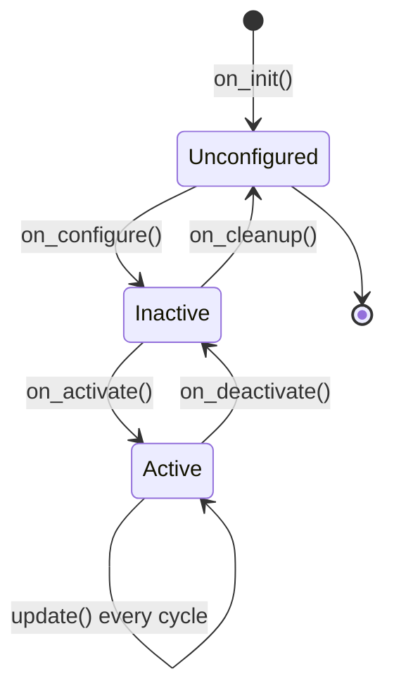

# ROS Control — Unit 4: Create a Controller

Stock controllers cover most needs, but eventually you'll want behavior they don't provide — a custom blend of two joints, a safety clamp, a nonstandard control law. This unit builds the simplest possible custom controller so you understand the plugin structure before you need to debug or extend a real one.

The state diagram below shows the lifecycle states a custom controller class moves through, and which override you fill in at each transition.



Each transition has a specific job:

- **`on_init()`** — read parameters and size member variables; hardware interfaces don't exist yet, so don't touch them.
- **`on_configure()`** — validate parameters and prepare anything that doesn't need live interfaces, such as resolving a joint name into an internal index.
- **`on_activate()`** — the controller manager has now handed you real, loaned state/command interfaces; cache pointers or indices into `state_interfaces_`/`command_interfaces_` here, and reset internal state (filters, integrators) so a re-activated controller doesn't inherit stale data.
- **`update()`** — the hot loop, covered below.
- **`on_deactivate()`**/**`on_cleanup()`** — release resources in reverse order, so the controller can be reconfigured or swapped without restarting the whole stack.

This mirrors the hardware interface lifecycle from Unit 6 almost exactly, using the same `rclcpp_lifecycle` state-machine types — which is why the controller manager can bring either one up or down independently.

## Anatomy of a controller class
A `ros2_control` controller is a C++ class that derives from `controller_interface::ControllerInterface` (in ROS 1, `controller_interface::Controller<HardwareInterface>`, using `starting()`/`stopping()` in place of `on_activate()`/`on_deactivate()`). The framework calls the lifecycle methods above on it; you fill in the ones that matter:

```cpp
class MyBasicController : public controller_interface::ControllerInterface
{
public:
  controller_interface::InterfaceConfiguration command_interface_configuration() const override;
  controller_interface::InterfaceConfiguration state_interface_configuration() const override;

  controller_interface::CallbackReturn on_init() override;
  controller_interface::CallbackReturn on_configure(
    const rclcpp_lifecycle::State & previous_state) override;
  controller_interface::CallbackReturn on_activate(
    const rclcpp_lifecycle::State & previous_state) override;

  controller_interface::return_type update(
    const rclcpp::Time & time, const rclcpp::Duration & period) override;
};
```

## Declaring which interfaces you need
`command_interface_configuration()` and `state_interface_configuration()` tell the controller manager exactly which joint interfaces your controller requires — this is the claim the manager checks against what the hardware interface exposes (Unit 2). Both return an `InterfaceConfiguration` whose `type` is one of `ALL` (every interface the hardware exposes), `INDIVIDUAL` (an explicit list — the common case), or `NONE`. A minimal single-joint position-passthrough controller declares one command interface and, since it wants feedback, a matching state interface:

```cpp
controller_interface::InterfaceConfiguration
MyBasicController::command_interface_configuration() const
{
  return {controller_interface::interface_configuration_type::INDIVIDUAL,
          {"single_joint/position"}};
}

controller_interface::InterfaceConfiguration
MyBasicController::state_interface_configuration() const
{
  return {controller_interface::interface_configuration_type::INDIVIDUAL,
          {"single_joint/position"}};
}
```

If the hardware interface (Unit 6) doesn't export a `single_joint/position` state or command interface, activation fails with an interface-claim error rather than silently running with missing data — the same failure mode as spawning a stock controller against a mismatched URDF back in Unit 3.

## The update loop
`update()` runs once per control cycle, inside the same fixed-rate real-time loop as every other active controller on the robot (Unit 2). It reads from state interfaces, computes a command, and writes to command interfaces — nothing more. Here's a one-line safety clamp on top of a target position, the kind of thing no stock controller gives you:

```cpp
controller_interface::return_type
MyBasicController::update(const rclcpp::Time & time, const rclcpp::Duration & period)
{
  double current = state_interfaces_[0].get_value();       // current joint position
  double target = target_position_;                        // set elsewhere, e.g. via a subscriber
  double clamped = std::clamp(target, current - max_step_, current + max_step_);
  command_interfaces_[0].set_value(clamped);                // write the (clamped) command
  return controller_interface::return_type::OK;
}
```

Keep `update()` cheap and deterministic: no dynamic allocation, no blocking calls, no heavy logging. Anything that needs a subscriber, service, or parameter should be set up in `on_configure()`/`on_activate()`, not inside `update()` — the same real-time discipline Unit 2 flagged for the controller manager's loop applies just as much to the code you write yourself.

## Registering the controller as a plugin
Controllers are loaded dynamically via `pluginlib`, so the class needs a plugin description and an export macro:

```xml
<!-- my_controller_plugin.xml -->
<library path="my_basic_controller">
  <class name="my_controller_ns/MyBasicController"
         type="my_controller_ns::MyBasicController"
         base_class_type="controller_interface::ControllerInterface">
    <description>A minimal passthrough position controller.</description>
  </class>
</library>
```

```cpp
#include "pluginlib/class_list_macros.hpp"
PLUGINLIB_EXPORT_CLASS(my_controller_ns::MyBasicController, controller_interface::ControllerInterface)
```

Your package's `CMakeLists.txt` needs a `pluginlib_export_plugin_description_file(controller_interface my_controller_plugin.xml)` call so the controller manager can find it by name at runtime, exactly like the stock controllers spawned in Unit 3.

## Building and spawning it
Once it builds (`colcon build --packages-select my_controller_ns`), the custom controller slots into the same YAML-and-spawner workflow as any stock one — add it to the YAML with its plugin name as `type`, then spawn it:

```yaml
controller_manager:
  ros__parameters:
    my_basic_controller:
      type: my_controller_ns/MyBasicController
```

```bash
ros2 run controller_manager spawner my_basic_controller
```

If the spawner reports a configuration error instead of activating cleanly, check `ros2 control list_hardware_interfaces` first — the most common cause is a name mismatch between what `*_interface_configuration()` claims and what the hardware interface actually exports.

## Try it yourself
Sketch (class skeleton + plugin XML, no need to fully compile it yet) a controller that reads a single joint's current position on every update and simply logs it, without writing any command. This "read-only" controller is a safe way to confirm you understand the lifecycle and interface-claiming mechanism before you write one that actually moves something.
