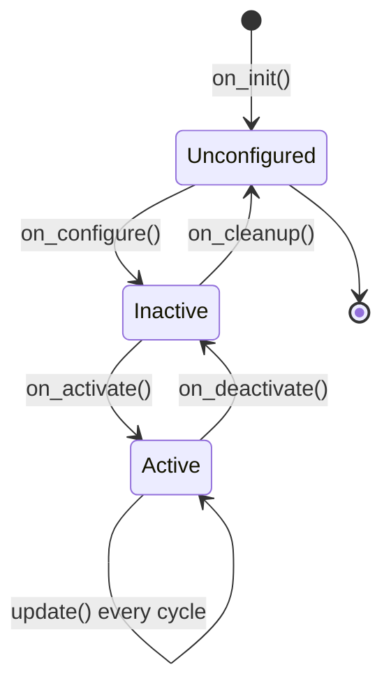

# ROS Control — Unit 4: Create a Controller

Stock controllers cover most needs, but eventually you'll want behavior they don't provide — a custom blend of two joints, a safety clamp, a nonstandard control law. This unit builds the simplest possible custom controller so you understand the plugin structure before you need to debug or extend a real one.

The state diagram below shows the lifecycle states a custom controller class moves through, and which override you fill in at each transition.



## Anatomy of a controller class
A `ros2_control` controller is a C++ class that derives from `controller_interface::ControllerInterface` (in ROS 1, `controller_interface::Controller<HardwareInterface>`). The framework calls a small set of lifecycle methods on it; you fill in the ones that matter:

```cpp
class MyBasicController : public controller_interface::ControllerInterface
{
public:
  controller_interface::InterfaceConfiguration command_interface_configuration() const override;
  controller_interface::InterfaceConfiguration state_interface_configuration() const override;

  controller_interface::CallbackReturn on_init() override;
  controller_interface::CallbackReturn on_configure(
    const rclcpp_lifecycle::State & previous_state) override;
  controller_interface::CallbackReturn on_activate(
    const rclcpp_lifecycle::State & previous_state) override;

  controller_interface::return_type update(
    const rclcpp::Time & time, const rclcpp::Duration & period) override;
};
```

## Declaring which interfaces you need
`command_interface_configuration()` and `state_interface_configuration()` tell the controller manager exactly which joint interfaces your controller requires — this is the claim the manager checks against what the hardware interface exposes (Unit 2). A minimal single-joint position-passthrough controller might declare:

```cpp
controller_interface::InterfaceConfiguration
MyBasicController::command_interface_configuration() const
{
  return {controller_interface::interface_configuration_type::INDIVIDUAL,
          {"single_joint/position"}};
}
```

## The update loop
`update()` runs once per control cycle. It reads from state interfaces, computes a command, and writes to command interfaces — nothing more. Keep it cheap and deterministic:

```cpp
controller_interface::return_type
MyBasicController::update(const rclcpp::Time & time, const rclcpp::Duration & period)
{
  double target = target_position_;               // set elsewhere, e.g. via a subscriber
  command_interfaces_[0].set_value(target);        // write the command
  return controller_interface::return_type::OK;
}
```

Anything that needs a subscriber, service, or parameter should be set up in `on_configure()`/`on_activate()`, not inside `update()`.

## Registering the controller as a plugin
Controllers are loaded dynamically via `pluginlib`, so the class needs a plugin description and an export macro:

```xml
<!-- my_controller_plugin.xml -->
<library path="my_basic_controller">
  <class name="my_controller_ns/MyBasicController"
         type="my_controller_ns::MyBasicController"
         base_class_type="controller_interface::ControllerInterface">
    <description>A minimal passthrough position controller.</description>
  </class>
</library>
```

```cpp
#include "pluginlib/class_list_macros.hpp"
PLUGINLIB_EXPORT_CLASS(my_controller_ns::MyBasicController, controller_interface::ControllerInterface)
```

Your package's `CMakeLists.txt` needs a `pluginlib_export_plugin_description_file(controller_interface my_controller_plugin.xml)` call so the controller manager can find it by name at runtime, exactly like the stock controllers you spawned in Unit 3.

## Try it yourself
Sketch (class skeleton + plugin XML, no need to fully compile it yet) a controller that reads a single joint's current position on every update and simply logs it, without writing any command. This "read-only" controller is a safe way to confirm you understand the lifecycle and interface-claiming mechanism before you write one that actually moves something.
