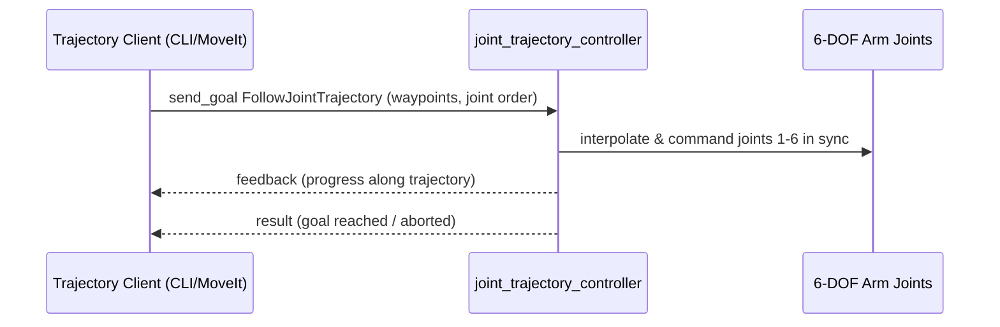

# ROS Control — Unit 5: Configuring the Controllers (Clarkson Manipulator)

Unit 3 configured controllers for a simple, low-DOF mobile base. This unit repeats the exercise on a more demanding target — a 6-DOF manipulator arm — to surface the extra complexity that shows up once joint count, ordering, and trajectory timing actually matter.

The sequence diagram below shows how a multi-joint trajectory goal flows from client to the `joint_trajectory_controller`, which coordinates all six joints together rather than treating them independently.



## Why an arm is harder than a base
A differential-drive base has two independent, decoupled joints and a controller (`diff_drive_controller`) built specifically for that kinematic shape. A 6-DOF arm has six joints that must move *in coordinated, time-synchronized trajectories* — you can't just send each joint an independent setpoint and expect a straight-line end-effector motion. That's exactly what `joint_trajectory_controller` is for: it accepts a full trajectory (positions, optionally velocities/accelerations, per waypoint, per joint, with timestamps) and interpolates all six joints together.

## URDF and YAML for six joints
The `<ros2_control>` block simply repeats the per-joint pattern from Unit 3, once per joint:

```xml
<ros2_control name="ClarksonArmSystem" type="system">
  <hardware>
    <plugin>gazebo_ros2_control/GazeboSystem</plugin>
  </hardware>
  <joint name="shoulder_pan_joint">
    <command_interface name="position"/>
    <state_interface name="position"/>
    <state_interface name="velocity"/>
  </joint>
  <!-- repeat for shoulder_lift, elbow, wrist_1, wrist_2, wrist_3 -->
</ros2_control>
```

The controller YAML now configures a `joint_trajectory_controller` instead of per-joint setpoint controllers:

```yaml
controller_manager:
  ros__parameters:
    update_rate: 100
    joint_state_broadcaster:
      type: joint_state_broadcaster/JointStateBroadcaster
    arm_trajectory_controller:
      type: joint_trajectory_controller/JointTrajectoryController

arm_trajectory_controller:
  ros__parameters:
    joints:
      - shoulder_pan_joint
      - shoulder_lift_joint
      - elbow_joint
      - wrist_1_joint
      - wrist_2_joint
      - wrist_3_joint
    command_interfaces: [position]
    state_interfaces: [position, velocity]
    constraints:
      goal_time: 0.5
```

## Joint order is not cosmetic
The `joints:` list order in the YAML is the order the controller expects positions/velocities to arrive in every trajectory point. If your trajectory publisher (or MoveIt, later in the course track) uses a different joint order than the URDF or the YAML, you'll get either a rejected goal or — worse — a *silently* wrong motion where joint 3's command lands on joint 5. Always double check joint-name ordering matches across URDF, controller YAML, and whatever publishes trajectories.

## Sending a test trajectory
You can exercise the controller directly from the command line before wiring up any planner:

```bash
ros2 action send_goal /arm_trajectory_controller/follow_joint_trajectory \
  control_msgs/action/FollowJointTrajectory \
  "{trajectory: {joint_names: [shoulder_pan_joint, shoulder_lift_joint, elbow_joint, wrist_1_joint, wrist_2_joint, wrist_3_joint], points: [{positions: [0.2, -0.3, 0.5, 0.0, 0.4, 0.0], time_from_start: {sec: 2}}]}}"
```

## Try it yourself
Using a 6-DOF arm description (a UR-style or similarly-shaped model), write the `joint_trajectory_controller` YAML for it, spawn the controller alongside `joint_state_broadcaster`, and send a two-waypoint trajectory via `ros2 action send_goal` that moves the arm from its home pose to a bent pose and back. Note what happens if you deliberately shuffle the `joint_names` order in the goal relative to the YAML.
