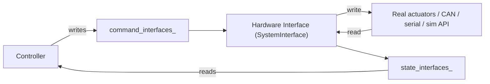

# ROS Control — Unit 6: Hardware Abstraction Layer

Every unit so far has used a simulator's hardware interface without asking what's underneath it. This unit opens that box: the Hardware Abstraction Layer (HAL) is the piece that actually talks to motors and sensors, and it's what you'll need to write yourself to move `ros_control`/`ros2_control` off simulation and onto real hardware.

The diagram below shows the HAL's bridging role in both directions: controllers only ever see named interfaces, while the HAL translates those into whatever protocol the real (or simulated) hardware speaks.



## What the HAL's job actually is
Controllers (Unit 4) only ever read and write named state/command interfaces — they have no idea whether those interfaces are backed by a CAN bus, a serial-connected motor controller, or a Gazebo physics engine. The HAL is the translation layer that makes that true: it exports the same interface names (`position`, `velocity`, `effort`, ...) that controllers expect, and internally converts reads/writes into whatever protocol the real actuators speak.

```
Controller  --writes-->  command_interfaces_["joint1/position"]
                                │
                          Hardware Interface (yours)
                                │
                          write() -> CAN frame / serial packet / simulator API
```

This is the same abstraction pattern as a device driver in a normal OS: user-facing code (the controller) never changes when you swap the underlying device, only the driver (hardware interface) does.

## The `SystemInterface` and its lifecycle
In `ros2_control`, a hardware interface implementing multiple joints typically derives from `hardware_interface::SystemInterface`, which — like controllers — follows a managed lifecycle (`on_init`, `on_configure`, `on_activate`, `on_deactivate`, `on_cleanup`) plus two hot-path methods:

```cpp
class MyRobotHardware : public hardware_interface::SystemInterface
{
public:
  std::vector<hardware_interface::StateInterface> export_state_interfaces() override;
  std::vector<hardware_interface::CommandInterface> export_command_interfaces() override;

  hardware_interface::return_type read(
    const rclcpp::Time & time, const rclcpp::Duration & period) override;
  hardware_interface::return_type write(
    const rclcpp::Time & time, const rclcpp::Duration & period) override;
};
```

`read()` pulls fresh sensor/encoder values from the real device into the state interfaces the controller manager will hand to controllers. `write()` pushes whatever the active controller most recently wrote into the command interfaces out to the real actuators. Both run inside the same fixed-rate loop as controller `update()` — a slow or blocking `read()`/`write()` stalls every controller on the robot, not just one.

## Simulated vs. real hardware interfaces
You've been using simulated hardware interfaces (`gazebo_ros2_control/GazeboSystem` or similar) since Unit 3 — these implement the exact same `SystemInterface` contract but their `read()`/`write()` talk to the physics engine instead of real electronics. There's also a generic `fake_components/GenericSystem` used for quick bring-up when you want to test controller configuration with no simulator and no hardware at all — it just echoes commands back as state. Structuring your project so the *only* thing that changes between "simulate", "bench test", and "real robot" is which `<plugin>` line the URDF points at is the entire point of this abstraction.

## Try it yourself
Sketch the `export_state_interfaces()`/`export_command_interfaces()` bodies (which interfaces, for which joints) for a hardware interface wrapping a single motor that reports position and velocity but only accepts a velocity command. Then note in one sentence what would need to change in your sketch to add a second identical motor.
