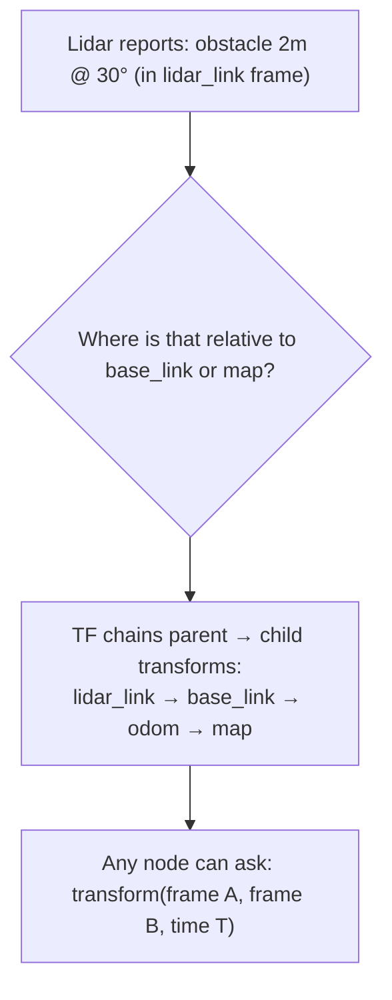

# TF ROS — Unit 1: Intro to TF

This first unit sets the stage for the whole course: what problem TF actually solves, why almost every ROS robot depends on it, and how the six units ahead build on each other.

The flow below traces why a raw sensor reading is useless on its own until TF relates it to the frame you actually care about.



## The problem TF exists to solve
A robot is not one rigid block — it is a tree of parts (base, wheels, arm links, a lidar mount, a camera) that all move relative to each other, and the whole assembly also moves relative to the world. Every sensor reports data in its own local frame. A lidar says "obstacle at 2m, bearing 30°" relative to *itself*, not relative to the robot's base or the map. Before you can act on that reading (steer around it, plan a grasp, localize on a map), you need to know the geometric relationship between the sensor's frame and every other frame you care about.

`TF` (short for "transform") is ROS's answer: a distributed system that tracks the relationship between coordinate frames over time and lets any node ask "where is frame A relative to frame B, at time T?" without every node having to hardcode that math itself.

## Why this is a tree, not a single number
Frames are organized in a tree, e.g. `map -> odom -> base_link -> lidar_link`. Each edge is a transform (translation + rotation) between a parent and a child frame. To go from `lidar_link` to `map`, TF walks the tree and chains the transforms together — you never publish "lidar relative to map" directly, you only publish each link's relationship to its immediate parent, and TF composes the rest.

```
map
 └── odom
      └── base_link
           ├── lidar_link
           ├── camera_link
           └── arm_base_link
                └── arm_link_1 ... arm_link_n
```

## What you'll build across this course
- Unit 2: inspect and visualize an existing TF tree with command-line tools and RViz.
- Unit 3: publish and subscribe to transforms yourself, using a 3D turtlesim-style example.
- Unit 4: let `robot_state_publisher` and `joint_state_publisher` generate the whole tree for a multi-link robot from a URDF, instead of hand-publishing every frame.
- Unit 5: publish frames that never move (a sensor bolted to the chassis) efficiently with static transforms.
- Unit 6: a capstone project — build a small robot model that publishes a correct TF tree from scratch.

## Try it yourself
Before touching any code, sketch (on paper or in a text file) the frame tree you'd expect for a simple two-wheeled robot with a lidar on top and a camera on the front: list each frame name and which frame is its parent. You'll come back to this sketch in Unit 6 when you build it for real.
