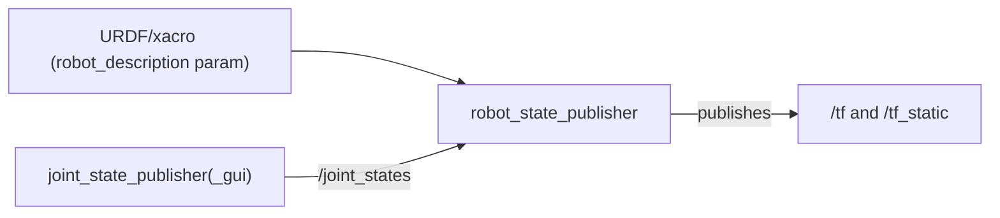

# TF ROS — Unit 4: Understanding Robot State Publisher & Joint State Publisher

Hand-broadcasting every frame of a real robot, as you did in Unit 3, does not scale — a robot arm alone might have six or more moving joints. This unit introduces the two nodes that generate an entire TF tree automatically from a robot description and its current joint angles.

The diagram below shows how the two nodes' outputs combine: fixed geometry from the URDF plus live joint angles becomes the full TF tree.



## Where the tree comes from: URDF
`robot_state_publisher` needs a model of the robot's kinematic structure to know which frames exist and how they're connected — that model is a URDF (Unified Robot Description Format) file, described in detail in the next course. For this unit, treat URDF as a given input: an XML description of links (rigid bodies) and joints (fixed, revolute, prismatic, continuous...) connecting them, each with a fixed offset from its parent.

## `robot_state_publisher`: joint angles in, TF tree out
`robot_state_publisher` subscribes to `/joint_states` (a `sensor_msgs/JointState` message listing joint names and their current position/velocity/effort) and combines each joint's live angle with the fixed geometry from the URDF to compute and publish every link's transform on `/tf` (and `/tf_static` for the joints marked `fixed`). You almost never write this logic yourself — you launch the node and feed it a robot description and a joint state stream:

```bash
ros2 run robot_state_publisher robot_state_publisher \
  --ros-args -p robot_description:="$(xacro my_robot.urdf.xacro)"
```

In a launch file this is more commonly expressed by loading the URDF/xacro text into a parameter and passing it to the node, alongside a `use_sim_time` parameter when running in simulation.

## `joint_state_publisher`: where `/joint_states` comes from
`robot_state_publisher` needs *something* publishing `/joint_states`. On real hardware, that's normally your driver or controller layer reporting actual encoder positions. While developing or testing a model with no hardware attached, `joint_state_publisher` fills that role — it publishes plausible joint values (defaulting to each joint's midpoint or zero), optionally cycling them, so you have a working tree to look at immediately.

```bash
ros2 run joint_state_publisher joint_state_publisher
# or, for a small GUI with sliders per joint:
ros2 run joint_state_publisher_gui joint_state_publisher_gui
```

The GUI variant is worth using early: dragging a slider and watching the corresponding link move in RViz is the fastest way to confirm your URDF's joint axes and limits are what you intended.

## The three pieces working together
```
URDF/xacro  ──(robot_description param)──▶  robot_state_publisher ──▶ /tf, /tf_static
joint_state_publisher(_gui) ──/joint_states──▶ robot_state_publisher
```
Note that `joint_state_publisher` and `robot_state_publisher` are two different nodes with overlapping names but distinct jobs: one produces joint angles, the other turns those angles plus the static URDF geometry into a full Cartesian TF tree.

## Try it yourself
If you have (or fetch) a simple URDF with at least one revolute joint, launch `robot_state_publisher` with that description alongside `joint_state_publisher_gui`, open RViz with a TF display, and drag the joint slider. Confirm the corresponding child frame visibly rotates around the axis you expect, and that every other frame in the tree stays correctly anchored to its parent.
