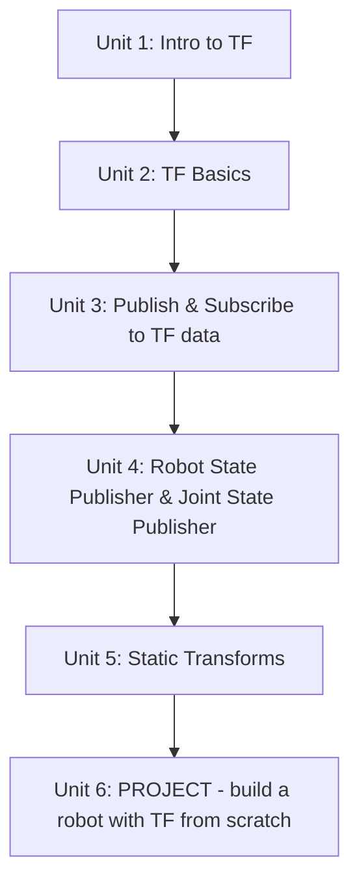

# TF ROS

Every ROS robot is a collection of parts moving relative to each other and relative to the world, and every sensor reports data in its own local frame — TF is the system that tracks all of those relationships so any node can ask "where is this frame relative to that one?" without hardcoding the geometry itself. This course builds that understanding hands-on: starting from reading and visualizing an existing TF tree, through publishing and subscribing to transforms yourself, letting `robot_state_publisher`/`joint_state_publisher` generate a tree automatically from a robot description, publishing fixed sensor mounts efficiently as static transforms, and finally assembling all of it into a small robot you build and verify from scratch.

The diagram below shows how each unit builds on the skills learned in the one before it, from reading a TF tree to publishing your own from scratch.

1. [Intro to TF](01-intro-to-tf.md) — A basic idea of what is in the course and what you will learn about TFs.
2. [TF Basics](02-tf-basics.md) — A first contact with TFs and the tools to visualize them.
3. [Publish & Subscribe to TF data](03-publish-and-subscribe-to-tf-data.md) — Publishing and subscribing to TF topics with a 3D version of turtlesim.
4. [Understanding Robot State Publisher & Joint State Publisher](04-understanding-robot-state-publisher-joint-state-publisher.md) — Using RobotStatePublisher to publish TF data of complex robots.
5. [Understanding Static Transforms](05-understanding-static-transforms.md) — Publishing static transforms from a launch file and the command line.
6. [PROJECT - Create your own robot with TF from scratch](06-project-create-your-own-robot-with-tf-from-scratch.md) — Build your own robot that publishes its TF.
