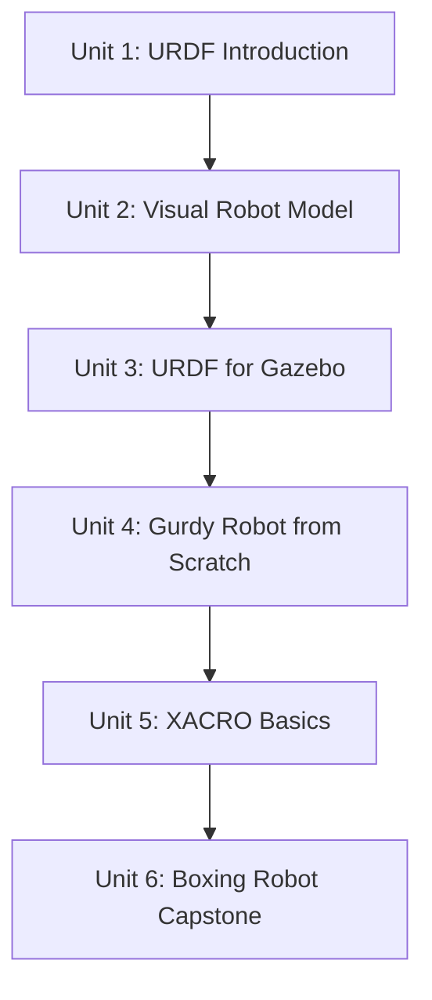

# URDF for Robot Modeling

Before a robot can move in RViz, be simulated in Gazebo, or be planned around with MoveIt, something has to describe what it physically *is* — how many links it has, how they're shaped, how they're jointed together, and how heavy each piece is. URDF (Unified Robot Description Format) is that description, and this course builds it up from a single-link skeleton to a full XACRO-driven robot: starting with the core vocabulary of links and joints, adding the visual and physical tags a simulator needs, building two real multi-part robots (a jointed lamp arm and a three-legged "Gurdy"), and finishing with XACRO macros that turn repetitive hand-copied XML into a maintainable, parameterized model — culminating in a self-designed "Boxing Robot" capstone.

The diagram below shows how each unit builds directly on the skills and models from the one before it.

1. [URDF Introduction](01-urdf-introduction.md) — What URDF is, the link/joint vocabulary, the robots you'll build, and how URDF feeds RViz, Gazebo, and TF.
2. [Building the Visual Robot Model with URDF](02-building-the-visual-robot-model-with-urdf.md) — `<link>`/`<visual>`/`<geometry>` tags, joint types, and validating a model with `check_urdf` and RViz.
3. [Using URDF for Gazebo](03-using-urdf-for-gazebo.md) — Adding `<collision>`, `<inertial>`, and `<gazebo>` tags so a URDF robot behaves physically once spawned.
4. [Create the URDF files for a Gurdy Robot from scratch](04-create-the-urdf-files-for-a-gurdy-robot-from-scratch.md) — Planning and building a three-legged, multi-branch robot tree by hand.
5. [XACRO Basics](05-xacro-basics.md) — Properties, math expressions, and parameterized macros to eliminate the hand-copied repetition from the Gurdy model.
6. [Project: Advanced XACRO and Create your own Boxing Robot](06-project-advanced-xacro-and-create-your-own-boxing-robot.md) — Conditionals and mirrored macros, applied to a self-designed two-armed Boxing Robot capstone.
