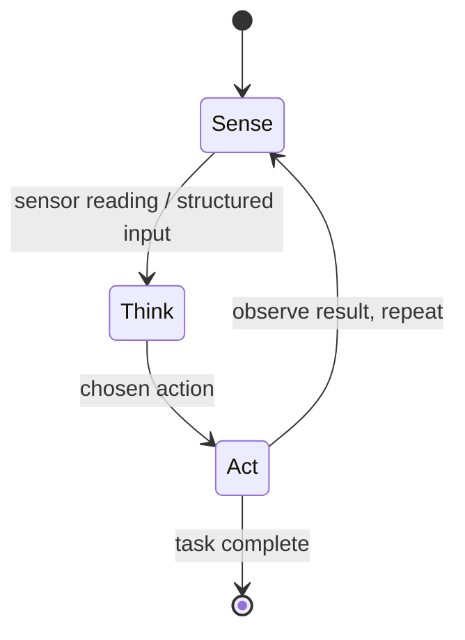

# AI Agents — Unit 1: Welcome

This unit sets the stage for the course: what an "AI agent" means in a robotics context, what you'll build across the next five units, and how the pieces (perception, navigation, multi-agent coordination) fit together into the capstone.

## What this course means by "agent"
In classic robotics, a program reads sensors, runs a fixed control loop, and writes actuator commands — no reasoning about goals beyond what was hard-coded. An **agent**, as used in this course, is a system that:

- Perceives its environment through sensors or structured input
- Maintains some internal state or memory of what it has observed
- Reasons about a goal, either with hand-written rules or an LLM-driven planner
- Chooses actions and executes them, then observes the result and repeats

This loop — **sense, think, act, repeat** — is the mental model you should carry into every later unit. The difference between units is mostly *what "think" is made of*: a state machine, a retrieval-augmented LLM, a planner coordinating a team.

The state diagram below shows this repeating cycle, which every agent design in this course is a variation of.

## Course roadmap
- **Unit 2 — Introduction to AI Agents**: rule-based agents versus LLM-driven agents, and where RAG fits.
- **Unit 3 — AI Agents for Perception**: turning raw sensor streams (camera, lidar) into structured facts an agent can reason over.
- **Unit 4 — Agents for Navigation**: using that perception, plus language instructions, to plan and execute motion.
- **Unit 5 — Multi Agent Systems**: coordinating several agents that must share information or divide work.
- **Unit 6 — Capstone Project**: combine perception, navigation, and multi-agent coordination into one system.

Each unit builds directly on the last, so skipping ahead will leave gaps — the capstone assumes you can write a perception-to-action loop and reason about at least two cooperating agents.

## What you need before starting
You should already be comfortable with Python and reading/writing structured data (JSON, dataclasses). You do **not** need prior robotics experience for this course, but the following will make examples click faster:

- Basic familiarity with a pub/sub messaging pattern (topics, publishers, subscribers) — the exact framework doesn't matter, ROS 2 or a plain message queue both work as a mental model.
- A rough idea of what a large language model API call looks like (prompt in, text out), since Unit 2 onward treats an LLM as a callable reasoning component.

## Try it yourself
Before Unit 2, write a 10-15 line Python stub with three functions: `sense()` returning a fake sensor reading (e.g. a dict like `{"obstacle_distance": 2.3}`), `think(state)` returning a naive action string based on a simple `if` rule, and `act(action)` that just prints it. Wire them into a `for` loop that runs five iterations. This bare skeleton is the shape every agent in this course extends.
