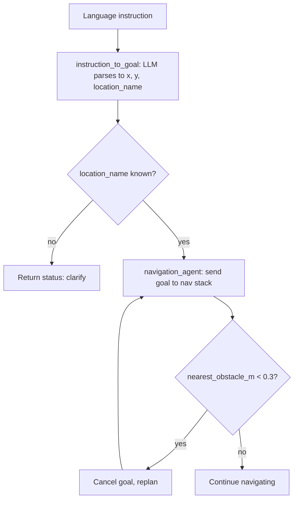

# AI Agents — Unit 4: Agents for Navigation

With perception producing structured facts (Unit 3), this unit covers the other half of getting a robot from A to B intelligently: turning a goal — whether a coordinate or a natural-language instruction — into a sequence of motion commands, and adjusting that plan as new perception arrives.

The flowchart below traces an instruction from parsing through the ambiguity check to navigation and the obstacle-triggered replan loop.



## Goal representations
Navigation agents need a goal to aim for. In classical robotics that goal is almost always a coordinate (`x, y, theta` in some map frame), produced by a planner like Nav2's `NavigateToPose`. An LLM-driven navigation agent adds a translation step in front of that: turning a language instruction into the same coordinate (or a sequence of waypoints).

```python
def instruction_to_goal(instruction: str, known_locations: dict, client) -> dict:
    prompt = f"""Known locations: {known_locations}
Instruction: "{instruction}"
Respond with JSON: {{"x": float, "y": float, "location_name": str}}"""
    response = client.messages.create(
        model="claude-sonnet-4-5",
        messages=[{"role": "user", "content": prompt}],
        max_tokens=150,
    )
    return json.loads(response.content[0].text)
```

Keep the set of `known_locations` explicit and passed in the prompt rather than trusting the model to invent coordinates — grounding the model in facts you control is the same principle as the RAG pattern from Unit 2, applied to navigation.

## From goal to motion: planning
Once you have a goal, getting there is a classical planning problem: a global planner (e.g. A* or Dijkstra over an occupancy grid) finds a path, and a local planner/controller follows it while reacting to obstacles the global map didn't know about. This course treats the agent as the layer *above* that stack — it decides *where* to go and *when* to re-plan, and delegates the geometry to an existing navigation stack (e.g. ROS 2's Nav2).

```python
def navigation_agent(state: dict, goal: dict, nav_client):
    if state["nearest_obstacle_m"] < 0.3 and not state.get("re_planned"):
        nav_client.cancel_goal()
        return "replanning"
    nav_client.send_goal(goal["x"], goal["y"])
    return "navigating"
```

The agent's job is to sit in the loop and make the *decision* to replan, abort, or ask for help — not to compute the path itself. This division of labor (agent decides, stack executes) keeps the LLM out of the tight real-time control loop where it's too slow and too unpredictable.

## Handling ambiguous or underspecified instructions
Natural-language instructions are frequently incomplete ("go to the charging station" when there are two) or contradictory ("avoid the kitchen" combined with "get the mug from the kitchen"). A robust navigation agent detects this rather than guessing:

```python
def instruction_to_goal_safe(instruction, known_locations, client):
    goal = instruction_to_goal(instruction, known_locations, client)
    matches = [loc for loc in known_locations if loc == goal["location_name"]]
    if not matches:
        return {"status": "clarify", "message": f"No location named '{goal['location_name']}'"}
    return {"status": "ok", "goal": goal}
```

Returning a "clarify" status instead of silently picking a default is usually the right failure mode for a physical robot — an agent that guesses wrong when it could ask is worse than one that pauses.

## Try it yourself
Using the `known_locations` dict `{"dock": (0, 0), "kitchen": (5, 2), "hallway": (2, 2)}`, write three test instructions — one clear ("go to the kitchen"), one ambiguous ("go to the charging spot"), and one referencing an unknown place ("go to the lab") — and run them through `instruction_to_goal_safe`. Confirm your function correctly flags the second and third for clarification instead of guessing coordinates.
