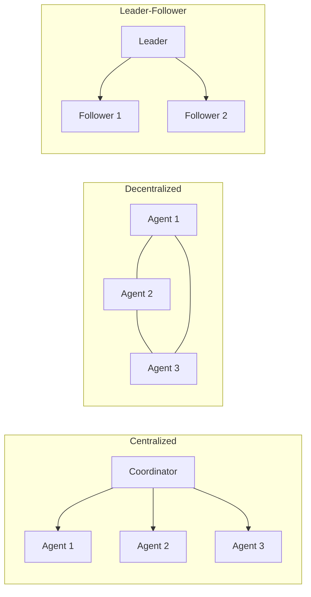

# AI Agents — Unit 5: Multi Agent Systems

A single agent handles one robot's sense-think-act loop. This unit covers what changes when several agents — possibly on different robots — need to share information, divide work, and avoid stepping on each other, which is the last piece needed before the capstone.

The diagram below contrasts the three topologies' information flow: a single coordinator, an all-to-all mesh, and one leader directing followers.



## System topologies
Multi-agent systems are usually classified by how control and information flow between agents:

- **Centralized**: one coordinator agent receives state from every worker agent and issues instructions. Simple to reason about and debug, but the coordinator is a single point of failure and a bandwidth bottleneck as the team grows.
- **Decentralized**: each agent talks to its neighbors (or broadcasts) and makes its own decisions using locally available information. More robust to individual failures, harder to guarantee global consistency.
- **Leader-follower**: a hybrid — one agent (the leader) sets high-level goals or a reference trajectory; followers track it while handling their own local obstacle avoidance.

Pick the topology based on the failure mode you can least tolerate: centralized systems fail all-at-once if the coordinator dies; decentralized systems can end up with agents holding contradictory beliefs about the world.

## Task allocation
Once agents can talk to each other, someone has to decide who does what. A simple and surprisingly effective approach for robotics is **auction-based allocation**: each agent bids on a task based on its own cost estimate (e.g. distance to the task), and the lowest bid wins.

```python
def auction_task(task, agents: list[dict]) -> str:
    # each agent dict: {"id": str, "position": (x, y)}
    def cost(agent):
        ax, ay = agent["position"]
        tx, ty = task["position"]
        return ((ax - tx) ** 2 + (ay - ty) ** 2) ** 0.5

    winner = min(agents, key=cost)
    return winner["id"]
```

This scales better than a central planner solving a full assignment problem, especially when tasks arrive one at a time rather than all at once. For a handful of agents and tasks known up front, an exact assignment (e.g. the Hungarian algorithm) minimizes total cost instead of settling for a greedy per-task winner.

## Shared state and communication
Agents need a shared channel to publish what they know (their position, what they've observed, which task they've claimed) and to avoid duplicate work. In a ROS 2 context this is naturally a topic; conceptually, any pub/sub bus works.

```bash
# ROS 2 example: agents publish claims to a shared topic, others subscribe
ros2 topic pub /agent_claims std_msgs/msg/String "data: '{\"agent\":\"a1\",\"task\":\"t3\"}'"
ros2 topic echo /agent_claims
```

```python
claimed_tasks = set()

def try_claim(agent_id: str, task_id: str, publisher) -> bool:
    if task_id in claimed_tasks:
        return False
    claimed_tasks.add(task_id)
    publisher.publish(json.dumps({"agent": agent_id, "task": task_id}))
    return True
```

Race conditions are the recurring bug here: two agents can both see a task as unclaimed and both claim it in the same instant. A production system resolves this with a sequenced/authoritative store (or the auction pattern above, where only one bid wins); a simulation can tolerate the occasional double-claim if you log and detect it.

## Try it yourself
Simulate three agents at positions `(0,0)`, `(5,5)`, `(1,4)` and two tasks at `(1,1)` and `(4,4)`. Run `auction_task` for both tasks in sequence, removing the winning agent from the pool after each auction so no agent gets both. Print which agent won which task and confirm the assignment matches what you'd expect from nearest-distance reasoning.
