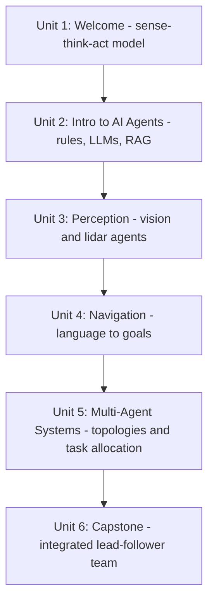

# AI Agents

This course walks through building intelligent agents for robots — systems that perceive their environment, reason over sensor data and language instructions, and decide how to act, rather than just following a fixed control loop. You'll move from simple rule-based reactive behavior up through LLM-driven planning and Retrieval-Augmented Generation (RAG), then apply those ideas to perception and navigation, extend to teams of coordinating agents, and finally integrate everything into a capstone system that navigates with lidar, follows language instructions, and leads a multi-agent team.

The diagram below shows how each unit builds directly on the one before it, ending in the capstone integration.

1. [Welcome](01-welcome.md) — Course roadmap, the sense-think-act mental model, and prerequisites before diving in.
2. [Introduction to AI Agents](02-introduction-to-ai-agents.md) — Rule-based agents, LLM-driven agents, and RAG for grounding agent decisions in real facts.
3. [AI Agents for Perception](03-ai-agents-for-perception.md) — Turning raw camera and lidar data into structured facts an agent can reason over, using vision and lidar agents.
4. [Agents for Navigation](04-agents-for-navigation.md) — Translating language instructions into goals, delegating path planning to a navigation stack, and handling ambiguous instructions safely.
5. [Multi Agent Systems](05-multi-agent-systems.md) — Centralized, decentralized, and leader-follower topologies; task allocation via auctions; shared state and communication.
6. [Capstone Project](06-capstone-project.md) — Integrating perception, navigation, and multi-agent coordination into one lead-and-follower team system.
