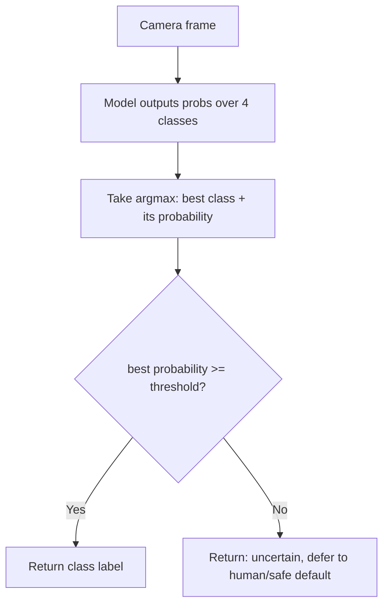

# AI Foundations for Robotics — Unit 1: Introduction to AI for Robotics

This unit sets expectations for the course: what "AI foundations" means as distinct from an applied ML/robotics course, a quick demo of the kind of behavior you'll be able to build by the end, and what background you need before diving into Unit 2's probability theory.

The flowchart below traces the reject-option decision logic that `classify_with_reject` implements.



## What this course actually teaches
Most robotics-AI material jumps straight to "train a model" without explaining what the model is doing underneath. This course is the substrate that makes those later courses (classical ML, deep learning, reinforcement learning) legible: univariate and multivariate probability, statistics (how parameters get estimated from data), decision theory (how a robot turns probabilities into actions), information theory (how uncertainty and "surprise" are measured), and finally logistic regression as the first real trainable model that ties everything together. Every later unit in this course reuses the previous one — there's no filler.

## A first look: classification under uncertainty
Here's a preview of where Unit 7 and the final project land. Suppose a pretrained model looks at a camera frame and has to decide which of four known objects it's looking at — or admit it isn't sure. A model that always forces a guess is dangerous in robotics: a robot that confidently misclassifies a person as a floor obstacle is worse than one that stops and asks for help. The fix is a **reject option** — refusing to decide when no class has enough posterior probability.

```python
import numpy as np

def classify_with_reject(probs, labels, threshold=0.6):
    best = int(np.argmax(probs))
    if probs[best] < threshold:
        return "uncertain — defer to a human or a safer default action"
    return labels[best]

probs = np.array([0.52, 0.31, 0.10, 0.07])   # model's belief over 4 classes
labels = ["lamp", "ball", "plant", "debris"]
print(classify_with_reject(probs, labels))    # -> "uncertain — defer..."
```

You'll formalize exactly *why* 0.6 is a reasonable threshold (and how to pick it properly instead of guessing) in Unit 5, Decision Theory.

## Prerequisites and how the course builds
You should be comfortable programming (this course assumes that) and have seen basic linear algebra (vectors, matrices, dot products) and calculus (derivatives) before — nothing exotic, but the probability and gradient-descent derivations lean on both. If either is rusty, a quick refresher before Unit 2 pays off. The course is strictly cumulative:

1. Probability (Units 2–3) gives you the language for uncertainty.
2. Statistics (Unit 4) turns observed data into probability model parameters.
3. Decision theory (Unit 5) turns probabilities into optimal actions.
4. Information theory (Unit 6) gives you the tools to measure and compare uncertainty, and motivates the standard loss function for classification.
5. Logistic regression (Unit 7) is the first trainable model, built directly from Units 4–6.
6. The final project (Unit 8) strings all of it into one working image-classification-and-decision pipeline.

## Try it yourself
Rewrite `classify_with_reject` so that instead of a single global `threshold`, it accepts a per-class threshold dictionary (e.g. `{"debris": 0.5, "lamp": 0.8}`) — objects a robot should be cautious about (like fragile items) get a stricter bar before the robot commits to an action. Run it against `probs = [0.45, 0.20, 0.15, 0.20]` and check whether the result changes with per-class thresholds versus a single global 0.6 threshold.
