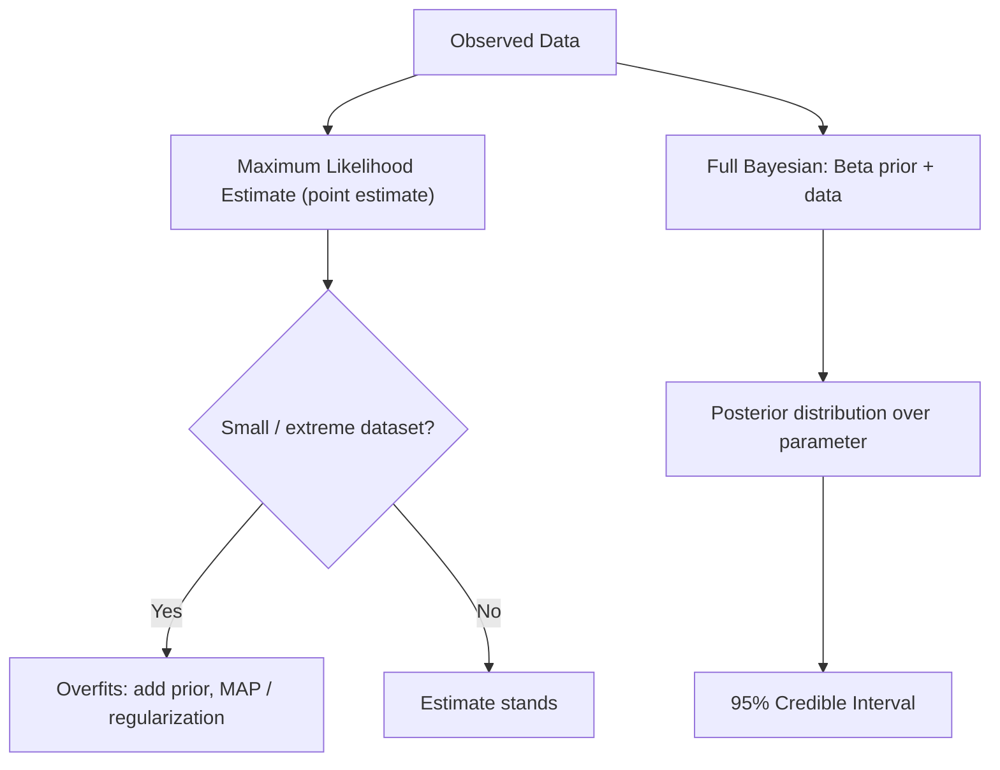

# AI Foundations for Robotics — Unit 4: Statistics

Units 2–3 assumed you already knew a distribution's parameters (e.g. "debris probability is 0.3"). In practice a robot never gets handed that number — it has to estimate it from observed data. This unit covers how, and what goes wrong if you estimate naively.

The flowchart below contrasts the point-estimate path (MLE, overfitting, regularization) with the full Bayesian path that keeps an entire posterior distribution.



## Maximum likelihood estimation: the core idea
Given observed data and a family of candidate distributions, **Maximum Likelihood Estimation (MLE)** picks the parameter value that makes the observed data most probable. Formally, the **likelihood** L(θ) = P(data | θ) is a function of θ (not of the data, which is fixed); MLE maximizes it, equivalently minimizes the **negative log-likelihood (NLL)**. This is the training objective behind nearly every model in this course, including the logistic regression you'll train in Unit 7.

## MLE across distributions
The pattern is strikingly consistent — MLE almost always reduces to "compute the obvious empirical statistic":

```python
import numpy as np

data = np.array([0, 1, 1, 0, 1, 1, 1, 0])       # 1 = debris found in room i
p_hat = data.mean()                              # MLE for Bernoulli/Binomial p

samples = np.array([1.62, 1.58, 1.55, 1.61])     # repeated range readings
mu_hat = samples.mean()                          # MLE for Gaussian mean
var_hat = samples.var()                          # MLE for Gaussian variance

lo_hat, hi_hat = data.min(), data.max()          # MLE for Uniform(a, b) bounds
```

For a **Bernoulli/Binomial**, the MLE is just the empirical success fraction. For a **Gaussian**, it's the sample mean and sample variance. For a **multivariate Gaussian**, the same pattern generalizes cleanly to the empirical mean vector and covariance matrix. For a **Uniform(a, b)**, the MLE is simply the min and max of the observed data — a genuinely different kind of argument (about interval width) rather than calculus, but the same "match what you observed" spirit.

## Method of moments and online (recursive) estimation
When the NLL is analytically or numerically painful to optimize, **Method of Moments (MOM)** offers a shortcut: equate K theoretical moments (mean, variance, ...) of the distribution to the K empirical moments of the data, and solve for the K unknown parameters. Separately, when data arrives continuously rather than all at once — a cleaning robot updating its belief about "the building's trash generation rate" mission after mission — **online (recursive) estimation** updates the running estimate incrementally instead of refitting from scratch:

```python
def online_update(estimate, new_obs, alpha=0.1):
    return estimate + alpha * (new_obs - estimate)   # exponentially weighted moving average
```

This is far cheaper than storing all past data and refitting, and it naturally emphasizes recent observations if `alpha` is chosen appropriately.

## Overfitting and regularization
MLE has a sharp failure mode with small or extreme datasets: if the robot happens to find debris in all 4 rooms it's checked so far, the Bernoulli MLE concludes p = 1.0 — "debris is certain, forever," leaving zero probability for any other outcome ever again. This is **overfitting**: the estimate memorizes the small sample instead of generalizing. The fix is **regularization** — pulling the estimate toward a plausible default unless the data strongly overrides it. In a Bayesian framing this means adding a prior, which turns MLE into **MAP (Maximum A Posteriori)** estimation; in general ML the same idea shows up as L1/L2 penalties added to a loss function.

## From point estimates to full Bayesian statistics
Point estimates (MLE, MOM, MAP) collapse everything to one number and quietly discard how *confident* you should be in it — dangerous when your dataset is small. Full **Bayesian statistics** keeps the entire posterior *distribution* over the parameter. The classic conjugate example is the **Beta-Binomial model**: with a `Beta(a, b)` prior over a Bernoulli/Binomial success probability, observing `s` successes and `f` failures gives a closed-form posterior:

```python
from scipy.stats import beta

a0, b0 = 2, 2                    # prior pseudo-counts (mild belief toward p=0.5)
successes, failures = 4, 4
posterior = beta(a0 + successes, b0 + failures)
print(posterior.mean(), posterior.std())
```

The **posterior predictive** — "what's the probability the *next* room has debris?" — is just this posterior's mean, and it naturally differs from (and is more conservative than) the raw plug-in MLE fraction, especially with little data.

## Credible intervals
A **credible interval** is the Bayesian tool for quantifying how much to trust a point estimate: a 95% credible interval is a range that contains 95% of the posterior probability mass. Unlike MLE alone, which reports no uncertainty, `posterior.interval(0.95)` (SciPy) gives you both a best guess and a defensible error bar in one call — essential before letting a robot act on an estimate with high stakes.

## Try it yourself
With only 2 observed rooms, one with debris and one without (`successes=1, failures=1`), compare the plug-in MLE prediction (`0.5`) against the Bayesian posterior predictive using `Beta(2, 2)` as the prior. Then repeat with a weaker prior `Beta(1, 1)`. Which prior pulls the estimate closer to 0.5, and why does that matter when you only have 2 data points?
