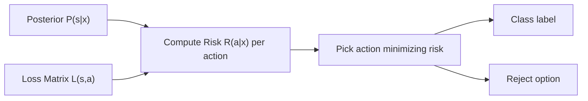

# AI Foundations for Robotics — Unit 5: Decision Theory

Probability and statistics tell you what's likely; decision theory tells you what to *do* about it. This unit turns posterior probabilities from Units 2–4 into optimal actions, and gives you the standard tools for evaluating whether a classifier is actually good.

The diagram below shows how a posterior and a loss matrix combine into the risk-minimizing action at the heart of Bayesian decision theory.



## Bayesian decision theory: actions, states, and loss
The formal framework has three pieces: a set of possible **actions** A, a set of possible **states of nature** S (the true, unobserved fact), and a **loss function** L(s, a) — the cost of taking action a when the true state is s. Given a posterior P(s | x) over states from your observations x, the **posterior expected loss (risk)** of an action is:

```
R(a | x) = Σ_s L(s, a) · P(s | x)
```

The **optimal policy** picks the action that minimizes this risk — equivalently, maximizes expected utility if you define utility as negative loss. Everything else in this unit is a special case of this one idea.

## Classification as decision making
Classification is decision theory where both actions and states of nature are class labels. With **zero-one loss** (every misclassification penalized equally, correct answers free), the risk-minimizing action is simply the class with the highest posterior probability — i.e. **MAP classification**, the "obvious" argmax rule you'd guess even without decision theory. Two refinements matter in robotics:

- **Cost-sensitive classification**: not all mistakes are equal. Misclassifying a person as a wall is far worse than the reverse, so the loss matrix should be asymmetric, not zero-one.
- **Reject option**: add a third "I'm not sure" action available whenever no class has enough posterior probability, deferring to a human or a safe fallback rather than forcing a possibly-wrong guess. This is the mathematical justification for the threshold trick from Unit 1.

## Evaluating classifiers: confusion matrices and ROC
For a binary classifier, every prediction falls into one of four buckets against ground truth: **True Positive**, **False Positive**, **True Negative**, **False Negative**. From these:

```
TPR (recall/sensitivity) = TP / (TP + FN)     # of actual positives, how many caught?
FPR                       = FP / (FP + TN)     # of actual negatives, how many wrongly flagged?
```

A **confusion matrix** lays out all four counts (or the full K×K grid for multiclass); an **ROC curve** plots TPR against FPR as the decision threshold sweeps, letting you pick an operating point that matches your loss matrix rather than defaulting to 0.5.

```python
from sklearn.metrics import confusion_matrix, roc_curve
cm = confusion_matrix(y_true, y_pred)
fpr, tpr, thresholds = roc_curve(y_true, y_scores)
```

## Regression as a decision problem
The same framework extends to continuous states and actions. With **squared-error loss**, the risk-minimizing action is the **posterior mean** of the state; with **absolute-error loss**, it's the **posterior median**. This is why "predict the mean" is the default for regression models trained with MSE — it's not arbitrary, it falls directly out of decision theory.

## Worked example: a three-sensor waste classifier
Scenario: the robot must sort debris into three categories — plastics, metals, organics — using three noisy sensors (camera, durometer, densimeter), each roughly 97–99% accurate per class. Build a 3×3 (or 4×4 with a reject action) loss matrix, starting from a zero-one baseline and then raising specific entries where a misclassification is materially worse (e.g. putting metal in the organics bin contaminates compost):

```python
import numpy as np

# rows = true class (plastic, metal, organic), cols = action (plastic, metal, organic, reject)
loss = np.array([
    [0, 5, 5, 1],
    [5, 0, 8, 1],   # metal misclassified as organic penalized extra
    [5, 5, 0, 1],
])

def bayes_risk(posterior, loss):
    return loss.T @ posterior          # expected loss per action

posterior = np.array([0.85, 0.10, 0.05])   # from combining the 3 sensors via Bayes' rule
risks = bayes_risk(posterior, loss)
action = int(np.argmin(risks))
```

The posterior itself is computed exactly as in Unit 2's product rule — combine each sensor's per-class likelihood with a class prior, normalize — this section just adds the loss matrix on top of that posterior to turn "which class is most likely" into "which action minimizes expected cost."

## Try it yourself
Using the loss matrix above, find a posterior vector close to a genuine three-way tie (e.g. `[0.36, 0.34, 0.30]`) where the zero-one-loss argmax rule would pick "plastic," but the cost-sensitive risk calculation picks the reject action instead. Explain in one sentence why the asymmetric loss changes the decision even though the posterior barely favors any single class.
