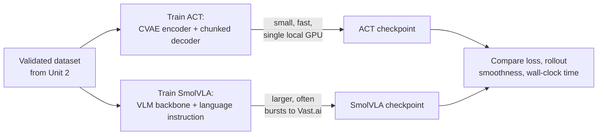

# Ai Robot Arm Project — Unit 3: Train ACT and SmolVLA on Your Datasets

With a validated dataset from Unit 2, this unit turns raw demonstrations into a trained policy. You'll train two different model families — ACT and SmolVLA — on the same data and understand why they behave differently.

The flowchart below contrasts the two training paths from the same dataset through to a side-by-side comparison.



## ACT: Action Chunking Transformer

ACT is a transformer-based policy that predicts a short *chunk* of future actions (e.g. the next 50-100 joint-position targets) from a single observation, rather than predicting one action at a time. This matters because raw teleoperation data is noisy — humans hesitate, correct, and jitter — and predicting a whole chunk lets the model smooth over that noise while still reacting to new observations frequently (a technique called temporal ensembling, where overlapping chunk predictions are averaged at execution time). ACT uses a CVAE (conditional variational autoencoder) encoder during training to model the multi-modality of human demonstrations, but at inference time only the decoder is used, conditioned on the current camera images and robot state. It is comparatively small, trains fast on a single GPU, and is a strong first policy to get a task working end to end.

## SmolVLA: a compact vision-language-action model

SmolVLA is a small vision-language-action model: it combines a pretrained vision-language backbone with an action-generation head, and — unlike ACT — is conditioned on a natural-language instruction in addition to images and robot state. Practically, this means the same trained SmolVLA checkpoint can be pointed at different tasks by changing the instruction string, and it can transfer some visual/language understanding from its pretraining rather than learning everything from your small dataset alone. The tradeoff is size and compute: SmolVLA is a larger model than ACT, so training and inference are both heavier, and you'll see its benefits most clearly once you have multiple tasks or want language-driven task switching rather than one policy per task.

## Local training workflow

Both policies are typically trained the same way at a high level: point a training script at your saved dataset, pick a policy type, and let it optimize a supervised imitation loss (predicted action vs. recorded action) for a number of steps or epochs.

```bash
# train ACT locally on a single GPU
python -m lerobot.scripts.train \
  --dataset.repo_id=you/pick-and-place-cube \
  --policy.type=act \
  --output_dir=outputs/train/act_pick_cube \
  --batch_size=8 --steps=100000

# train SmolVLA on the same dataset
python -m lerobot.scripts.train \
  --dataset.repo_id=you/pick-and-place-cube \
  --policy.type=smolvla \
  --output_dir=outputs/train/smolvla_pick_cube \
  --batch_size=4 --steps=20000
```

Watch training loss and, if your tooling supports it, periodic rollout success rate — loss alone can look fine while the policy is actually failing at the task, especially with chunked action prediction.

## Training in the cloud with Vast.ai

Local GPUs are often too small or slow for comfortable SmolVLA training runs. Vast.ai rents spare GPU compute by the hour from a marketplace of providers, which makes it a cost-effective way to burst to a larger GPU for a training run without owning the hardware. The workflow is: package your dataset (upload it or push it to a shared dataset hub), rent an instance with enough VRAM for your batch size, run the same training command inside that instance, and pull the resulting checkpoint back down when training finishes. Treat the cloud run identically to a local one from a code perspective — only the machine underneath changes — which is exactly why organizing your training command as a single reproducible script pays off here.

## Comparing what you trained

After both runs finish, compare them on more than raw loss: check qualitative rollout behavior (does ACT's chunking make it smoother but slower to react to disturbances? does SmolVLA follow the instruction correctly if you collected data for more than one task?), and note training wall-clock and checkpoint size — these are the practical tradeoffs you'll be weighing again in Units 4 and 5 when you decide what to deploy where.

## Try it yourself

Train ACT on your Unit 2 dataset for a short run (a few thousand steps is enough to see the loss trend), then plot training loss over time and note the step at which it visibly plateaus. Compare that plateau point against your total planned training budget before committing to a full-length run.
