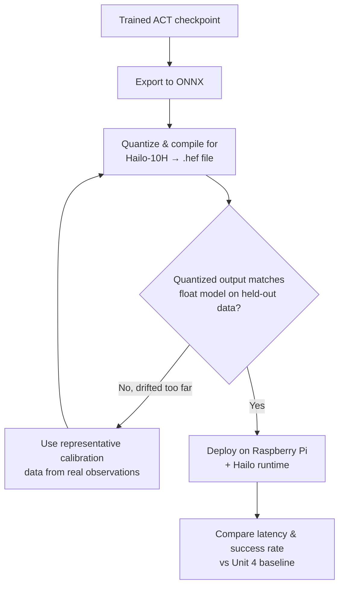

# Ai Robot Arm Project — Unit 5: Run Your ACT Policy on the Hailo-10H Edge NPU

The final unit takes the ACT policy you trained and deployed in Units 3-4 and moves inference onto a dedicated edge AI accelerator — a Hailo NPU attached to a Raspberry Pi — so the arm can run its policy without a laptop or cloud GPU in the loop at all.

The flowchart below traces the checkpoint through export, compilation, and validation, including the loop back to recompiling when quantized outputs drift too far from the float model.



## Why an edge NPU

A Raspberry Pi's CPU can run a small ACT policy, but slowly and with high, inconsistent latency — bad news for a real-time control loop. An edge NPU like the Hailo-10H is a dedicated chip built for neural-network inference: it offloads the matrix-multiply-heavy forward pass of your model to hardware designed for exactly that, giving you much higher and more predictable frames-per-second than the Pi's general-purpose CPU, at a fraction of the power draw of a discrete GPU. This is the same "run trained models cheaply and locally" trade you see across embedded AI generally — you already trade accuracy/flexibility for efficiency when you go from a big server GPU to a laptop; the Hailo module pushes that trade one step further, onto a battery-friendly, arm-mountable board.

## From checkpoint to edge-ready model

Edge NPUs don't run your training framework's model object directly — they run a compiled, quantized graph in the accelerator's own format. The general pipeline looks like:

1. **Export** your trained ACT checkpoint to an intermediate exchange format such as ONNX.
2. **Quantize and compile** that graph for the target NPU using the vendor's toolchain (Hailo's SDK/Dataflow Compiler ingests ONNX and produces a `.hef` file for their runtime).
3. **Validate** that quantized outputs still match the original float model closely enough on a held-out batch of your own logged observations — quantization can silently degrade accuracy, and the only way to catch that is comparing outputs, not trusting the conversion step blindly.

```bash
# conceptual export step (exact flags depend on your training framework version)
python -m lerobot.scripts.export_policy \
  --policy.path=outputs/train/act_pick_cube/checkpoint-final \
  --format=onnx --output=act_pick_cube.onnx

# compile for the Hailo NPU using the vendor toolchain
hailomz compile act_pick_cube.onnx --hw-arch hailo10h --output act_pick_cube.hef
```

## Running inference on the Raspberry Pi + Hailo module

Once compiled, the inference loop on the Pi looks structurally identical to the local-inference loop from Unit 4 — read camera and joint state, run a forward pass, write the action — except the forward pass now calls into the Hailo runtime instead of your training framework:

```python
from hailo_platform import HEF, VDevice

hef = HEF("act_pick_cube.hef")
with VDevice() as device:
    network_group = device.configure(hef)[0]
    with network_group.activate():
        obs = {"image": camera.read(), "state": follower_bus.read("Present_Position")}
        action = run_inference(network_group, obs)   # wraps the Hailo call, returns joint targets
        follower_bus.write("Goal_Position", action)
```

The servo control code you already wrote for Unit 4 is unchanged — only where the "predict the action" step executes has moved.

## Performance and accuracy tradeoffs

Measure two things once this is running: throughput (inference rate, ideally matching or exceeding your desired control frequency) and task success rate compared to your Unit 4 GPU/CPU baseline. A small accuracy drop from quantization is normal and often acceptable; a large one usually means you need a representative calibration dataset for the quantizer (real observations from your actual task, not synthetic/random inputs) rather than a fundamentally different model. If success rate holds up close to your baseline while latency drops, you've achieved the whole point of this unit: a self-contained arm that runs its own trained brain with no laptop or cloud dependency at inference time.

## Try it yourself

Compile your ACT checkpoint for the Hailo module, then run the same 20-trial evaluation protocol from Unit 4's exercise on the edge-deployed version. Compare success rate and average inference latency directly against your local-GPU numbers and note whether the gap (if any) is acceptable for this task.
