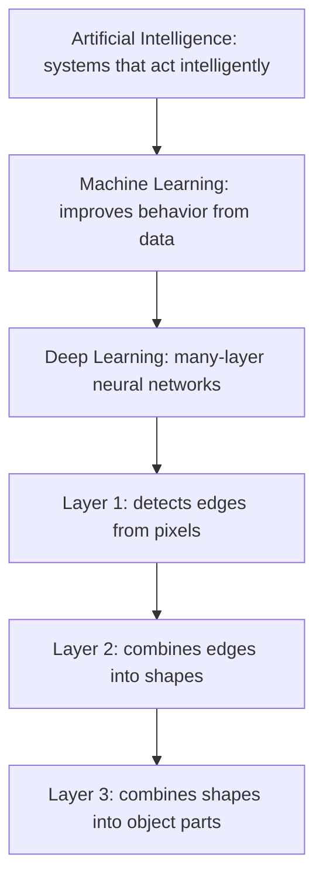

# Deep Learning Basics — Unit 1: Introduction to Deep Learning

This unit orients you before the math starts: it places deep learning inside the broader AI/ML landscape, previews the seven-unit arc of the course, and tells you what you need to already know to get the most out of it.

The diagram below shows deep learning's place inside the AI/ML hierarchy and, concretely, what stacking layers buys you — each layer composing simple features from the one before it.

## Where deep learning sits: AI, ML, and DL
Artificial intelligence is the broad goal of building systems that perform tasks we associate with intelligence. Machine learning is a subset of AI: instead of hand-coding rules, you write an algorithm that improves its behavior from data. Deep learning is a subset of ML: it specifically uses neural networks with many layers ("deep" stacks) to learn hierarchical representations directly from raw or lightly processed data.

The practical distinction that matters for robotics: classical ML (decision trees, SVMs, logistic regression) typically needs you to hand-engineer features — you decide what a "useful edge" or "useful sensor statistic" looks like before the algorithm ever sees the data. Deep learning pushes that feature-engineering step into the model itself. A convolutional network learns what edges and textures matter directly from pixels; you don't write that code by hand. That's the shift that unlocked most of the last decade's breakthroughs — image classification, speech recognition, language models, and increasingly, end-to-end robot perception and control.

## What "deep" actually buys you
A single-layer network (a perceptron) can only separate data that is linearly separable. Stacking layers — each one a linear transform followed by a nonlinearity — lets the network compose simple functions into arbitrarily complex ones. Layer 1 might learn to detect edges from pixels; layer 2 combines edges into shapes; layer 3 combines shapes into object parts, and so on. This compositional structure is why deep networks generalize better per-parameter than wide shallow ones on most real-world data — you'll see the theoretical argument for this in Unit 3 when we contrast shallow vs. deep architectures directly.

## Course roadmap
The six units after this one build in a strict dependency chain:
1. **Unit 2 (Neural Networks)** — the perceptron, activation functions, and shallow (single-hidden-layer) networks. This is the vocabulary everything else is built on.
2. **Unit 3 (Deep Neural Networks)** — stacking hidden layers, ReLU activations, and why depth outperforms width in practice.
3. **Unit 4 (The Training Process)** — the full supervised-learning pipeline: data collection, loss functions, gradient-based optimization, and generalization (train/test splits, bias/variance).
4. **Unit 5 (Global Exercise)** — a capstone: train a character-recognition network end to end, from raw pixels to a working inference pipeline.
5. **Unit 6 (Optimization, Initialization, Regularization)** — the engineering details that separate a network that trains from one that doesn't: SGD/Momentum/Adam, backpropagation, Xavier/He initialization, dropout, and weight decay.
6. **Unit 7 (Convolutional Networks)** — the architecture family purpose-built for images, and how it plugs into robot perception pipelines.

Each unit assumes the vocabulary and code patterns from the previous one, so work through them in order the first time.

## What you should already know
You should be comfortable programming in Python (this course leans on NumPy-style array thinking and later PyTorch), and comfortable with the basics of linear algebra (vectors, matrices, dot products) and calculus (derivatives, chain rule) — you don't need to be fluent, but the notation will not be re-derived from scratch. No prior ROS 2 or robotics-specific knowledge is assumed for the deep learning concepts themselves; where robotics context is used (camera feeds, sensor logs) it's illustrative, not a hard dependency.

## Try it yourself
Before Unit 2, write down — in your own words, one or two sentences each — what you currently think a "neuron," a "layer," and "training" mean in a neural network. Keep that note. After finishing Unit 4, reread it and rewrite it: comparing your before/after understanding is a fast way to see exactly which concepts this course changed for you.
