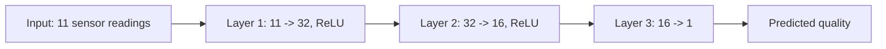

# Deep Learning Basics — Unit 3: Deep Neural Networks

Unit 2 showed that one hidden layer is theoretically enough to approximate any function. This unit shows why that's rarely how it's done in practice, and builds up the stacked-layer architecture that gives deep learning its name.

The diagram below traces the sauce-quality example's `11 -> 32 -> 16 -> 1` layer stack, showing depth as several narrower layers chained together instead of one wide layer.



## From shallow to deep: applying a shallow network to a harder problem
Take the Gatekeeper robot's next challenge: predicting a pasta sauce's quality rating from an 11-dimensional sensor reading (acidity, viscosity, salt content, and so on). In principle, Unit 2's Universal Approximation Theorem says a shallow network can learn this — but to carve up an 11-dimensional input space finely enough with a single layer of "kinks," you need a combinatorial explosion of hidden neurons. The shallow network becomes wide, slow to train, and prone to overfitting long before it fits the data well. That practical wall is the motivation for going deep instead of wide.

## Partitioning the input space, revisited
Each hidden neuron with a ReLU activation defines a hyperplane that splits the input space in two, and the network's output is piecewise-linear across the regions those hyperplanes carve out. A single hidden layer with `k` neurons can produce at most a bounded number of such regions, growing polynomially with `k`. Stacking layers changes the growth rate: composing layers lets the number of representable regions grow *exponentially* with depth, because each layer can re-partition the regions produced by the layer before it. That's the mathematical crux of "depth is efficient": the same "resolution" of function approximation costs far fewer total parameters when spread across layers instead of packed into one wide layer.

## Generalizing to deep networks
A deep network is just shallow networks composed — the output of one becomes the input of the next:

```python
def deep_net(x, layers):
    """
    layers: list of (W, b) tuples, one per layer.
    Applies ReLU after every layer except the last.
    """
    a = x
    for i, (W, b) in enumerate(layers):
        z = W @ a + b
        a = relu(z) if i < len(layers) - 1 else z
    return a
```

Each layer's weight matrix `W` has shape `(units_in_this_layer, units_in_previous_layer)`. Stack three or four of these and you have a genuinely deep network — nothing conceptually new versus Unit 2's shallow network, just the same building block repeated.

## Worked example: predicting sauce quality
Given the Gatekeeper's historical dataset of (11 sensor readings → quality rating) pairs, a deep regression network might use layer sizes like `11 -> 32 -> 16 -> 1`:

```python
import numpy as np

def relu(z):
    return np.maximum(0, z)

def init_layer(n_in, n_out, rng):
    W = rng.normal(0, np.sqrt(2 / n_in), size=(n_out, n_in))  # He-style scale
    b = np.zeros(n_out)
    return W, b

rng = np.random.default_rng(0)
layers = [init_layer(11, 32, rng), init_layer(32, 16, rng), init_layer(16, 1, rng)]

sample_sensor_reading = rng.normal(size=11)
predicted_quality = deep_net(sample_sensor_reading, layers)
```

At this stage the network's predictions are meaningless — the weights are random. Unit 4 covers how training turns this random function into a useful one.

## Are many layers actually needed?
Empirically, yes, for most nontrivial real-world tasks — image recognition, speech, and language models all use tens to hundreds of layers. But depth isn't free: deeper networks are harder to optimize (vanishing/exploding gradients, covered in Unit 6), need more careful initialization, and can overfit small datasets just as easily as an overly wide shallow network. The practical answer used throughout this course and in industry is: start with a moderate depth appropriate to your data size and problem complexity, and add depth only when a shallower network provably underfits — not by default.

## Try it yourself
Modify the `deep_net` example to use layer sizes `11 -> 4 -> 1` instead of `11 -> 32 -> 16 -> 1`. Count the total number of learnable parameters (weights + biases) in each version. This is the concrete trade-off behind "depth vs. width": notice how much representational capacity you get per parameter as you add layers versus widening a single layer.
