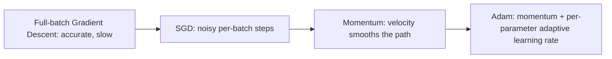

# Deep Learning Basics — Unit 6: Optimization, Gradient Initialization and Regularization

Units 4-5 used gradient descent and Adam as black boxes. This unit opens them up: how gradients are actually computed (backpropagation), how optimizers improve on plain gradient descent, how initial weights are chosen, and how overfitting is controlled.

The diagram below shows how each optimizer covered in this unit builds directly on the one before it, adding one new idea at a time.



## Introduction to gradient descent, revisited
Recall the update rule `w = w - lr * dL/dw`. Two things this unit adds to that picture: first, `dL/dw` for a deep network with millions of parameters isn't computed by hand — it needs an algorithm (backpropagation). Second, plain ("vanilla") gradient descent is rarely used as-is in practice; it's slow to converge and sensitive to the learning rate, which is why SGD variants exist.

## Stochastic Gradient Descent
Full-batch gradient descent computes the loss gradient over the *entire* training set before taking one step — accurate but slow, and infeasible for large datasets. Stochastic Gradient Descent (SGD) instead estimates the gradient from a single example or small batch, taking many more, noisier steps per unit of data seen:

```python
import numpy as np

def sgd_step(w, x, y_true, model_fn, loss_grad_fn, lr):
    y_pred = model_fn(w, x)
    grad = loss_grad_fn(w, x, y_true, y_pred)
    return w - lr * grad
```

The noise in each step is not purely a downside — it can help SGD escape shallow local minima that full-batch gradient descent would settle into.

## Momentum
Momentum accelerates SGD by maintaining a velocity vector that blends the current gradient with the direction of previous updates, damping oscillations in narrow valleys of the loss landscape:

```python
def momentum_step(w, v, grad, lr, beta=0.9):
    v = beta * v + (1 - beta) * grad
    w = w - lr * v
    return w, v
```

Think of it as a ball rolling downhill: it builds speed in a consistent direction and doesn't reverse instantly when the local gradient briefly points the other way.

## Adam optimization
Adam combines momentum with per-parameter adaptive learning rates, using running estimates of both the gradient's mean and its variance:

```python
def adam_step(w, m, v, grad, t, lr=1e-3, b1=0.9, b2=0.999, eps=1e-8):
    m = b1 * m + (1 - b1) * grad
    v = b2 * v + (1 - b2) * grad**2
    m_hat = m / (1 - b1**t)
    v_hat = v / (1 - b2**t)
    w = w - lr * m_hat / (np.sqrt(v_hat) + eps)
    return w, m, v
```

Adam tends to converge faster and needs less learning-rate tuning than plain SGD or Momentum, especially on loss surfaces with very different curvature along different parameter directions (anisotropic landscapes) — which is common in deep networks. It's the default optimizer choice in most of this course, and in `torch.optim.Adam` used in Unit 5.

## Backpropagation
Backpropagation is the algorithm that computes `dL/dw` for every parameter in a deep network efficiently, using the chain rule. It has two passes: a forward pass computes and *stores* every layer's activation, then a backward pass propagates the loss gradient from the output back toward the input, layer by layer, reusing the stored activations at each step:

```
forward:  a0 = x -> z1 = W1@a0+b1 -> a1 = relu(z1) -> z2 = W2@a1+b2 -> loss
backward: dL/dz2 -> dL/dW2, dL/da1 -> dL/dz1 -> dL/dW1, dL/da0
```

Frameworks like PyTorch automate this entirely via `loss.backward()`, but understanding the two-pass structure explains why deep networks need memory proportional to their depth during training (every intermediate activation must be kept until the backward pass uses it).

## Parameter initialization
Starting all weights at zero (or all the same value) breaks training — every neuron in a layer would compute identical gradients and stay identical forever (a symmetry problem). Randomizing weights fixes symmetry, but the *scale* of that randomness matters: too large and activations/gradients explode through layers; too small and they vanish. Xavier/Glorot initialization (for sigmoid/tanh) and He initialization (for ReLU) pick the random scale as a function of the layer's input size specifically to keep activation variance roughly constant from layer to layer:

```python
def he_init(n_in, n_out, rng):
    return rng.normal(0, np.sqrt(2 / n_in), size=(n_out, n_in))
```

## Explicit and implicit regularization
Explicit regularization adds a penalty term directly to the loss — L2 (weight decay) penalizes large weights, controlled by a hyperparameter `lambda`:

```
L_total = L_data + lambda * sum(w**2 for w in all_weights)
```

Implicit regularization is the generalization benefit that shows up *without* an explicit penalty term, arising from the optimization process itself — SGD's mini-batch noise, and stopping training before full convergence (early stopping), both tend to bias the model toward simpler solutions even though nothing in the loss function explicitly asks for that.

## Heuristics that improve performance
A handful of widely-used techniques round out practical training: learning-rate scheduling (reducing the learning rate over training), dropout (randomly zeroing a fraction of activations during training to prevent co-adaptation between neurons), batch normalization (normalizing layer inputs across a batch to stabilize training), data augmentation (synthetically expanding the training set with transformed copies of existing examples), and early stopping (halting when validation loss stops improving, even if training loss keeps dropping).

## Try it yourself
Implement `sgd_step`, `momentum_step`, and `adam_step` above as three interchangeable optimizers over the same toy loss function — e.g., `f(w) = w[0]**2 + 10*w[1]**2` (an anisotropic bowl). Run all three from the same starting point for a fixed number of steps and plot the (w[0], w[1]) trajectory of each. You should see Momentum and Adam reach the minimum in noticeably fewer, straighter steps than plain SGD.
