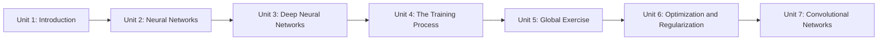

# Deep Learning Basics

This course is a first step into neural networks — the shared foundation underneath most modern AI, including a growing share of robotics perception and control. It builds up from a single artificial neuron to stacked deep networks and convolutional architectures, treating the full supervised-learning pipeline (data, loss, optimization, regularization, generalization) as a first-class topic rather than an afterthought, and closes with a hands-on capstone and a dedicated unit on the convolutional networks that dominate robot vision.

The diagram below shows how each unit's concepts build directly on the one before it, in the strict dependency order the course expects you to follow.

1. [Introduction to Deep Learning](01-introduction-to-deep-learning.md) — Places deep learning within AI/ML, previews the course roadmap, and lists the background you should already have.
2. [Neural Networks](02-neural-networks.md) — The perceptron, connecting neurons into shallow networks, and the Universal Approximation Theorem.
3. [Deep Neural Networks](03-deep-neural-networks.md) — Stacking hidden layers with ReLU activations, and why depth beats width in practice.
4. [The Training Process](04-the-training-process.md) — Data collection/preprocessing, loss functions, gradient-based parameter updates, and honestly measuring generalization.
5. [Global Exercise](05-global-exercise.md) — Capstone: train a feedforward network for alphanumeric character recognition end to end.
6. [Optimization, Gradient Initialization and Regularization](06-optimization-gradient-initialization-and-regularization.md) — SGD, Momentum, Adam, backpropagation, weight initialization, and regularization techniques.
7. [Convolutional Networks](07-convolutional-networks.md) — CNNs for image data: convolution, pooling, and robotics vision applications.
