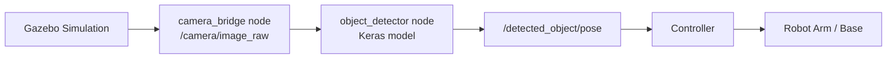

# Deep Learning with Domain Randomization — Unit 1: Quick Demo

This unit is a preview, not a lesson in the usual sense: you'll run a finished perception pipeline end to end before building any piece of it yourself, so the rest of the course has a concrete target to build toward.

The diagram below traces the five-stage pipeline you're running today, from simulated camera frame to robot motion.



## The pipeline you're about to run
The finished system in this course is a chain of five stages: a Gazebo simulation renders a scene containing a target object (a can of "SPAM", used as a stand-in for any small graspable item), a camera topic publishes RGB frames, a trained Keras model consumes each frame and regresses the object's 3D position, a ROS node republishes that position as a pose message, and a simple controller drives a robot arm or base toward it. By the end of the course you will have built every one of those stages yourself. Today you only run the last two — inference and control — against a model that's already trained, so you can see what "done" looks like.

## Setting up your workspace
You need three things on your machine or VM: a ROS 2 workspace with a Gazebo-compatible simulator, Python 3 with `tensorflow`/`keras` installed, and the demo package (a small `perception_demo` package with a launch file). The setup pattern is the same one you'll reuse for the rest of the course:

```bash
mkdir -p ~/dl_dr_ws/src && cd ~/dl_dr_ws
# clone or copy the course's demo package into src/
colcon build --symlink-install
source install/setup.bash
ros2 launch perception_demo quick_demo.launch.py
```

The launch file starts three nodes: the Gazebo world, a `camera_bridge` node that republishes simulated images on `/camera/image_raw`, and an `object_detector` node that loads a pre-trained `.h5` Keras model and publishes `/detected_object/pose`.

## Running the pre-trained demo model
The detector node itself is short enough to read end to end — this is the shape every detector node in this course will take, just with the model getting smarter as you go:

```python
import rclpy
from rclpy.node import Node
from sensor_msgs.msg import Image
from geometry_msgs.msg import PointStamped
from cv_bridge import CvBridge
from tensorflow import keras
import numpy as np

class ObjectDetector(Node):
    def __init__(self):
        super().__init__('object_detector')
        self.model = keras.models.load_model('models/spam_locator.h5')
        self.bridge = CvBridge()
        self.sub = self.create_subscription(Image, '/camera/image_raw', self.on_image, 10)
        self.pub = self.create_publisher(PointStamped, '/detected_object/pose', 10)
        self.declare_parameter('confidence_threshold', 0.5)

    def on_image(self, msg: Image):
        frame = self.bridge.imgmsg_to_cv2(msg, 'rgb8')
        batch = np.expand_dims(frame / 255.0, axis=0)
        xyz = self.model.predict(batch, verbose=0)[0]
        out = PointStamped()
        out.header = msg.header
        out.point.x, out.point.y, out.point.z = [float(v) for v in xyz]
        self.pub.publish(out)
```

Watch the output live with `ros2 topic echo /detected_object/pose` while the object moves in the simulated scene, and you'll see the predicted XYZ track it.

## Try it yourself
Launch the demo, then change the `confidence_threshold` parameter at runtime with `ros2 param set /object_detector confidence_threshold 0.9` and watch how the publish rate or jitter on `/detected_object/pose` changes. Note down what you observe — you'll build the training pipeline that produces this exact model starting in Unit 2, and this gives you a baseline for "what good detections look like" to compare against.
