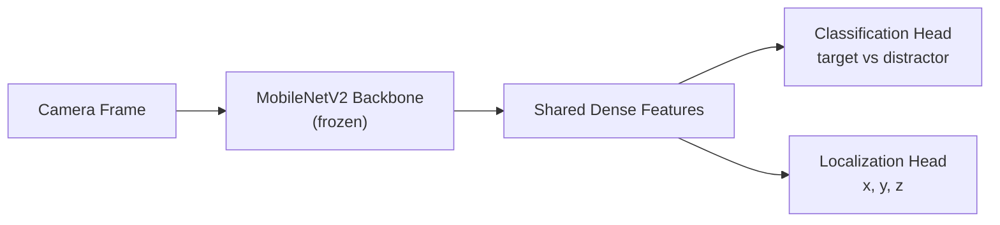

# Deep Learning with Domain Randomization — Unit 4: Exercises for Spam and a Distractor

So far the model has only ever seen one object in the scene, so it never had to decide *which* object to point at — it just pointed at "the thing." This unit adds a second, similarly-shaped object that also moves, forcing the model to actually discriminate the target from a lookalike.

The diagram below shows how the two-headed model shares backbone features but branches into a classification output and a localization output.



## The distractor problem in object detection
A pure regression model trained on scenes with a single object will happily learn "predict the centroid of whatever's salient in this frame" without ever learning what makes the target *the target*. Add a second object and that shortcut breaks immediately — the model has no signal telling it which one to track, and its predictions become an average of both, or it locks onto whichever object happens to be more visually prominent. This is a general pitfall in supervised perception: a model is only as discriminative as the hardest examples in its training set, so a dataset without confusable near-misses (hard negatives) systematically overstates how good the model actually is.

## Multi-task head: classification + localization
The fix is to make the model explicitly answer two questions at once: "is the target present/which object is this," and "where is it." A functional-API model with two output heads sharing the same backbone features does this cleanly:

```python
from tensorflow.keras import layers, Model
from tensorflow.keras.applications import MobileNetV2

base = MobileNetV2(input_shape=(224, 224, 3), include_top=False, weights='imagenet')
base.trainable = False
features = layers.GlobalAveragePooling2D()(base.output)
shared = layers.Dense(64, activation='relu')(features)

class_out = layers.Dense(2, activation='softmax', name='class_output')(shared)   # [target, distractor]
loc_out = layers.Dense(3, activation='linear', name='location_output')(shared)   # x, y, z

model = Model(base.input, [class_out, loc_out])
model.compile(
    optimizer='adam',
    loss={'class_output': 'sparse_categorical_crossentropy', 'location_output': 'mse'},
    loss_weights={'class_output': 1.0, 'location_output': 1.0},
    metrics={'class_output': 'accuracy', 'location_output': 'mae'},
)
```

`loss_weights` matters here: classification loss (cross-entropy, typically order 0.1-1.0) and regression loss (MSE in meters², which can be much smaller) sit on different scales, so an unbalanced sum can let one task dominate training. Watch both metrics during training, not just total loss, and adjust the weights if one task's metric stalls while the other keeps improving.

## Building a balanced dataset with distractors
Extend the `DatasetCollector` from Unit 2 to log which object is in frame per sample — spawn the distractor at random and record a class label (0 = target, 1 = distractor) alongside the XYZ, and crucially, only supply a valid location label for frames where the *target* is visible (mask out or skip distractor-only frames from the location loss, since "where is the target" is undefined when it isn't there). Aim for close to a 50/50 split between target-present and distractor-present frames; a lopsided dataset teaches the classifier to bias toward whichever class is more common regardless of the image.

## Evaluating confusion between target and distractor
A confusion matrix on the held-out validation set tells you exactly where the model breaks down:

```python
from sklearn.metrics import confusion_matrix
import numpy as np

y_pred = np.argmax(model.predict(val_images)[0], axis=1)
print(confusion_matrix(val_labels, y_pred))
```

If the off-diagonal (target misclassified as distractor or vice versa) stays high even after training converges, the two objects may be too visually similar for the current image resolution or backbone to separate — worth checking before assuming it's purely a data-quantity problem.

## Try it yourself
Add a second object of a visibly different color to your Gazebo scene, collect a balanced target/distractor dataset of at least 400 frames, train the two-head model above, and report both the classification accuracy and the location MAE restricted to target-present frames.
