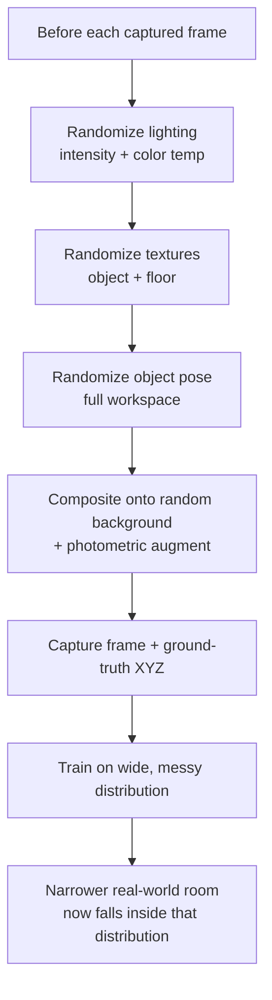

# Deep Learning with Domain Randomization — Unit 5: Exercises with Distractor and Random Env

This is the unit the course is named for. Everything so far trained in one fixed lighting setup and one fixed background — fine for the simulator, useless the moment the model meets a real camera in a real room. Domain randomization closes that gap by making the *training* distribution deliberately wider and messier than any single environment, simulated or real.

The diagram below traces the randomization loop applied before every captured frame, and why it makes the real world just another point inside the training distribution.



## What domain randomization solves: the reality gap
A model trained exclusively on clean, consistent simulated renders learns to rely on cues that are artifacts of the simulator — a specific lighting angle, a specific floor texture, the absence of sensor noise — rather than the object's actual visual features. When you then deploy that model against a real camera, none of those crutches are present, and accuracy collapses even though the object itself looks "the same" to a human. Domain randomization's insight, developed originally for exactly this sim-to-real transfer problem, is counterintuitive: instead of trying to make the simulation photorealistic (hard, expensive, never perfect), make it *unrealistically* varied — randomize lighting, textures, colors, camera noise, and backgrounds far beyond what reality will actually throw at the model. If the model learns to find the object correctly across thousands of wildly different renders, the narrower band of variation in one real room becomes just another point inside a distribution it already handles.

## Randomizing the Gazebo environment: lighting, textures, poses
Most simulators expose services or plugins to change scene properties at runtime without restarting. A randomization step between each data-collection sample might touch several axes:

```python
import random

def randomize_scene(set_light_srv, set_material_srv, teleport_srv):
    # lighting: intensity and color temperature
    set_light_srv(intensity=random.uniform(0.3, 1.5),
                   color=(random.uniform(0.8, 1.0), random.uniform(0.8, 1.0), random.uniform(0.8, 1.0)))
    # object and floor material/texture
    set_material_srv('spam_can', texture=random.choice(TEXTURE_POOL))
    set_material_srv('ground_plane', texture=random.choice(FLOOR_TEXTURE_POOL))
    # object pose across the full reachable workspace, not just a small patch
    teleport_srv('spam_can', x=random.uniform(-0.4, 0.4), y=random.uniform(-0.4, 0.4), z=0.1,
                 yaw=random.uniform(0, 6.28))
```

Call `randomize_scene(...)` immediately before each frame you save in your `DatasetCollector` loop from Unit 2, so every training example comes from a genuinely different-looking world rather than a handful of environments repeated many times.

## Augmenting with large-scale background datasets
Simulator randomization alone is still bounded by what the simulator can render. A cheap way to widen the distribution further is to composite the rendered object onto backgrounds sampled from a large, unrelated image dataset, and apply standard photometric augmentation on top:

```python
from tensorflow.keras.preprocessing.image import ImageDataGenerator

augmenter = ImageDataGenerator(
    brightness_range=(0.5, 1.5),
    channel_shift_range=30.0,
    zoom_range=0.15,
    horizontal_flip=False,  # keep off: it would invalidate your X label's sign
)
```

Be deliberate about which augmentations are safe: geometric transforms like flips or rotations that a camera would never actually undergo can silently corrupt your position labels, since the label was computed for the un-augmented frame. Photometric augmentations (brightness, color, noise, blur) are safe by default because they don't move anything in the image.

## Training at scale and monitoring for overfitting
Domain-randomized datasets need to be bigger than the earlier units' — thousands rather than hundreds of frames — because the model now has to learn invariances, not just a mapping. Track train vs. validation loss curves closely: an unusually large gap where validation loss climbs while train loss keeps falling is a sign the randomization space is too narrow relative to the model's capacity (it's memorizing the randomized set rather than generalizing), while curves that never fully separate but plateau higher than earlier units is expected — DR trades peak in-simulation accuracy for real-world robustness, so a slightly worse validation MAE here can still be a strictly better model outside the simulator.

## Try it yourself
Re-run your Unit 4 distractor dataset collection with `randomize_scene` wired into the loop, generating at least 1,500 frames. Train the multi-task model from Unit 4 on this randomized set, then evaluate it against a handful of frames captured under lighting/background conditions you *never* randomized over (a condition held out on purpose) — the gap between validation MAE and this held-out MAE is your best available proxy for how the model will behave on a real camera.
