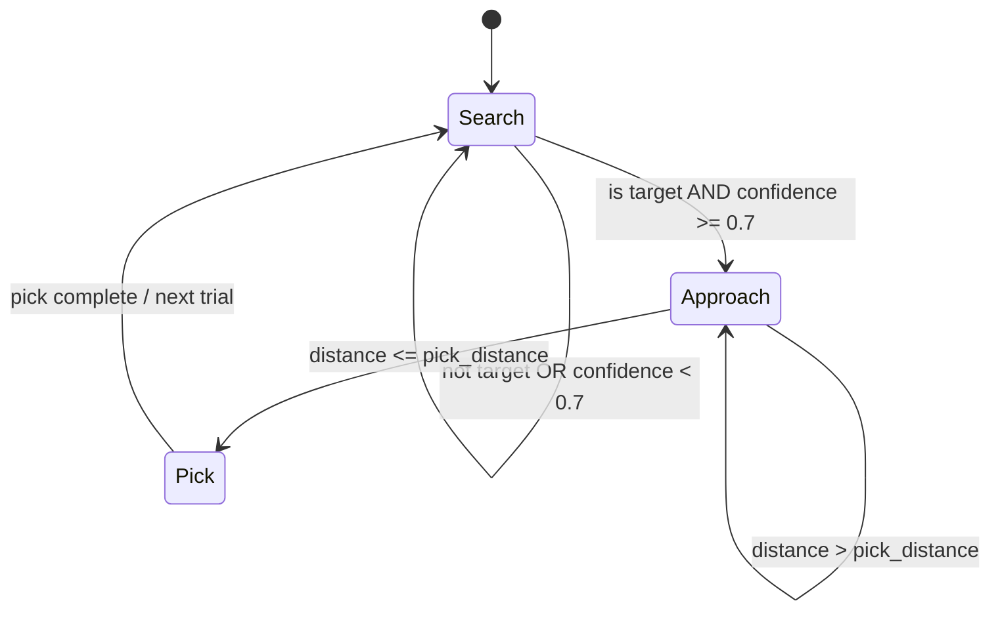

# Deep Learning with Domain Randomization — Unit 6: Microproject Garbage Collector

This is the capstone: everything from Units 1-5 — data generation, transfer learning, fine-tuning, multi-object discrimination, and domain randomization — gets assembled into one working robot behavior. The robot must find a target object among distractors, approach it to picking distance, and pick it up.

The diagram below shows the decide stage's search/approach/pick state machine that the `on_detection` callback implements.



## Project architecture: perceive, decide, act
Structuring the system as three loosely coupled stages keeps each piece testable on its own and mirrors how most real perception-driven manipulation stacks are built:
- **Perceive** — the trained model (Units 4-5's multi-task classifier + locator) turns camera frames into "is the target visible, and if so where" at some steady rate.
- **Decide** — a small state machine turns a stream of detections into a discrete decision: search, approach, or pick. It's deliberately simple here (a few `if`/`elif` branches on distance and confidence), not a planner — the point of this course is the perception pipeline, not decision-making sophistication.
- **Act** — a proportional controller drives the base or arm toward the detected position, and a manipulation call (an action server, or a MoveIt planning request if your arm has one configured) executes the pick once close enough.

Keeping these as separate ROS nodes communicating over topics/services means you can test perception in isolation (echo the detection topic with the arm disabled) before ever risking a bad pick attempt.

## Wiring the trained model into a ROS node
This node is the Unit 1 demo node's shape, but now with the two-headed model from Units 4-5 and a confidence gate before it trusts a detection:

```python
class GarbageDetector(Node):
    def __init__(self):
        super().__init__('garbage_detector')
        self.model = keras.models.load_model('models/spam_locator_dr.h5')
        self.bridge = CvBridge()
        self.create_subscription(Image, '/camera/image_raw', self.on_image, 10)
        self.pub = self.create_publisher(DetectionResult, '/garbage/detection', 10)

    def on_image(self, msg: Image):
        frame = self.bridge.imgmsg_to_cv2(msg, 'rgb8')
        batch = np.expand_dims(frame / 255.0, axis=0)
        class_probs, xyz = [o[0] for o in self.model.predict(batch, verbose=0)]
        result = DetectionResult()
        result.header = msg.header
        result.is_target = bool(np.argmax(class_probs) == 0)
        result.confidence = float(np.max(class_probs))
        result.point.x, result.point.y, result.point.z = [float(v) for v in xyz]
        self.pub.publish(result)
```

`DetectionResult` here is a small custom message combining a bool, a float confidence, and a `Point` — defining a purpose-built message keeps the decide/act stages from having to re-derive "is this detection trustworthy" from raw floats.

## Approaching and picking the target amid distractors
The decision loop consumes `/garbage/detection` and only acts on detections that are both classified as the target *and* above a confidence threshold — this is where the classification head from Unit 4 earns its keep, since without it the robot would happily chase the distractor:

```python
def on_detection(self, det):
    if not det.is_target or det.confidence < 0.7:
        self.state = 'search'
        return
    distance = math.hypot(det.point.x - self.base_x, det.point.y - self.base_y)
    if distance > self.pick_distance:
        self.state = 'approach'
        self.publish_velocity(towards=det.point, gain=0.3)
    else:
        self.state = 'pick'
        self.stop()
        self.call_pick_action(det.point)
```

A proportional gain (`gain=0.3` above) on the approach velocity is enough for this project — the goal is a working pipeline, not a tuned controller, and an overly aggressive gain will just make the robot overshoot the object.

## Testing and iterating
Evaluate the whole pipeline the way you'd evaluate any stochastic system: run many trials, not one. Randomize target and distractor starting positions each trial (reusing the `randomize_scene` helper from Unit 5, restricted to poses rather than lighting/texture so trials stay comparable), and log outcome (pick succeeded / wrong object grabbed / timed out) per trial. A single successful run tells you the happy path works; a success rate across 20+ randomized trials tells you whether the perception model you spent five units building actually generalizes.

## Try it yourself
Run the full garbage-collector pipeline for 20 trials with randomized target/distractor placement, and report a simple success-rate table (successful target picks / wrong-object grabs / timeouts). For any failure category above zero, look at the corresponding detection log — cross-referencing failures against confidence scores usually reveals whether the fix belongs in the perception model (retrain with more of that scenario) or in the decision threshold (tune `confidence < 0.7`).
