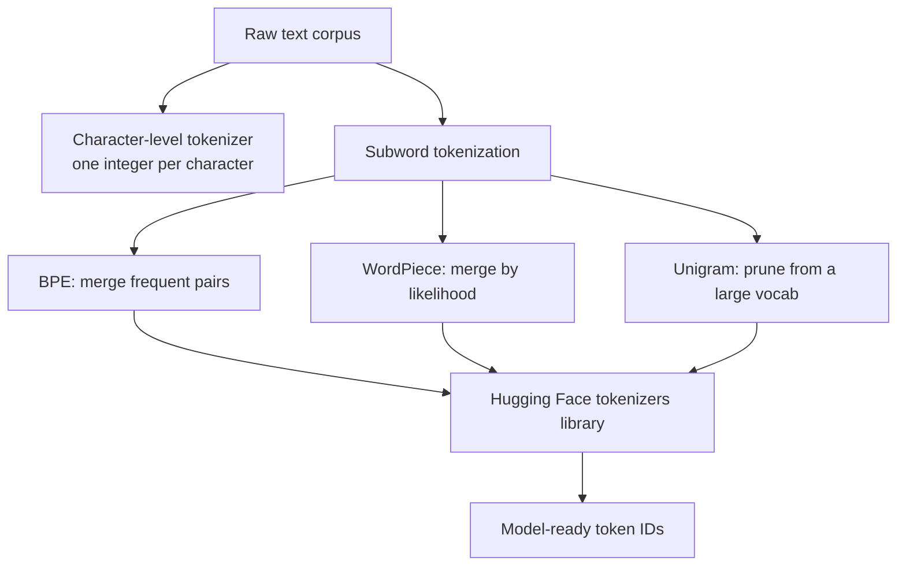

# Generative AI for Robotics — Unit 2: Tokenization and Data Foundations

Every generative language model operates on integers, not text. Tokenization is the process that turns raw strings into those integers (and back again), and the choices made here — vocabulary size, granularity, how unknown words are handled — shape everything downstream: model size, training speed, and how well the model generalizes. This unit builds that understanding from first principles before you touch a pretrained model.

The diagram below traces the path this unit follows, from a raw corpus down to the granularity choices (character, BPE, WordPiece, Unigram) that a production tokenizer library packages up.


## Why tokenization matters
A tokenizer defines the model's vocabulary: the fixed set of symbols it can read and write. Too coarse (whole words) and the vocabulary explodes and can't handle typos or new words. Too fine (raw bytes) and sequences become very long, making training and inference slower and harder to learn long-range structure from. Every modern LLM uses something in between — **subword** tokenization — so common words stay as single tokens while rare words split into meaningful pieces (`tokenization` → `token` + `##ization`).

## Exploring a corpus: vocabularies, sets, and iterables
Before building anything, look at your data. The classic toy dataset for this is Tiny Shakespeare — a few hundred KB of plays and sonnets, small enough to iterate on quickly:
```python
text = open("tinyshakespeare.txt").read()
vocab = sorted(set(text))          # unique characters
print(len(vocab), vocab[:10])      # 65 unique characters in the full works
```
That `set(text)` is doing real work: it collapses the corpus down to its full *working vocabulary* at the character level. Every character-level model built on this dataset will have exactly `len(vocab)` possible symbols to predict from at each step — a useful sanity check before you build anything larger.

## Building a character-level tokenizer from scratch
The simplest possible tokenizer maps each character to an integer and back:
```python
stoi = {ch: i for i, ch in enumerate(vocab)}
itos = {i: ch for ch, i in stoi.items()}

def encode(s): return [stoi[c] for c in s]
def decode(ids): return "".join(itos[i] for i in ids)

encode("hi there")  # -> [46, 47, 1, 58, ...]
```
This works, and it's a great way to see the mechanics with nothing hidden. But it doesn't scale: a character-level vocabulary forces the model to spend capacity re-learning that `t-h-e` almost always means "the," and sequences become very long relative to the information they carry. That motivates **subword** tokenization.

## Byte-Pair Encoding (BPE)
BPE, used by GPT and RoBERTa, builds its vocabulary bottom-up: start from individual characters, then repeatedly merge the *most frequent adjacent pair* into a new token, until you hit a target vocabulary size.
```python
from collections import Counter

def get_pair_counts(corpus_words):
    pairs = Counter()
    for word, freq in corpus_words.items():
        symbols = word.split()
        for a, b in zip(symbols, symbols[1:]):
            pairs[(a, b)] += freq
    return pairs

def merge_pair(pair, corpus_words):
    merged = {}
    bigram = " ".join(pair)
    replacement = "".join(pair)
    for word, freq in corpus_words.items():
        merged[word.replace(bigram, replacement)] = freq
    return merged
```
Run `get_pair_counts` → find the top pair → `merge_pair` → repeat for a fixed number of merges. The resulting vocabulary naturally contains whole common words and useful sub-word fragments, learned directly from your data rather than designed by hand. Vocabulary pruning afterward removes merges that turned out to add little value.

## WordPiece: BERT's likelihood-driven cousin
WordPiece (BERT, ELECTRA) mirrors BPE's merge loop with two differences: non-word-initial pieces are prefixed with `##` (so `##ization` marks a continuation, not a new word), and the pair chosen at each step maximizes the *likelihood* of the training data — roughly `count(pair) / (count(a) * count(b))` — instead of raw frequency. This favors merges that provide real statistical signal over merges that are merely common.

## Unigram, SentencePiece, and the Hugging Face `tokenizers` library
**Unigram** tokenization works top-down: start from a large candidate vocabulary and iteratively prune the tokens that hurt a probabilistic language model the least. **SentencePiece** is a language-agnostic wrapper that can run either BPE or Unigram directly on raw text (including whitespace as a token, `▁`), which is why it's the default for many multilingual models. You don't need to reimplement any of this in practice — the Hugging Face `tokenizers` library gives you production-grade, Rust-backed implementations of all of them:
```python
from tokenizers import Tokenizer, models, trainers, pre_tokenizers

tokenizer = Tokenizer(models.BPE())
tokenizer.pre_tokenizer = pre_tokenizers.Whitespace()
trainer = trainers.BpeTrainer(vocab_size=8000, special_tokens=["[UNK]", "[PAD]"])
tokenizer.train(["tinyshakespeare.txt"], trainer)
tokenizer.save("shakespeare-bpe.json")
```

## Try it yourself
Train a BPE tokenizer (via the `tokenizers` library, as above) with `vocab_size=500` on the Tiny Shakespeare corpus, then encode the same sentence with it and with a `vocab_size=5000` tokenizer. Compare the resulting token counts and print the actual subword pieces each one chose — this is the most direct way to feel the size/granularity tradeoff before you carry it into Unit 3, where these tokenizers feed real training runs.
