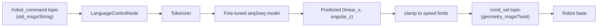

# Generative AI for Robotics — Unit 4: Natural Language Robot Control

This is the unit where generative AI stops being an abstract text exercise and starts moving a robot. You'll train a sequence-to-sequence model that maps natural language commands to differential-drive wheel velocities, then wire that model into a ROS 2 node so a real (or simulated) robot can act on it.

The diagram below shows how a typed or spoken command flows through the ROS 2 node built in this unit to become an actual `/cmd_vel` velocity command.


## From language to wheel velocities
The task is a translation problem: input is a string like "turn left slowly" and output is a pair of numbers, `(linear_x, angular_z)`, the standard differential-drive control signal published on `/cmd_vel`. Framing it this way lets you reuse the sequence-to-sequence machinery built for language translation — an encoder reads the command, a small regression or generation head produces the velocity pair — instead of inventing something bespoke. The pipeline has seven concrete steps, which is worth internalizing as a template you'll reuse in later units too: setup, data, model, tokenize, fine-tune, test in sim, test on hardware.

## Setup, dataset, and model selection (Steps 1-3)
**Setup** means creating a clean project structure before writing training code: a config file for hyperparameters, a directory for generated data, and a directory for checkpoints — this pays off the first time you need to rerun training with a tweak.

**Generating the training dataset** is usually the most important step for this kind of task, because natural robot commands are combinatorial (verb × direction × speed × modifier) and you rarely have enough hand-labeled examples. A template-and-sample approach covers the space efficiently:
```python
import random

verbs = ["move", "go", "drive", "head"]
directions = {"forward": (0.3, 0.0), "backward": (-0.3, 0.0), "left": (0.1, 0.5), "right": (0.1, -0.5)}
modifiers = {"slowly": 0.5, "quickly": 1.5, "": 1.0}

def sample():
    verb, direction, mod = random.choice(verbs), *random.choice(list(directions.items())), random.choice(list(modifiers))
    lin, ang = directions[direction]
    scale = modifiers[mod]
    text = f"{verb} {direction} {mod}".strip()
    return text, (lin * scale, ang * scale)
```
**Model selection** means picking a pretrained encoder-decoder or encoder-only checkpoint with a small footprint — something like `t5-small` or `distilbert-base-uncased` — since inference will eventually need to run close to real time on the robot, and the task's language complexity is genuinely small.

## Tokenizing, fine-tuning, and testing in simulation (Steps 4-6)
**Tokenize** the command strings with the tokenizer that matches your chosen model (Unit 2's `AutoTokenizer.from_pretrained(...)`, applied consistently at train and inference time — a mismatch here is a common, hard-to-spot bug). **Fine-tune** the model with a regression head replacing (or alongside) its language-modeling head, minimizing MSE between predicted and target `(linear_x, angular_z)`. **Test in simulation** before touching hardware: feed held-out command strings through the trained model and check the predicted velocities are sane (within the robot's actual speed limits, correct sign for direction) before publishing anything to a real actuator.

## From simulation to the real robot, and reviewing the code (Step 7)
Once simulation testing passes, wrap the model in a ROS 2 node:
```python
import rclpy
from rclpy.node import Node
from geometry_msgs.msg import Twist
from std_msgs.msg import String

class LanguageControlNode(Node):
    def __init__(self):
        super().__init__("language_control_node")
        self.model, self.tokenizer = load_trained_model()
        self.cmd_pub = self.create_publisher(Twist, "/cmd_vel", 10)
        self.create_subscription(String, "/robot_command", self.on_command, 10)

    def on_command(self, msg: String):
        lin, ang = predict_velocities(self.model, self.tokenizer, msg.data)
        twist = Twist()
        twist.linear.x, twist.angular.z = clamp(lin), clamp(ang)
        self.cmd_pub.publish(twist)
```
Publish test commands from the terminal and watch it move:
```bash
ros2 topic pub --once /robot_command std_msgs/String "data: 'turn left slowly'"
```
The **code review** step matters as much as writing the code the first time: revisit the dataset generator for coverage gaps, the tokenizer/model pairing for consistency, and — most importantly for anything touching real hardware — the `clamp()` call, which is your last line of defense against a confidently wrong prediction commanding an unsafe velocity.

## Try it yourself
Extend the dataset generator above with one new phrasing pattern the model hasn't seen (e.g. `"can you {verb} {direction}?"`), retrain, and check whether the model generalizes to that phrasing on commands it wasn't trained on with that exact wording. If it doesn't, that's covariate shift again — the same failure mode from imitation learning, showing up in language instead of vision.
