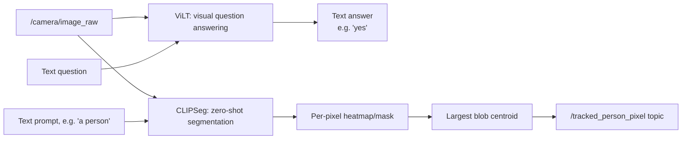

# Generative AI for Robotics — Unit 5: Vision-Language Models in Robotics

Language alone gets a robot part of the way — it still needs to connect words to what its camera actually sees. This unit introduces vision-language models (VLMs) that reason jointly about images and text, and applies them to a concrete robotics task: detecting and tracking a person using nothing but a natural-language description.

The diagram below shows how the same camera frame and text prompt feed the two complementary VLMs this unit covers, and how CLIPSeg's output specifically becomes a tracked pixel location.


## Visual question answering and zero-shot segmentation
Two complementary capabilities matter here. **Visual question answering (VQA)** takes an image and a text question and produces a text answer — "is there a person in this room?" → "yes, near the couch." **Zero-shot segmentation** takes an image and a text *prompt* and produces a pixel mask, without ever having been trained on your specific object categories — you can ask it to segment "person" or "red mug" and it generalizes from what it learned about language and images jointly, not from a fixed label set. Together, these replace a huge amount of what used to require training a bespoke object detector per object class.

## ViLT: a compact model for VQA
ViLT (Vision-and-Language Transformer) is a lightweight VQA model — it skips a heavy convolutional backbone and feeds image patches directly into a transformer alongside the text, which keeps it fast enough for interactive use:
```python
from transformers import ViltProcessor, ViltForQuestionAnswering
from PIL import Image

processor = ViltProcessor.from_pretrained("dandelin/vilt-b32-finetuned-vqa")
model = ViltForQuestionAnswering.from_pretrained("dandelin/vilt-b32-finetuned-vqa")

image = Image.open("camera_frame.jpg")
question = "Is there a person in this image?"

inputs = processor(image, question, return_tensors="pt")
outputs = model(**inputs)
answer = model.config.id2label[outputs.logits.argmax(-1).item()]
print(answer)  # e.g. "yes"
```
Wrapped in a simple command-line loop (read a question, run inference, print the answer, repeat), this becomes a fast way to interactively probe what a model does and doesn't understand about a given scene before you commit to using it in a robot's perception pipeline.

## CLIPSeg: segmentation from a text prompt
CLIPSeg extends CLIP's joint image-text embedding space to produce a per-pixel segmentation mask from a free-text prompt, rather than a fixed set of trained class labels:
```python
from transformers import CLIPSegProcessor, CLIPSegForImageSegmentation
import torch

processor = CLIPSegProcessor.from_pretrained("CIDAS/clipseg-rd64-refined")
model = CLIPSegForImageSegmentation.from_pretrained("CIDAS/clipseg-rd64-refined")

prompts = ["a person", "a red mug"]
inputs = processor(text=prompts, images=[image] * len(prompts), return_tensors="pt")
with torch.no_grad():
    outputs = model(**inputs)

masks = torch.sigmoid(outputs.logits)  # one heatmap per prompt, same H×W as the image
```
Each output heatmap can be thresholded into a binary mask and displayed side by side with the original image — a fast way to sanity-check that the model is actually attending to the right region before you trust it for anything closed-loop. Because the prompts are plain text, adding a new object to detect is a one-line change, not a retraining run.

## Robotics application: tracking a person from a camera feed
Inside a ROS 2 node, combine CLIPSeg's mask with classic blob detection (centroid + bounding box from the largest connected mask region) to get a stable 2D pixel location to track in real time:
```python
class PersonTrackerNode(Node):
    def __init__(self):
        super().__init__("person_tracker_node")
        self.create_subscription(Image, "/camera/image_raw", self.on_frame, 10)
        self.pos_pub = self.create_publisher(Point, "/tracked_person_pixel", 10)

    def on_frame(self, msg: Image):
        frame = ros_image_to_cv2(msg)
        mask = clipseg_segment(frame, prompt="a person")
        centroid = largest_blob_centroid(mask)  # None if nothing above threshold
        if centroid is not None:
            self.pos_pub.publish(Point(x=float(centroid[0]), y=float(centroid[1]), z=0.0))
```
Running CLIPSeg on every incoming frame is expensive relative to camera frame rate, so a realistic version of this node throttles inference (e.g. every Nth frame) and interpolates or reuses the last mask in between — a pattern worth remembering any time you put a large model in a real-time perception loop.

## Try it yourself
Take three photos from your own environment (or reuse camera frames from a simulator) and run CLIPSeg on each with two prompts: one describing an object that's actually present, and one describing an object that isn't. Inspect the resulting heatmaps side by side — this tells you what the model's confidence looks like for a true negative, which matters as much as getting true positives right when you're deciding what threshold to trust in a real pipeline.
