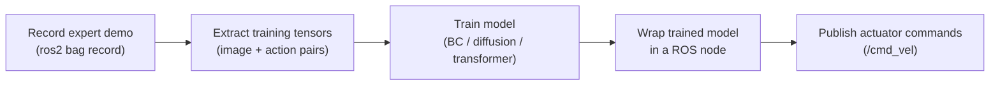

# Intermediate Generative AI for Robotics — Unit 1: Introduction

This unit orients you before any modeling begins: what the course actually covers, what you need to already know, and how the running example — a Mars rover — will be used to ground every generative AI technique that follows. Treat it as a map, not a lesson to rush past.

The diagram below shows the record-to-deploy pipeline this course repeats in every unit, swapping in a different model architecture each time:

## Course structure and the Mars rover thread
Every unit in this course reuses the same fictional platform: a Mars rover equipped with a forward-facing camera, a Lidar sensor, wheel encoders, and a ROS-based software stack. Instead of switching toy examples between units (MNIST here, CartPole there), you'll build up one increasingly capable rover: first cloning an expert driver's behavior, then giving it a diffusion-based navigation goal, then adding object detection, then real-time obstacle avoidance, and finally combining all of it into a capstone.

The pedagogical reason for this is that generative AI for robotics is rarely about a model in isolation — it's about the *pipeline* around the model: how data is recorded (usually as ROS bags), how it's turned into training tensors, how a trained model gets wrapped in a ROS node, and how that node's outputs turn into actuator commands safely. You'll practice that full loop repeatedly, with a different model architecture standing in the middle each time.

## Prerequisites for this course
This is an intermediate course, so it assumes:
- Comfort with Python and at least one deep learning framework (PyTorch is used throughout; if you only know TensorFlow, the concepts transfer directly).
- Basic ROS 2 fluency: topics, nodes, launch files, and reading/writing `.bag` (or `.mcap`) recordings — covered in the foundational ROS courses in this repo, not repeated here.
- A working understanding of supervised learning (loss functions, gradient descent, train/val splits) — this course builds on that rather than teaching it.
- No prior exposure to diffusion models or transformers is assumed; those are taught from first principles in Units 3 and 4.

If any of the ROS 2 or PyTorch prerequisites feel shaky, it's worth pausing here and working through the relevant foundational course first — the pace picks up quickly starting in Unit 2.

## What "generative" means in this context
It's worth being precise about scope, since "generative AI" is used loosely elsewhere. In this course it covers three distinct capabilities that all involve a model producing structured output rather than a single label:
- **Imitation learning** generates a *policy* — a mapping from observations to actions — by learning to reproduce an expert's demonstrated behavior.
- **Diffusion models** generate *samples* (here, plausible next states or trajectories) by learning to reverse a noising process.
- **Transformers** (DETR, ViT) generate *structured predictions* — sets of bounding boxes, or attention-weighted feature summaries — that downstream logic turns into decisions.

Keeping this distinction in mind will help you see why the same underlying idea (learn a function from data, sample or predict from it) shows up in such different-looking units.

## How the milestones connect
Units 2-5 are each self-contained enough to complete independently, but they compound: the ROS data-collection pattern from Unit 2 is reused in Units 3 through 6; the positional encoding intuition from Unit 4 carries directly into Unit 5's Vision Transformer; and the capstone in Unit 6 assumes you can run both the navigation pipeline and the detection pipeline from memory. Budget your time accordingly — skimming Unit 2's ROS bag exercise will cost you later.

## Try it yourself
Before writing any code, sketch (on paper or in a text file) the rover's software architecture as you currently imagine it: what nodes will exist, what topics connect them, and where you expect a trained model to sit in that graph. Save it — you'll revisit and correct this sketch after the capstone in Unit 6, and comparing the two versions is a good gauge of how much your mental model has shifted.
