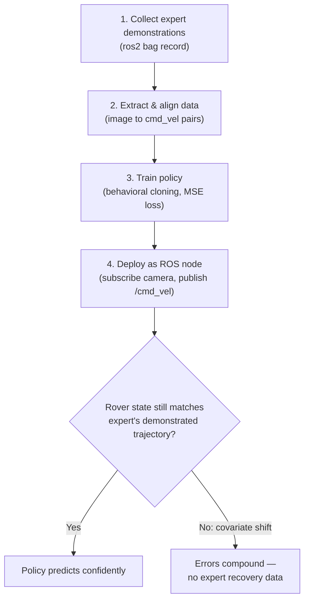

# Intermediate Generative AI for Robotics — Unit 2: Imitation Learning

Imitation learning is often the fastest path to a working autonomous policy: instead of hand-designing a controller or waiting on a reinforcement learning agent to discover behavior through trial and error, you record an expert driving the rover and train a model to reproduce those actions directly. This unit builds that full pipeline, from raw ROS recordings to a deployed policy.

The diagram below shows the four-stage behavioral cloning pipeline and where covariate shift creeps in once the trained policy leaves the expert's own trajectory:



## What is imitation learning
Imitation learning frames control as a supervised learning problem: given an observation `o` (camera image, Lidar scan, odometry), predict the action `a` an expert would take. The simplest and most widely used variant is **behavioral cloning (BC)** — train a model to minimize the difference between its predicted action and the expert's recorded action, using ordinary supervised loss (MSE for continuous actions like velocity, cross-entropy for discrete ones like steering bins).

BC differs from generic supervised learning in one important way: the training distribution is the *expert's* trajectory through state space, but at test time the model's own (imperfect) predictions determine what states it sees next. Small errors compound — a slightly wrong turn puts the rover in a state the expert never demonstrated recovering from, and the model has no idea what to do there. This is known as **covariate shift** or **distributional drift**, and it's the central weakness of naive BC that every practical imitation learning system has to account for, whether through data augmentation, safety fallbacks, or more advanced algorithms like DAgger.

## Behavioral cloning in action
The full pipeline has four stages:

1. **Collect expert demonstrations.** Drive the rover (teleoperated, or via a scripted expert) while recording the relevant ROS topics — typically `/camera/image_raw`, `/odom`, and `/cmd_vel` — into a bag file:
```bash
ros2 bag record /camera/image_raw /odom /cmd_vel -o rover_demo_01
```

2. **Extract and align the data.** Bag files store messages by arrival time, not in a training-ready tensor layout, so you need to synchronize each image with the velocity command that was active at that moment:
```python
from rosbags.highlevel import AnyReader

pairs = []
with AnyReader([Path("rover_demo_01")]) as reader:
    for connection, timestamp, rawdata in reader.messages():
        if connection.topic == "/camera/image_raw":
            img = decode_image(reader.deserialize(rawdata, connection.msgtype))
            cmd = nearest_cmd_vel(timestamp)  # match by closest timestamp
            pairs.append((img, cmd.linear.x, cmd.angular.z))
```

3. **Train the policy.** A compact CNN mapping image to `(linear_x, angular_z)` is enough to start:
```python
import torch.nn as nn

class BCPolicy(nn.Module):
    def __init__(self):
        super().__init__()
        self.backbone = nn.Sequential(
            nn.Conv2d(3, 32, 5, stride=2), nn.ReLU(),
            nn.Conv2d(32, 64, 5, stride=2), nn.ReLU(),
            nn.AdaptiveAvgPool2d(1), nn.Flatten(),
        )
        self.head = nn.Linear(64, 2)  # linear_x, angular_z

    def forward(self, x):
        return self.head(self.backbone(x))
```
Train with plain MSE against the recorded `(linear_x, angular_z)` pairs and a standard optimizer loop.

4. **Deploy as a ROS node.** Wrap the trained model in a node that subscribes to the camera and publishes `/cmd_vel`:
```python
def image_callback(self, msg):
    img = self.preprocess(msg)
    with torch.no_grad():
        linear_x, angular_z = self.model(img).squeeze().tolist()
    twist = Twist()
    twist.linear.x, twist.angular.z = linear_x, angular_z
    self.cmd_pub.publish(twist)
```

## Exercises
- **Bag-to-CSV extraction.** Write a script that reads a rover bag file and writes a CSV with columns `timestamp, odom_x, odom_y, linear_x, angular_z`, so you have a lightweight, framework-agnostic artifact you can inspect without re-parsing the bag every time.
- **Safety-clamped policy.** Extend the BC deployment node so that predicted velocities are clamped to a safe operating envelope before publishing (e.g. `linear_x = max(0.0, min(linear_x, MAX_LINEAR))`, similarly for angular velocity) — a minimal but real safeguard against a model confidently predicting something the hardware shouldn't execute.

## Try it yourself
Record two short teleop sessions of the same simple task (e.g. driving in a straight line, then navigating around one obstacle), train a BC policy on the straight-line data only, and evaluate it in a scenario that includes the obstacle. Note where and how it fails — this failure is covariate shift in action, and it's the problem the rest of this course's techniques (diffusion goals, richer perception) will help address.
