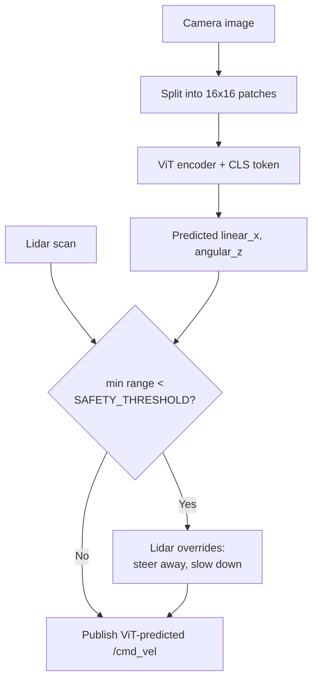

# Intermediate Generative AI for Robotics — Unit 5: Real-Time Decision Making

Where Unit 4 used a transformer for offline-style object detection, this unit puts a transformer directly in the rover's real-time control loop. Vision Transformers (ViT) let the rover reason globally about a scene fast enough to reactively steer around obstacles, and combining that with Lidar gives the system a sensor-fusion safety net.

The diagram below shows the "ViT proposes, Lidar can veto" decision logic that fuses the learned policy with a hard safety constraint:



## What are Vision Transformers
A Vision Transformer applies the same self-attention machinery from Unit 4 directly to images, with one key adaptation: instead of feeding individual pixels (which would make the sequence length enormous), the image is split into fixed-size **patches** — typically 16x16 pixels — each of which is flattened and linearly projected into an embedding, exactly like a "token" in a text transformer:
```python
# image: (B, 3, 224, 224) -> patches: (B, 196, patch_dim) for 16x16 patches
patches = image.unfold(2, 16, 16).unfold(3, 16, 16)
patches = patches.reshape(B, 3, -1, 16, 16).permute(0, 2, 1, 3, 4).flatten(2)
patch_embeddings = linear_projection(patches) + positional_embedding
```
A learnable `[CLS]` token is typically prepended to the patch sequence, and after the transformer encoder processes everything, that token's output embedding is used for whatever downstream task you need — classification, or here, a continuous action prediction.

Visualizing attention maps (which patches a given query patch or the `[CLS]` token attends to most strongly) is one of the most useful debugging tools available for a ViT — it directly shows you what regions of the image are driving the model's decision, in a way a CNN's feature maps don't as cleanly. Multi-head attention again matters here: different heads often specialize, e.g. one head consistently attending to the horizon line, another to nearby obstacles.

## Vision Transformer for real-time decision making
For the rover, a ViT is trained (behavioral-cloning style, as in Unit 2, but with a ViT backbone in place of the small CNN) to predict velocity commands directly from the camera feed:
```python
class ViTPolicy(nn.Module):
    def __init__(self, vit_backbone, action_dim=2):
        super().__init__()
        self.backbone = vit_backbone   # outputs CLS token embedding
        self.head = nn.Linear(vit_backbone.embed_dim, action_dim)

    def forward(self, image):
        cls_embedding = self.backbone(image)
        return self.head(cls_embedding)  # linear_x, angular_z
```
Camera-only prediction is fast and captures rich visual context, but it has no direct notion of *metric distance* — a ViT can misjudge how close an obstacle actually is from appearance alone. Lidar fixes exactly this gap: it gives precise range measurements but no semantic understanding of what's causing a return. The two are fused with a simple, explainable override rule rather than a learned fusion network, which keeps the safety-critical path auditable:
```python
def compute_command(image, lidar_ranges):
    linear_x, angular_z = vit_policy(image)
    min_range = min(lidar_ranges)
    if min_range < SAFETY_THRESHOLD:
        # Lidar overrides the learned prediction only when something is genuinely close
        angular_z = steer_away_from(lidar_ranges)
        linear_x = min(linear_x, SLOW_SPEED)
    return linear_x, angular_z
```
This "ViT proposes, Lidar can veto" pattern is a common and pragmatic way to combine a learned perception model with a hard safety constraint in real robotic systems.

## Exercises
- **Visualize all attention heads.** For a single new image, extract and plot the attention maps from every head in the last transformer layer (not just the `[CLS]` token's aggregate). Compare what different heads focus on — do any specialize on the horizon, the path edges, or specific obstacle types?
- **Vision-only navigation.** Temporarily disable the Lidar override in `compute_command` so the rover relies solely on ViT-predicted velocities, and run it through a test course with a few unexpected obstacles. Document where it fails compared to the fused version — this is a concrete illustration of why the override exists.

## Try it yourself
Pick any pretrained ViT (e.g. `vit_base_patch16_224` from `timm` or `torchvision`) and run it on three photos: one where the salient object is centered and obvious, one where it's small and off to the side, and one cluttered scene. For each, visualize the `[CLS]` token's attention over patches and predict beforehand which image you expect the attention to be "sharpest" (most concentrated) on — then check whether your prediction was right.
