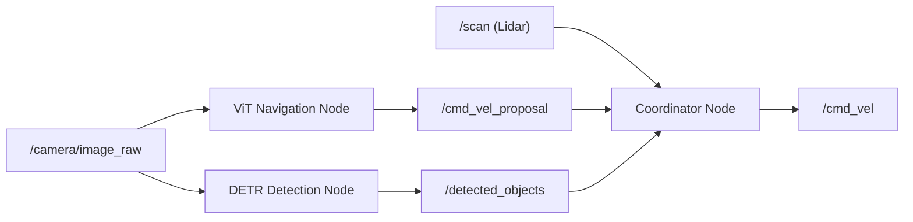

# Intermediate Generative AI for Robotics — Unit 6: Capstone Project

The capstone pulls together every technique from the course into one deployed system: a Visual Navigation Transformer (Units 2 and 5's imitation learning and ViT work, combined) running alongside a DETR object detector (Unit 4), both operating simultaneously on the same rover. This is the unit where the pipeline habits you practiced repeatedly finally pay off as a single integrated system.

The diagram below shows how the two AI pipelines and the coordinator node connect over ROS topics:



## Project scope and architecture
The capstone rover runs two parallel AI pipelines against the same camera stream, each publishing to its own ROS topic, with a coordinator node reading both:
```
/camera/image_raw ──┬──> [ViT Navigation Node] ──> /cmd_vel_proposal
                     │
                     └──> [DETR Detection Node] ──> /detected_objects
                                                          │
                     /scan (Lidar) ──────────────────────┤
                                                          v
                                              [Coordinator Node] ──> /cmd_vel
```
The coordinator's job is intentionally simple: take the navigation node's proposed velocity, check it against both the Lidar safety override (Unit 5) and any high-priority detections from DETR (e.g. a "STOP sign"-equivalent obstacle class), and publish the final command. Keeping this arbitration logic simple and explicit — rather than folding it into a learned model — makes the whole system's behavior auditable, which matters a great deal once two independent learned components are running at once.

## Building the visual navigation pipeline
This stage repeats the full loop from Units 2 and 5, end to end, on fresh data:
1. Collect new expert demonstrations via `ros2 bag record`, covering a course with varied lighting and at least a few obstacles the rover must steer around.
2. Extract and align image/velocity pairs from the bag, as in Unit 2.
3. Define the ViT-based policy architecture from Unit 5 (patch embedding, transformer encoder, linear action head).
4. Train with the standard behavioral-cloning MSE loss, holding out a validation split recorded on a *different* run than training, so validation loss reflects generalization rather than memorization of one specific path.
5. Deploy as a ROS node publishing `/cmd_vel_proposal`, exactly as in Unit 5, but now feeding the coordinator rather than `/cmd_vel` directly.

## Building the object detection pipeline
This stage builds DETR from its components, deliberately not starting from a pretrained checkpoint, so each part connects back to Unit 4's theory:
```python
class RoverDETR(nn.Module):
    def __init__(self, num_classes, num_queries=50):
        super().__init__()
        self.backbone = resnet50_backbone(pretrained=True)  # ImageNet features are a reasonable starting point
        self.pos_encoding = sinusoidal_pe                    # Unit 4's generalization-friendly choice
        self.transformer = nn.Transformer(d_model=256, nhead=8)
        self.query_embed = nn.Parameter(torch.randn(num_queries, 256))
        self.class_head = nn.Linear(256, num_classes + 1)    # +1 for "no object"
        self.box_head = nn.Linear(256, 4)

    def forward(self, image):
        features = self.backbone(image) + self.pos_encoding(image.shape)
        decoded = self.transformer(features, self.query_embed)
        return self.class_head(decoded), self.box_head(decoded)
```
Train with the Hungarian-matching loss from Unit 4 on labeled rover-terrain images (rocks, ridges, equipment — whatever obstacle classes matter for your course), then deploy as a node publishing structured `/detected_objects` messages the coordinator can act on.

## Running both pipelines simultaneously
With both nodes launched alongside the coordinator, the practical challenges shift from "does each model work" (answered in earlier units) to systems concerns:
- **Compute budget.** Two transformer models plus a coordinator, all processing the same camera stream at some target rate, will contend for GPU/CPU time — profile end-to-end latency, not just each model's isolated inference time.
- **Topic timing.** If the navigation and detection nodes run at different rates, decide explicitly how the coordinator handles a "stale" detection versus a fresh navigation proposal (a `message_filters` approximate-time synchronizer, or simply timestamping and discarding anything older than a threshold, both work).
- **Conflicting signals.** Define, in writing, what happens when the ViT proposes moving toward a spot DETR has just flagged as an obstacle — this is exactly the arbitration logic the coordinator exists to encode, and it's worth testing deliberately rather than discovering the behavior by accident.

## Try it yourself
Launch the full two-pipeline system (simulated or real) on a course with at least one obstacle placed specifically where the ViT's training data gave it no reason to expect one. Log the coordinator's decisions frame by frame and identify the exact moment DETR's detection changes the published command from what the ViT alone proposed. Write a short note on whether the override triggered early enough, on time, or too late — this closes the loop back to your Unit 1 architecture sketch, and is the single best test of whether the whole course's material has actually come together.
