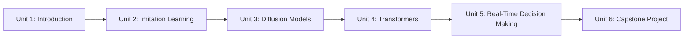

# Intermediate Generative AI for Robotics

This course takes generative AI from theory to a working robot pipeline, using one running example — a Mars rover with a camera, Lidar, and a ROS-based stack — throughout. You'll teach the rover to imitate an expert driver via behavioral cloning, use diffusion models to score how well its current view matches a navigation goal, apply transformer-based object detection (DETR) to spot obstacles, deploy a Vision Transformer for real-time reactive steering fused with Lidar, and finally combine the navigation and detection pipelines into one capstone system running simultaneously on the rover.

The diagram below shows how each unit's technique builds on the ones before it, all grounded in the same Mars rover example:

1. [Introduction](01-introduction.md) — Course structure, prerequisites, the Mars rover running example, and what "generative" means across the units ahead.
2. [Imitation Learning](02-imitation-learning.md) — Behavioral cloning from ROS-recorded expert demonstrations, covariate shift, and a full record-to-deploy pipeline.
3. [Diffusion Models](03-diffusion-models.md) — Forward/reverse noising processes, noise schedules, and using diffusion representations with cosine similarity to detect navigation goals.
4. [Transformers](04-transformers.md) — Self-attention, positional encodings, and DETR object detection applied to the rover's camera feed.
5. [Real-Time Decision Making](05-real-time-decision-making.md) — Vision Transformers for reactive control, attention visualization, and fusing ViT predictions with Lidar safety overrides.
6. [Capstone Project](06-capstone-project.md) — Running the Visual Navigation Transformer and DETR object detection pipelines together, with a coordinator arbitrating between them.
