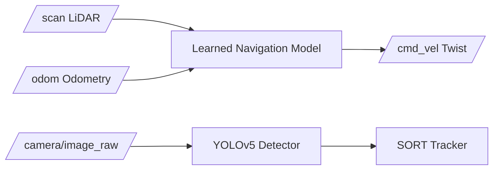

# Machine Learning for Robotics — Unit 1: Introduction

This unit sets the destination before the journey: by the end of the course you will have taken a stationary, unprogrammed TurtleBot4 and turned it into a robot that can navigate using a learned model, detect objects with its camera, and track moving entities. This unit maps out how each later unit contributes to that goal and makes the case for why ML and robotics are worth learning together.

The diagram below sketches the finished system's data flow: two parallel pipelines — a learned LiDAR/odometry navigator and a camera-based detection-and-tracking stack — that the rest of the course builds toward.



## The destination: what "done" looks like
The course's running example is a TurtleBot4 in a simulated office environment. At the start it does nothing — no navigation logic, no perception, nothing but raw sensor topics being published. The end state is a robot that:
- Consumes LiDAR scans and odometry to predict safe linear/angular velocities (a learned reactive navigator, not a classical planner).
- Has a cleaned, augmented, feature-engineered dataset behind that model rather than raw sensor dumps.
- Runs an RGB-camera object detector and a simple multi-object tracker on live camera frames.

Keeping this end state in mind matters because every unit is a means to it, not an isolated lesson. When you're deep in Ridge Regression hyperparameters in Unit 4, remember it's in service of a `cmd_vel` publisher running on a real (simulated) robot.

## Why machine learning, and why now, for robotics
Classical robotics leans on hand-derived models: kinematics equations, PID controllers, geometric planners. Those work well when the environment and sensor behavior are well understood and can be modeled in closed form. Machine learning earns its place when:
- The mapping from sensor input to correct action is too complex or too noisy to derive by hand (e.g., "what velocity should I command given this 360-point noisy LiDAR scan?").
- You have — or can collect — data that captures the relationship you care about, and it's cheaper to learn the mapping than to derive it.
- The task involves perception (images, point clouds) where classical feature engineering has largely been superseded by learned representations.

The skill stack this course builds — ROS 2 for the robotics plumbing, classical ML (scikit-learn) for the tabular sensor-data problems, and deep learning (TensorFlow/PyTorch) for the harder function approximation and vision problems — is deliberately broad because real robotics projects rarely stay inside one paradigm.

## How the course is structured
The five units after this one build in a strict dependency chain, not a menu of independent topics:
1. **Unit 2 (Machine Learning Overview)** lays classical-ML foundations — supervised vs. unsupervised learning, the standard classifiers (logistic regression, k-NN, SVM, decision trees), dimensionality reduction, clustering, and a first pass at neural networks. No robot yet; this is the vocabulary you need before touching sensor data.
2. **Unit 3 (Supervised Learning)** is the first hands-on unit: collecting real LiDAR and odometry data from TurtleBot4 in simulation and exploring it.
3. **Unit 4 (Supervised Learning II)** turns that data into working models — Ridge Regression and a TensorFlow neural network — deployed as ROS 2 nodes that actually drive the robot.
4. **Unit 5 (Data Augmentation and Feature Engineering)** goes back to the dataset, not the model, and improves it: noise injection, synthetic samples, and clustering-derived features.
5. **Unit 6 (Object Detection, Classification and Tracking)** switches sensing modality to the RGB camera, adding YOLO-based detection and SORT-based tracking.

Each unit assumes the previous one's outputs exist — the dataset from Unit 3 is what Units 4 and 5 operate on. Skipping ahead will leave you without the artifacts later units expect.

## What you should already have in place
This course is not a ROS 2 or Python primer, so a few prerequisites are assumed rather than taught: a working ROS 2 workspace with a TurtleBot4 simulation you can launch and drive with teleop, comfort reading and writing ROS 2 nodes in Python, and a Python environment with `numpy`, `pandas`, `scikit-learn`, `tensorflow` (or `torch`), and `opencv-python` installed. If any of those are missing, it's worth setting them up now:

```bash
python3 -m venv ~/venvs/ml_robotics
source ~/venvs/ml_robotics/bin/activate
pip install numpy pandas scikit-learn matplotlib tensorflow opencv-python
```

Getting this environment sorted before Unit 3 means you can focus on the ML content itself rather than debugging package installs mid-lesson.

## Simulation vs. real hardware
Every exercise in this course is framed around simulation (Gazebo, or whichever simulator your TurtleBot4 setup uses) rather than physical hardware, for a practical reason: data collection for ML is iterative and failure-prone by nature, and crashing a simulated robot into a simulated wall a hundred times while you debug a data collection node costs nothing. The concepts, ROS 2 topics, and trained models transfer to real hardware with minimal changes — mainly recalibrating sensor noise assumptions, since real LiDAR and cameras are noisier and less consistent than their simulated counterparts.

## Try it yourself
Before writing any code, sketch (on paper or in a text file) the data flow you expect by the end of the course: which ROS 2 topics exist, which node subscribes to what, and where a trained model sits in that graph. Revisit this sketch after Unit 4 and Unit 6 and correct it against what you actually built — the gap between your first guess and reality is usually where the real learning happened.
