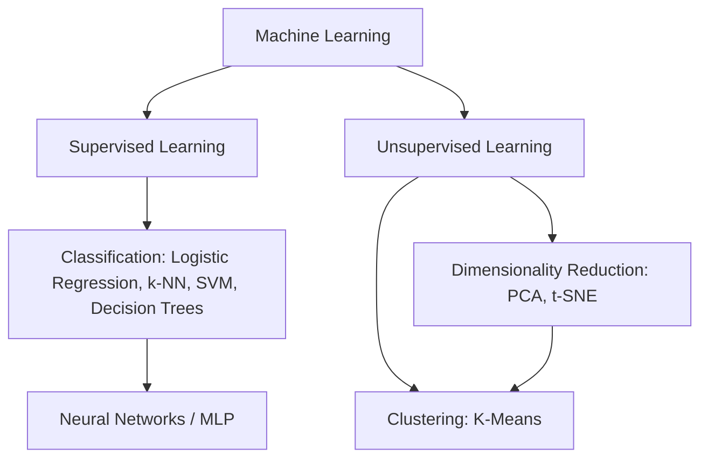

# Machine Learning for Robotics — Unit 2: Machine Learning Overview

This unit is the classical-ML toolbox you'll draw on for the rest of the course: the supervised/unsupervised split, the standard classifiers, how models are actually trained and evaluated, dimensionality reduction, clustering, and a first build-up of neural networks. Nothing here touches a robot yet — the goal is to make later units (where you fit these techniques to LiDAR and camera data) feel like application, not derivation.

The diagram below maps this unit's toolbox: how supervised and unsupervised learning branch into the specific algorithms covered here.



## Traditional programming vs. machine learning
In traditional programming you write the rules and the computer produces outputs from inputs: `output = f(input)` where you author `f`. Machine learning inverts this — you supply (input, output) pairs and the algorithm learns an approximation of `f` from data. For robotics this reframing matters because many robot behaviors (e.g., "what steering command given this LiDAR scan") are far easier to demonstrate or record than to derive analytically.

Supervised learning uses labeled pairs (a LiDAR scan mapped to a known-good velocity); unsupervised learning finds structure with no labels at all (grouping LiDAR points into clusters of obstacles). Both appear later in this course.

## Classification
Classification predicts a discrete label — binary (obstacle / no obstacle) or multiclass (which object class). Three workhorse algorithms:
- **Logistic regression** — a linear decision boundary, fast, interpretable, a good baseline.
- **k-NN** — classify by majority vote of the k nearest training points; no training phase, but slow at inference on large datasets.
- **SVM** — finds the maximum-margin separating boundary, with kernels for non-linear boundaries.

```python
from sklearn.linear_model import LogisticRegression
from sklearn.metrics import accuracy_score, precision_score, recall_score, f1_score, confusion_matrix

clf = LogisticRegression().fit(X_train, y_train)
y_pred = clf.predict(X_test)
print(accuracy_score(y_test, y_pred), precision_score(y_test, y_pred), recall_score(y_test, y_pred))
print(confusion_matrix(y_test, y_pred))
```

In a robotics context these metrics aren't abstract: for obstacle detection, a false negative (missed obstacle) risks a collision, while a false positive (phantom obstacle) just costs efficiency. That asymmetry is why recall on the "obstacle" class often matters more than raw accuracy.

## Training models: gradient descent, overfitting, regularization
Most ML models are fit by iteratively minimizing a loss function via gradient descent — nudging parameters in the direction that reduces error, scaled by a learning rate. Two failure modes to watch for:
- **Overfitting** — the model memorizes training data noise instead of the underlying pattern; it looks great on training data and poor on held-out data.
- **Regularization** (L1/L2 penalties, dropout, early stopping) — constrains model complexity to fight overfitting.

Always split data into train/validation/test sets (or use cross-validation) so you're measuring generalization, not memorization:

```python
from sklearn.model_selection import train_test_split, cross_val_score
X_train, X_test, y_train, y_test = train_test_split(X, y, test_size=0.2, random_state=42)
scores = cross_val_score(clf, X_train, y_train, cv=5)
```

## Decision trees and dimensionality reduction
A **decision tree** splits data recursively on the feature/threshold that most reduces impurity, measured by **entropy** and **information gain**. Trees are easy to inspect but prone to overfitting on their own (which is why ensembles like random forests exist, even if this course doesn't dive into them).

**Dimensionality reduction** compresses high-dimensional data for visualization or preprocessing. **PCA** is a linear projection onto the directions of maximum variance; **t-SNE** is non-linear and better for visualization than for feeding into a downstream model. A 360-value LiDAR scan is exactly the kind of high-dimensional input where PCA becomes useful before clustering or modeling.

## Clustering
**K-Means** and **hierarchical clustering** find groups in unlabeled data. A representative worked example: take the handwritten-digits dataset (64 dimensions per sample), compress it to 2D with PCA, then run K-Means with `k=10` (one cluster per digit) and check how well the unsupervised clusters line up with the true digit labels:

```python
from sklearn.decomposition import PCA
from sklearn.cluster import KMeans
from sklearn.datasets import load_digits

digits = load_digits()
X_2d = PCA(n_components=2).fit_transform(digits.data)
labels = KMeans(n_clusters=10, n_init="auto", random_state=0).fit_predict(X_2d)
```

This same PCA-then-cluster pattern reappears in Unit 5 when clustering LiDAR points into obstacle groups.

## Artificial neural networks
Starting from a single **perceptron** (weighted sum + activation function), stacking perceptrons into layers gives a **multilayer perceptron (MLP)**, and stacking more layers with non-linear activations gives a deep network capable of learning complex, non-linear mappings — the kind that linear/Ridge regression can't capture. A minimal MLP trained on MNIST digits:

```python
import tensorflow as tf

model = tf.keras.Sequential([
    tf.keras.layers.Flatten(input_shape=(28, 28)),
    tf.keras.layers.Dense(128, activation="relu"),
    tf.keras.layers.Dense(10, activation="softmax"),
])
model.compile(optimizer="adam", loss="sparse_categorical_crossentropy", metrics=["accuracy"])
model.fit(x_train, y_train, epochs=5, validation_split=0.1)
```

This is the same architecture family you'll deploy in Unit 4, just with LiDAR/odometry features instead of pixels, and continuous velocity outputs instead of digit classes.

## Try it yourself
Load `sklearn.datasets.load_digits()`, split into train/test, and train both a `LogisticRegression` and an `SVC` classifier on the raw 64-dimensional features (skip PCA). Compare accuracy and confusion matrices. Then repeat after reducing to 2D with PCA — how much accuracy do you lose by compressing to 2 dimensions, and does that trade-off feel acceptable for a robot that needs low-latency LiDAR classification?
