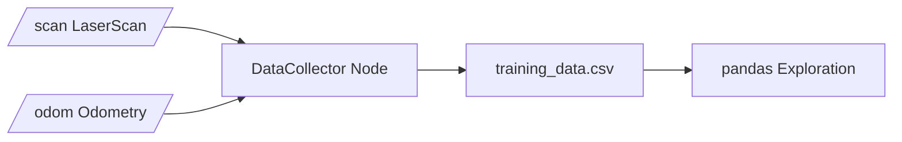

# Machine Learning for Robotics — Unit 3: Supervised Learning

This is where the course stops being abstract: you set up a real ROS 2 package, pull live LiDAR/odometry/camera data off a simulated TurtleBot4, and start exploring it. Everything built here — the package structure and the raw dataset — is what Units 4 and 5 will train models on.

The diagram below shows the data-collection architecture this unit builds: two sensor topics feeding a single collector node that writes a synchronized CSV dataset.



## From theory to hands-on robotics work
Unit 2 covered classifiers and clustering on toy datasets; this unit's job is regression on real sensor data — predicting continuous outputs (linear and angular velocity) from continuous inputs (LiDAR ranges, odometry). Regression differs from classification in one key way: instead of predicting a class label, you're predicting a real-valued number, so evaluation uses error metrics like mean squared error (MSE) or mean absolute error (MAE) rather than accuracy/precision/recall.

## Project setup
Create a dedicated ROS 2 package to hold the data collection, training, and inference nodes for this course — keeping it separate from any navigation stack you might already have avoids topic name collisions and makes the project easy to reason about in isolation:

```bash
cd ~/ros2_ws/src
ros2 pkg create ml_turtlebot4_supervised --build-type ament_python \
  --dependencies rclpy sensor_msgs nav_msgs geometry_msgs
cd ~/ros2_ws
colcon build --packages-select ml_turtlebot4_supervised
source install/setup.bash
```

Keep a clear internal layout from the start: a `data_collection/` module for the recording nodes, a `notebooks/` or `training/` directory for offline model work, and an `inference/` module for the nodes that will later publish velocity commands.

## Introduction to regression
Regression is the supervised-learning method at the heart of this unit: given LiDAR and odometry readings, predict continuous outputs like linear velocity, angular velocity, or distance-to-obstacle. Unlike the classifiers from Unit 2, a regression model's output is unbounded (or bounded by physical limits, not a fixed label set), which changes both the loss function used for training (squared error rather than cross-entropy) and how you sanity-check predictions (does a predicted velocity respect the robot's actual speed limits?).

## Data collection
Data collection means subscribing to TurtleBot4's sensor topics and writing synchronized samples to disk. A minimal collector node:

```python
import rclpy
from rclpy.node import Node
from sensor_msgs.msg import LaserScan
from nav_msgs.msg import Odometry
import csv

class DataCollector(Node):
    def __init__(self):
        super().__init__("data_collector")
        self.scan_sub = self.create_subscription(LaserScan, "/scan", self.scan_cb, 10)
        self.odom_sub = self.create_subscription(Odometry, "/odom", self.odom_cb, 10)
        self.latest_scan = None
        self.writer = csv.writer(open("training_data.csv", "w", newline=""))

    def scan_cb(self, msg):
        self.latest_scan = msg.ranges

    def odom_cb(self, msg):
        if self.latest_scan is None:
            return
        lin_v = msg.twist.twist.linear.x
        ang_v = msg.twist.twist.angular.z
        self.writer.writerow(list(self.latest_scan) + [lin_v, ang_v])
```

Two practical issues surface immediately: LiDAR and odometry arrive on independent, unsynchronized topics (this naive version just pairs each odometry message with the most recent scan — `message_filters.ApproximateTimeSynchronizer` is the more rigorous fix), and a stationary or wandering robot produces a boring, low-variance dataset. That's why a proper collection pipeline pairs the collector with an **autonomous recovery node** — one that nudges the robot to keep moving (e.g., a simple random-walk or wall-following behavior) whenever it stalls, so the recorded dataset actually covers a useful range of LiDAR/velocity combinations.

## Data exploration
Before training anything, inspect what you collected. Load the CSV into pandas and check the fundamentals: shape, dtypes, missing values, and physically implausible readings (LiDAR returning `inf` or `nan` for out-of-range, or a `0.0` that actually means "no return" rather than "obstacle at zero distance"):

```python
import pandas as pd
import matplotlib.pyplot as plt

df = pd.read_csv("training_data.csv")
print(df.describe())
print(df.isna().sum())

df["linear_velocity"].hist(bins=50)
plt.xlabel("linear velocity (m/s)")
plt.title("Distribution of collected linear velocities")
plt.show()
```

Look specifically for distributional skew — if the recovery behavior mostly drove forward, your dataset will be dominated by near-zero angular velocity, which will bias any model trained on it toward "always go straight." This is exactly the kind of gap that Unit 5's data augmentation work exists to fix.

## Try it yourself
Write a small ROS 2 node that subscribes to `/scan` and logs the minimum, mean, and maximum range value on every message. Run it against a simulated TurtleBot4 (or bag-played data) while manually driving the robot around with `teleop_twist_keyboard`, and note how those three statistics change as you approach and pass by obstacles — this is the same signal your future regression model will have to learn to interpret.
