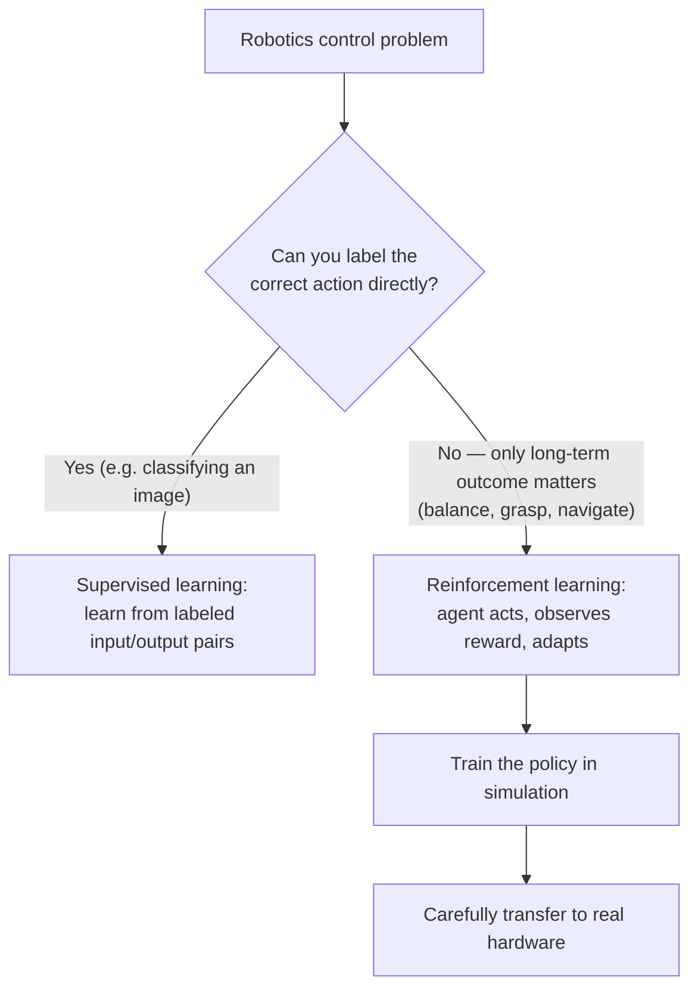

# Mastering Reinforcement Learning for Robotics — Unit 1: Course Intro

Reinforcement learning (RL) is the branch of machine learning where an agent learns by *doing* rather than by being shown labeled examples — it acts, observes the consequences, and adjusts its behavior to get more of what it wants. This unit sets the frame for the whole course: what RL actually is, why it's a natural fit for robot control, and what you'll be able to build by the end.

The diagram below captures the decision that leads to RL in the first place — whether the "correct" action can be labeled at all — and the sim-to-real path that follows once you commit to it:



## Why RL, and why for robotics
Supervised learning (covered elsewhere in this repo) needs a labeled dataset of "correct" input-output pairs. For a lot of robotics problems — balancing, grasping, navigating around unpredictable obstacles — nobody can hand-label the "correct" motor torque at every instant; the notion of "correct" only makes sense in terms of long-term outcome (did the robot stay upright, did it reach the goal, did it avoid the wall). RL formalizes exactly this: an agent takes actions in an environment, receives a scalar **reward** signal, and learns a policy that maximizes cumulative reward over time. That framing matches robot control almost perfectly, which is why RL shows up throughout modern robotics — from legged locomotion to dexterous manipulation to autonomous driving.

It's worth being honest about the trade-off up front: RL is data-hungry and often sample-inefficient, and a policy trained carelessly can produce reward-seeking behavior that technically maximizes the reward function while doing something you didn't intend (reward hacking). Most of that risk is manageable, but it's why RL for robotics is almost always trained in simulation first and only carefully transferred to real hardware — a theme you'll see recur across this course.

## The agent-environment loop
Every RL problem, no matter how complex, reduces to the same loop:

1. The agent observes the current **state** `s` of the environment (e.g., joint angles, camera image, LiDAR scan).
2. The agent selects an **action** `a` according to its **policy** `π(a|s)`.
3. The environment transitions to a new state `s'` and emits a **reward** `r`.
4. The agent updates its policy using `(s, a, r, s')` and repeats.

```
   ┌────────────┐   action a    ┌──────────────┐
   │            │ ────────────► │              │
   │   Agent    │                │  Environment │
   │  (policy)  │ ◄──────────── │  (robot/sim)  │
   └────────────┘  state s',    └──────────────┘
                    reward r
```

This loop is exactly what you'll implement in code throughout the course, whether the "environment" is a Gymnasium toy problem or a physics-simulated robot arm.

## What this course covers
- **Unit 2** builds the vocabulary and math you need — states, actions, rewards, policies, value functions, and the exploration/exploitation trade-off — without any code yet.
- **Unit 3** implements Q-Learning, the classic tabular algorithm that most RL practitioners learn first, on a small discrete environment.
- **Unit 4** scales that idea up with Deep Q-Learning (DQN), replacing the lookup table with a neural network so the same ideas work on high-dimensional, continuous-ish state spaces closer to real robot sensing.

By the end you won't be an RL researcher, but you'll be able to read an RL paper's method section, stand up a training loop with a standard library, and reason about why a robot policy is or isn't learning.

## Setting up your environment
You'll want a Python environment with the standard RL toolchain. A minimal setup:

```bash
python3 -m venv rl-robotics-env
source rl-robotics-env/bin/activate
pip install gymnasium numpy matplotlib torch
```

`gymnasium` (the maintained successor to OpenAI's `gym`) gives you a standard API — `reset()`, `step(action)`, `render()` — for RL environments, which is what all three remaining units will build on. Verify it works:

```python
import gymnasium as gym

env = gym.make("CartPole-v1")
obs, info = env.reset(seed=0)
print("Initial observation:", obs)

obs, reward, terminated, truncated, info = env.step(env.action_space.sample())
print("Reward:", reward, "Terminated:", terminated)
```

## Try it yourself
Install the environment above and run the CartPole snippet in a loop for 100 random steps, printing the cumulative reward at the end. Then look up what CartPole's state vector and action space actually represent (check the source or `gymnasium`'s documentation) and write one sentence connecting each of the four state values to a physical quantity — this habit of grounding abstract "state" vectors in real physical meaning is one you'll use constantly once you move to robot environments.
