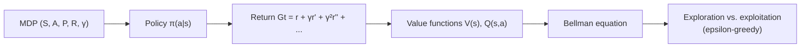

# Mastering Reinforcement Learning for Robotics — Unit 2: Fundamentals of Reinforcement Learning

Before writing any RL code, you need the shared vocabulary the field runs on: MDPs, value functions, and the exploration/exploitation trade-off. Everything in Units 3 and 4 is a specific algorithm for solving the general problem this unit defines.

The diagram below shows how this unit's concepts build on one another, from the raw MDP definition up to the exploration strategy every algorithm in this course relies on:



## Markov Decision Processes
RL problems are formalized as **Markov Decision Processes (MDPs)**, defined by a tuple `(S, A, P, R, γ)`:
- `S` — the set of possible states.
- `A` — the set of possible actions.
- `P(s'|s,a)` — the transition dynamics: the probability of landing in state `s'` after taking action `a` in state `s`.
- `R(s,a,s')` — the reward received for that transition.
- `γ` (gamma) — the discount factor, a number in `[0, 1)` that controls how much the agent values future reward versus immediate reward.

The "Markov" part is the key assumption: the next state depends only on the current state and action, not on the full history that led there. This is why state *representation* matters so much in robotics — if your state doesn't include enough information (e.g., you drop velocity and only keep position), the process stops being Markovian and learning gets much harder. A LiDAR scan plus the robot's current velocity is closer to Markovian than a LiDAR scan alone, because it captures momentum that affects what happens next.

## Policies and returns
A **policy** `π` is the agent's behavior — a mapping from states to actions (deterministic, `a = π(s)`) or to a probability distribution over actions (stochastic, `a ~ π(·|s)`). The agent's objective is to find the policy that maximizes the **expected return**, the discounted sum of future rewards:

```
G_t = r_t + γ·r_{t+1} + γ²·r_{t+2} + ...
```

Discounting does two jobs: it keeps the sum finite for infinite-horizon problems, and it encodes a preference for reward sooner rather than later — reasonable for a robot, since a battery-draining or slower path to the same reward is genuinely worse.

## Value functions
Two related functions let an agent evaluate how good a state (or state-action pair) is without having to look all the way to the end of an episode:
- **State-value function** `V(s)` — expected return starting from state `s` and following policy `π` thereafter.
- **Action-value function** `Q(s,a)` — expected return starting from state `s`, taking action `a`, and following `π` thereafter.

These satisfy the **Bellman equation**, which expresses value recursively in terms of immediate reward plus the discounted value of what comes next:

```
Q(s,a) = R(s,a) + γ · Σ_{s'} P(s'|s,a) · max_{a'} Q(s',a')
```

This single equation is the mathematical seed of both algorithms in this course — Q-Learning (Unit 3) is literally an iterative way of solving it from sampled experience, and Deep Q-Learning (Unit 4) approximates the `Q` function on the right-hand side with a neural network instead of a table.

## Exploration vs. exploitation
An agent that always picks the action it currently believes is best (**exploitation**) can get permanently stuck on a mediocre strategy it never disproves. An agent that always acts randomly (**exploration**) never capitalizes on what it has learned. The standard fix used throughout this course is **epsilon-greedy** action selection: with probability `ε` take a random action, otherwise take the greedy (best-known) action, and decay `ε` over training so the agent explores heavily early and exploits what it has learned later.

```python
import random

def epsilon_greedy(q_values, epsilon, action_space):
    if random.random() < epsilon:
        return action_space.sample()          # explore
    return int(q_values.argmax())              # exploit
```

For a robot this trade-off has physical stakes beyond training speed: unconstrained exploration on real hardware can mean commanding wild, potentially damaging actions, which is another reason RL policies are trained in simulation before anything touches a physical robot.

## Try it yourself
Take the CartPole environment from Unit 1 and write a tiny script that runs 20 episodes with a *fixed* random policy, recording the total return (sum of rewards, undiscounted) per episode. Then compute the mean and standard deviation across episodes. This number is your baseline — in Units 3 and 4 you'll retrain smarter policies and should see the mean return climb well above this random baseline, which is the simplest possible sanity check that learning is happening at all.
