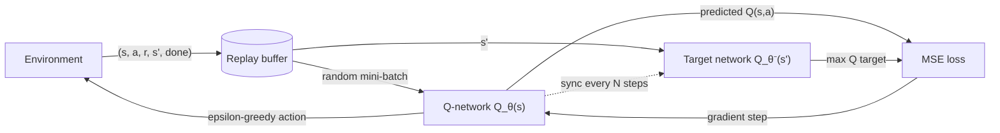

# Mastering Reinforcement Learning for Robotics — Unit 4: Deep Q-Learning

Q-Learning's lookup table breaks down the moment state becomes continuous or high-dimensional — a robot's joint angles, a LiDAR scan, or a camera frame can't be enumerated into table rows. Deep Q-Learning (DQN) fixes this by replacing the table with a neural network that approximates `Q(s,a)`, which is what makes the algorithm actually usable on realistic robot state spaces.

The diagram below shows how the pieces this unit introduces — replay buffer and target network — sit around the Q-network to keep training stable:



## From table to function approximator
Instead of `Q[s, a]` as an array lookup, DQN uses a neural network `Q_θ(s)` parameterized by weights `θ` that takes a state vector as input and outputs one Q-value per discrete action simultaneously:

```python
import torch
import torch.nn as nn

class QNetwork(nn.Module):
    def __init__(self, state_dim, n_actions, hidden=128):
        super().__init__()
        self.net = nn.Sequential(
            nn.Linear(state_dim, hidden),
            nn.ReLU(),
            nn.Linear(hidden, hidden),
            nn.ReLU(),
            nn.Linear(hidden, n_actions),
        )

    def forward(self, state):
        return self.net(state)          # shape: [batch, n_actions]
```

Action selection is the same epsilon-greedy rule as Unit 3 — `argmax` over the network's output instead of a table row. The hard part is training this network stably, because naively applying the Q-Learning update as a supervised-learning loss turns out to be unstable. DQN's two key fixes address that directly.

## Experience replay
Training a neural network on consecutive, highly-correlated (state, action, reward, next-state) transitions as they're generated violates the i.i.d. assumption most neural-network training relies on, and it also throws each transition away after one use. **Experience replay** fixes both problems: store transitions in a buffer, and train on randomly-sampled mini-batches from that buffer instead of on the live stream.

```python
import random
from collections import deque

class ReplayBuffer:
    def __init__(self, capacity=50_000):
        self.buffer = deque(maxlen=capacity)

    def push(self, s, a, r, s_next, done):
        self.buffer.append((s, a, r, s_next, done))

    def sample(self, batch_size):
        return random.sample(self.buffer, batch_size)

    def __len__(self):
        return len(self.buffer)
```

Random sampling breaks the correlation between consecutive updates, and reusing each transition many times across training makes DQN far more sample-efficient than it would otherwise be — a meaningful win for robotics, where every real transition can be physically expensive to collect.

## Target networks
The second instability: the Bellman target `r + γ · max_a' Q_θ(s',a')` uses the *same* weights `θ` that you're actively updating, so the target shifts every training step — like trying to hit a target that moves whenever you take a shot. The fix is a **target network** `Q_θ⁻`, a periodically-synced copy of the main network used only to compute targets, kept frozen between syncs so the target stays stable for many updates at a time.

```python
def compute_loss(q_net, target_net, batch, gamma=0.99):
    states, actions, rewards, next_states, dones = batch

    q_values = q_net(states).gather(1, actions.unsqueeze(1)).squeeze(1)

    with torch.no_grad():
        max_next_q = target_net(next_states).max(dim=1).values
        targets = rewards + gamma * max_next_q * (1 - dones)

    return nn.functional.mse_loss(q_values, targets)
```

The target network's weights are copied from the main network every `N` steps (a "hard" update) or blended in continuously with a small mixing factor (a "soft"/Polyak update) — either works; hard updates are simpler to reason about when you're starting out.

## Putting it on a robot
A DQN policy still only outputs a *discrete* action, so applying it to a robot means discretizing the action space first — e.g., a mobile robot's continuous `(linear_vel, angular_vel)` command space collapsed to a handful of options like `{forward, turn_left, turn_right, stop}`. That's a real limitation (fine control needs finer discretization, which blows up the action count), and it's exactly why continuous-control algorithms like DDPG, SAC, or PPO exist — but DQN remains the right place to start because every stability trick introduced here (replay buffers, target networks) carries over directly into those more advanced algorithms.

## Try it yourself
Implement the training loop: for each step, act epsilon-greedily using `q_net`, push the transition into a `ReplayBuffer`, and once the buffer has at least one batch's worth of data, sample a batch, compute `compute_loss`, and take an optimizer step on `q_net`. Sync `target_net`'s weights from `q_net` every 500 steps. Run it on `gymnasium`'s `CartPole-v1` (state dim 4, 2 actions) and confirm episode return climbs well above the random baseline you recorded in Unit 2 — that comparison is your evidence the deep function approximator is actually learning, not just memorizing noise.
