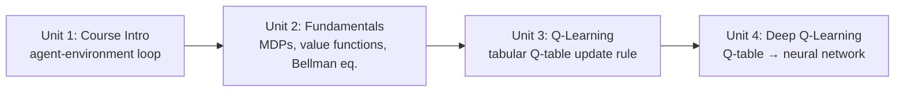

# Mastering Reinforcement Learning for Robotics

This course builds reinforcement learning up from first principles to a working deep RL agent, with robotics as the running motivation throughout. You'll start with the agent-environment loop and the vocabulary of Markov Decision Processes, implement classic tabular Q-Learning on a small grid-world, and then scale that same core algorithm up to Deep Q-Learning by swapping the lookup table for a neural network — the same trick that underlies most modern RL used in robot locomotion, manipulation, and navigation.

The diagram below shows how each unit builds directly on the algorithm and vocabulary introduced by the one before it:

1. [Course Intro](01-course-intro.md) — Why reinforcement learning fits robot control, the agent-environment loop, and setting up a Python/Gymnasium environment.
2. [Fundamentals of Reinforcement Learning](02-fundamentals-of-reinforcement-learning.md) — MDPs, policies, returns, value functions, the Bellman equation, and exploration vs. exploitation.
3. [Q-Learning](03-q-learning.md) — Implementing the Q-table update rule end to end on a grid-world, plus reward shaping considerations.
4. [Deep Q-Learning](04-deep-q-learning.md) — Replacing the Q-table with a neural network, experience replay, target networks, and applying DQN to a robot-style discrete action space.
