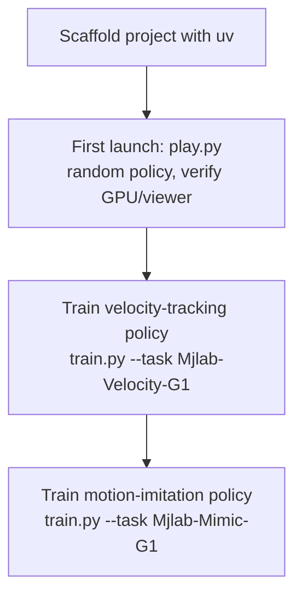

# MujocoLab for Robotics — Unit 2: MJLab basics

Unit 1 showed you the shape of the ecosystem; this unit gets your hands on it. By the end you will have a working MJLab project, a simulation you launched yourself, and two trained policies — one that walks, one that imitates a reference motion — using only the robot and environments MJLab ships by default.

The diagram below shows the order of operations this unit walks through, from an empty project to two trained policies.



## Introduction: what "basics" means here
Everything in this unit uses MJLab's built-in humanoid (typically a G1-class robot) and its built-in flat-ground environment. That's deliberate: the goal is to learn the *workflow* — project layout, launch commands, training loop, monitoring — before Unit 3 and 4 ask you to swap in your own terrain and your own robot. If a command here fails, the problem is almost always environment setup (GPU drivers, CUDA-enabled MuJoCo Warp, Python version) rather than the RL logic itself, so get this unit fully working before moving on.

## Scaffolding a project with uv
MJLab projects are typically managed with `uv`, a fast Python package and project manager. Starting a new package gives you a reproducible, lockfile-pinned environment instead of a loose `pip install` into whatever interpreter happens to be active:

```bash
uv init mjlab-basics --package
cd mjlab-basics
uv add mjlab torch wandb          # illustrative dependency set
uv run python -c "import mjlab; print(mjlab.__version__)"
```

`uv add` resolves and locks the dependency, `uv run` executes a command inside that locked environment without you having to manually activate a virtualenv. Keep this project directory — Unit 3 and 4 build directly on top of it rather than starting fresh.

## First launch: running your first simulation
With the package scaffolded, the first useful thing to do is launch an environment with a random (untrained) policy, just to confirm the physics, GPU batching, and viewer all work end to end:

```bash
uv run python scripts/play.py --task Mjlab-Velocity-G1-Play --num-envs 16
```

At this stage you're not training anything — you're watching a handful of robots take random actions and immediately fall over, which is exactly what you want to see. If this launches a viewer window and the robots visibly react to physics (falling, colliding with the ground plane), your GPU/MuJoCo Warp setup is sound and you're ready to train.

## Training a walking policy with velocity tracking
Velocity tracking is the canonical first training task: the policy is rewarded for matching a commanded linear/angular velocity (e.g. "walk forward at 1 m/s, turn left at 0.2 rad/s") while being penalized for falling, excessive joint torque, or foot-slip. Training launches the same way as play mode, but with far more parallel environments and a training-specific entry point:

```bash
uv run python scripts/train.py --task Mjlab-Velocity-G1 --num-envs 4096 \
    --logger wandb --project mjlab-basics
```

With thousands of environments stepping in parallel on the GPU, PPO-style on-policy training can take a walking policy from "collapses immediately" to "tracks commanded velocity reliably" in a training run measured in minutes to a couple of hours, not days — this is the practical payoff of the MuJoCo Warp layer from Unit 1.

**A note on distributed training:** the same idea scales further across multiple GPUs or multiple machines — each worker runs its own batch of parallel environments, gradients (or rollouts) are aggregated, and the effective environment count multiplies with the number of workers. You won't need it for this unit's single-GPU runs, but it's the same lever you'd pull if a training run needed to go faster than one GPU allows.

## Motion imitation: teaching a robot to dance
Velocity tracking rewards a *behavior* (walk at this speed); motion imitation rewards *matching a reference trajectory* — a recorded or motion-captured clip of joint angles and root pose over time, such as a dance or gesture. The reward is typically a per-timestep distance between the policy's pose and the reference clip's pose at the same point in time, so training amounts to "minimize tracking error against this recording" rather than "achieve this velocity." Launch is structurally identical to velocity tracking, just pointed at a motion-imitation task and a reference-motion file:

```bash
uv run python scripts/train.py --task Mjlab-Mimic-G1 --motion-file dance01.npz \
    --num-envs 4096 --logger wandb
```

Watch the W&B reward curve here specifically for a shape that plateaus early and stays flat — that usually means the reference clip contains a pose the robot's joint limits can't physically reach, which no amount of extra training time will fix.

## Try it yourself
Launch the play-mode command above with `--num-envs 1` instead of 16, and watch a single robot closely for one episode. Note down: how many simulated seconds pass before it falls (if it does), and which joint or body part visibly moves first when it loses balance. You'll use this same single-environment habit in Unit 3 to sanity-check custom terrain before scaling back up to thousands of environments.
