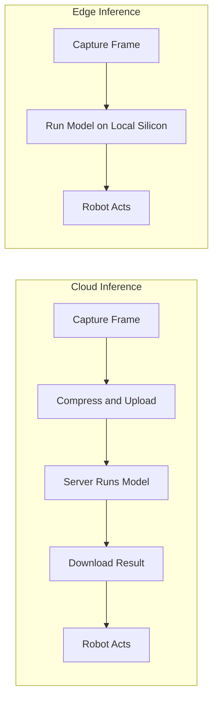

# On device AI for Robotics — Unit 1: Introduction to Edge AI

This unit sets the stage for the whole course: what Edge AI actually is, why a robot benefits from running inference locally instead of phoning home to the cloud, and what hardware you'll be assembling to make that happen. Everything that follows — quantization, pruning, on-device LLMs — only matters once you understand the constraint this unit introduces: real robots operate under latency, connectivity, power, and privacy limits that cloud AI was never designed around.

The diagram below contrasts the cloud-inference round trip with the edge-inference path this course optimizes for.



## What is Edge AI
Edge AI means running a trained model's inference step directly on the device that captured the data — a Raspberry Pi, a microcontroller, a phone SoC — rather than shipping the raw sensor data to a remote server and waiting for a response. The training usually still happens elsewhere (a workstation or the cloud, where you have GPUs and large datasets); it's the *inference* that moves to the edge.

For robotics this distinction is not academic. Compare two architectures for a camera-equipped rover deciding whether to stop for an obstacle:

- **Cloud inference**: capture frame → compress → upload → server runs the model → downloads result → robot acts. Round trip is easily 100-500ms over a good link, and undefined (or infinite) with no link at all.
- **Edge inference**: capture frame → run the model on local silicon → act. Round trip is single-digit to low double-digit milliseconds, with zero dependency on network availability.

The four benefits worth internalizing, because they recur as design justifications throughout the course:
1. **Latency** — control loops (obstacle avoidance, grasping) need predictable, low-latency decisions; network jitter is unacceptable.
2. **Reliability/offline operation** — a robot exploring a basement, a mine, or another planet cannot assume connectivity.
3. **Privacy/security** — raw camera/audio never leaves the device, which matters for home robots and any deployment with data-governance constraints.
4. **Operating cost** — no per-inference cloud bill, no bandwidth cost for streaming video continuously.

The tradeoff you're signing up for is reduced compute budget: edge accelerators like a Coral TPU deliver a few TOPS, not the hundreds of TFLOPS of a datacenter GPU. The rest of the course is fundamentally about closing that gap through model optimization.

## Natural Language Control of the Leo Rover (course demo)
The course's running example is a Leo Rover on a simulated planet ("Constructia") that takes natural-language instructions ("find the red flower and take a photo") and autonomously navigates, captures an image, and runs object detection — entirely on its onboard Raspberry Pi + Coral TPU, with no cloud round-trip. Keep this end-to-end demo in mind as the target shape: a small language-driven planner issuing goals, a perception model doing on-device object detection, and a control layer executing motion — all within a power and compute budget that fits on the rover.

## Essential hardware for Edge AI development
The reference hardware stack you'll be using across the course:

| Component | Role |
|---|---|
| Raspberry Pi 4 (4GB+ RAM recommended) | Host CPU, runs the OS and orchestrates everything |
| Google Coral USB Accelerator (Edge TPU) | Dedicated ASIC for fast INT8 inference, offloads the CPU |
| Camera module (CSI or USB) | Primary sensor for classification/detection/segmentation |
| microSD card (32GB+, fast UHS-I/A2) | Boot and storage — I/O speed matters for model loading |
| Adequate 5V/3A power supply | Sustained inference draws real current; undervoltage causes silent throttling |

A quick sanity check once assembled:

```bash
# confirm the Pi sees the Edge TPU over USB
lsusb | grep -i "Global Unichip\|Google"

# confirm the camera is detected
libcamera-hello --list-cameras   # Raspberry Pi OS Bullseye+
```

You don't need this exact hardware to follow along conceptually — any small ARM/x86 SBC plus a USB accelerator (or none, at reduced speed) will let you work through the same pipeline.

## Course roadmap
The four units build on each other: Unit 1 (this one) establishes why and what; Unit 2 takes you from a trained cloud model to a working TensorFlow Lite deployment on the Pi, directly experiencing the cloud-latency problem firsthand; Unit 3 is a deep technical dive into the optimization toolbox (quantization, pruning, clustering, distillation) that makes models small and fast enough for the edge; Unit 4 pushes past classification into detection, segmentation, and finally running (and fine-tuning) a compact LLM on the same hardware, culminating in an on-device AI agent.

## Try it yourself
Before touching any code, write a one-paragraph latency/reliability budget for a robot task of your choosing (e.g., "a warehouse robot must stop within 200ms of detecting a person"). State the maximum acceptable round-trip time, whether the robot can assume network connectivity, and whether raw sensor data is allowed to leave the device. This budget is the same exercise you'll implicitly be re-running every time you choose an optimization technique in Unit 3.
