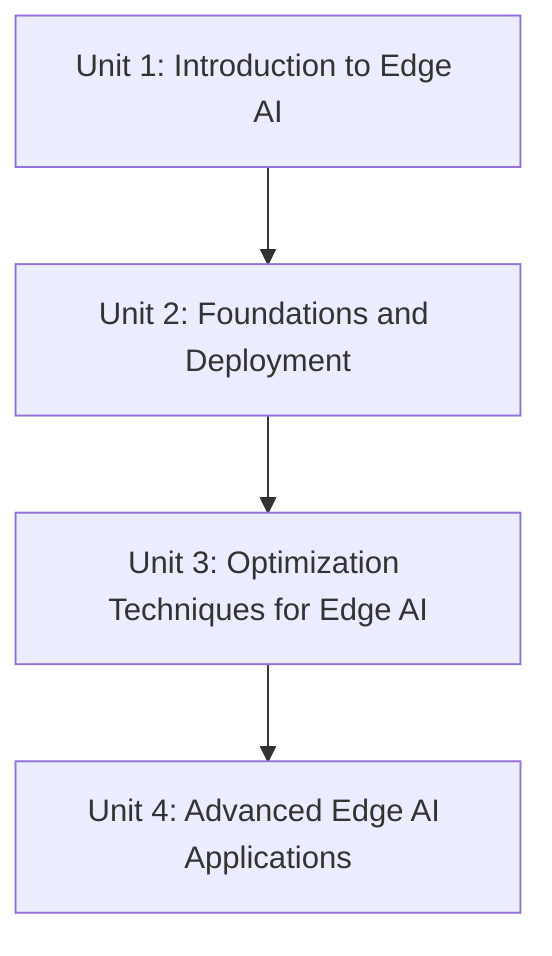

# On device AI for Robotics

This course is a hands-on path into Edge AI for robotics: instead of relying on a cloud API for every inference, you train, optimize, and deploy models that run directly on embedded hardware such as a Raspberry Pi 4 paired with a Google Coral TPU. You'll go from understanding why on-device inference matters for real-time, secure, offline robot behavior, through a full train-to-deploy pipeline with TensorFlow Lite, into the compression toolbox (quantization, pruning, clustering, distillation) that makes models small enough for embedded hardware, and finally into advanced applications — object detection, semantic segmentation, and even a locally-run and fine-tuned LLM — culminating in a complete on-device AI agent.

The diagram below shows how each unit builds on the previous one, from foundational concepts to a full on-device AI agent.

1. [Introduction to Edge AI](01-introduction-to-edge-ai.md) — What Edge AI is, why on-device inference matters for robotics, and the hardware you'll use throughout the course.
2. [Foundations and Deployment](02-foundations-and-deployment.md) — Train a flower classifier, feel the pain of cloud inference firsthand, then convert and deploy it on the Pi with TensorFlow Lite.
3. [Optimization Techniques for Edge AI](03-optimization-techniques-for-edge-ai.md) — Quantization, pruning, clustering, and knowledge distillation, applied and compared on the same model.
4. [Advanced Edge AI Applications](04-advanced-edge-ai-applications.md) — Object detection, semantic segmentation, and running (and fine-tuning) a compact LLM on-device, building toward a full AI agent.
