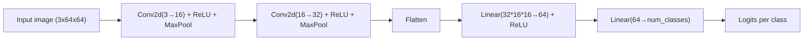

# PyTorch Essentials for Robotics — Unit 4: AI models creation

With tensors (Unit 2) and a dataset (Unit 3) in hand, this unit covers how PyTorch lets you assemble a neural network from reusable building blocks instead of writing matrix math by hand, and applies that directly to the mini keyboard detector.

The diagram below traces the mini-keyboard detector's data flow from input image to output logits, layer by layer:



## PyTorch nn.Module basics
Every model in PyTorch — from a two-line linear layer to a full convolutional network — is a subclass of `torch.nn.Module`. A `Module` bundles together learnable parameters (weights, biases) and a `forward` method that defines how input tensors flow through them:

```python
import torch.nn as nn

class TinyNet(nn.Module):
    def __init__(self):
        super().__init__()
        self.layer1 = nn.Linear(10, 32)
        self.activation = nn.ReLU()
        self.layer2 = nn.Linear(32, 1)

    def forward(self, x):
        x = self.layer1(x)
        x = self.activation(x)
        x = self.layer2(x)
        return x

model = TinyNet()
print(model)                              # prints the layer structure
print(sum(p.numel() for p in model.parameters()))  # total learnable parameters
```

Calling `model(x)` invokes `forward` for you (via `__call__`), and PyTorch automatically tracks every operation for gradient computation as long as the input tensor requires gradients — you never write backpropagation by hand.

## Common building blocks: layers, activations, loss functions
Real models are compositions of a small set of standard pieces:

- **Linear/Dense layers** (`nn.Linear`) — a weighted sum plus bias; the workhorse of fully-connected networks.
- **Convolutional layers** (`nn.Conv2d`) — slide small learned filters over an image, ideal for camera input because they share weights across spatial positions instead of learning a separate weight per pixel.
- **Activation functions** (`nn.ReLU`, `nn.Sigmoid`) — nonlinearities inserted between layers; without them, stacking linear layers would collapse into a single linear layer no matter how many you add.
- **Pooling layers** (`nn.MaxPool2d`) — downsample spatial dimensions, reducing computation and adding some translation tolerance.

`nn.Sequential` is a convenient shortcut when your model is just a straight pipeline of these, with no branching:

```python
model = nn.Sequential(
    nn.Conv2d(3, 8, kernel_size=3, padding=1),
    nn.ReLU(),
    nn.MaxPool2d(2),
    nn.Flatten(),
    nn.Linear(8 * 32 * 32, 2),   # 2 output classes
)
```

Use `nn.Sequential` when the architecture really is linear; write a full `nn.Module` subclass (as above) once you need anything with branches, skip connections, or multiple inputs.

## Building your own network: the mini-keyboard detector
Putting the pieces together for the dataset from Unit 3 — 64x64 RGB images, two classes (`keyboard` / `no_keyboard`):

```python
class KeyboardDetector(nn.Module):
    def __init__(self, num_classes=2):
        super().__init__()
        self.features = nn.Sequential(
            nn.Conv2d(3, 16, kernel_size=3, padding=1),
            nn.ReLU(),
            nn.MaxPool2d(2),          # 64x64 -> 32x32
            nn.Conv2d(16, 32, kernel_size=3, padding=1),
            nn.ReLU(),
            nn.MaxPool2d(2),          # 32x32 -> 16x16
        )
        self.classifier = nn.Sequential(
            nn.Flatten(),
            nn.Linear(32 * 16 * 16, 64),
            nn.ReLU(),
            nn.Linear(64, num_classes),
        )

    def forward(self, x):
        x = self.features(x)
        x = self.classifier(x)
        return x

model = KeyboardDetector()
sample_batch, _ = next(iter(train_loader))   # from Unit 3's DataLoader
logits = model(sample_batch)
print(logits.shape)   # (16, 2) -- one score per class, per image in the batch
```

The output here is *logits* — raw, unnormalized scores, not probabilities and not a decision yet. Turning logits into a trained, useful classifier is exactly what Unit 5 covers: defining a loss function, computing gradients, and updating the weights.

## Try it yourself
Modify `KeyboardDetector` to accept a `num_classes` argument other than 2 (say, 4, for a "which of 4 objects" detector), instantiate it, and run a random `(1, 3, 64, 64)` tensor through it with `model(torch.rand(1, 3, 64, 64))`. Confirm the output shape matches `(1, num_classes)`.
