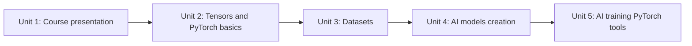

# PyTorch Essentials for Robotics

This course builds a working foundation in PyTorch, the deep learning framework most robotics perception and control models are trained with, using a single running example — a small "mini keyboard" image detector — that grows across every unit. You'll start with tensors, the core data structure behind every model, move on to building and loading datasets, assemble a neural network from PyTorch's `nn` building blocks, and finish by writing a real training loop that turns that network into a working, saved, reloadable model. The goal is fluency with the mechanics (shapes, dtypes, devices, `Dataset`/`DataLoader`, `nn.Module`, the training loop) so that later robotics-AI courses can focus on the robotics problem instead of re-explaining PyTorch basics.

The diagram below shows how each unit builds directly on the pieces introduced before it:

1. [Course presentation](01-course-presentation.md) — See the finished pipeline in miniature and get your PyTorch environment set up.
2. [Tensors and PyTorch basics](02-tensors-and-pytorch-basics.md) — Create, inspect, reshape, and reduce tensors, and understand CPU/GPU device placement.
3. [Datasets](03-datasets.md) — Build a training dataset and wrap it with PyTorch's `Dataset`/`DataLoader` abstractions.
4. [AI Models creation](04-ai-models-creation.md) — Assemble a neural network from `nn.Module` building blocks for the mini keyboard detector.
5. [Ai training PyTorch tools](05-ai-training-pytorch-tools.md) — Write the training loop, evaluate on held-out data, and save/reload the trained model.
