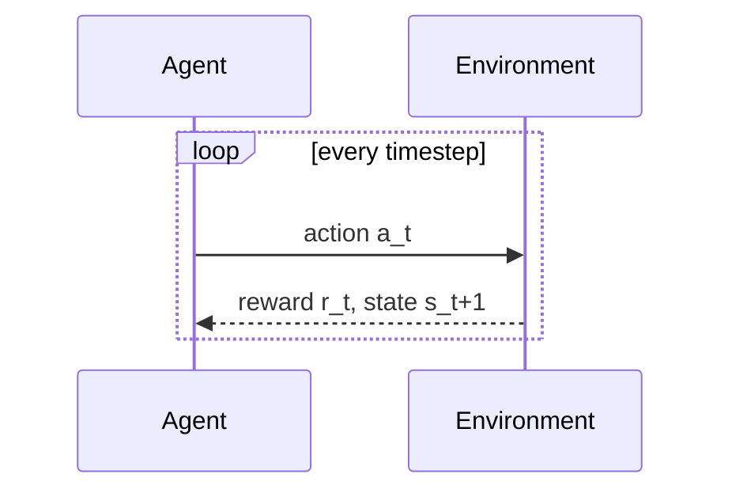

# Reinforcement Learning for Robotics — Unit 1: Introduction to the Course

This unit previews the whole course and gets your tooling in place. By the end you should know what each later unit builds on top of, and you should have a working Python environment that can run a minimal agent-environment loop end to end.

The diagram below shows the agent-environment loop every algorithm in this course drives, repeated one timestep at a time.



## Course roadmap
This course builds one idea at a time, and each unit depends on the one before it:
- **Unit 2** formalizes what "the reinforcement learning problem" actually is: the multi-armed bandit as a simplified warm-up, then the full Markov Decision Process (MDP), and the value functions and Bellman equation that every later algorithm is built from.
- **Unit 3** covers dynamic programming — solving an MDP exactly when you already know its transition probabilities and rewards (the "model").
- **Unit 4** covers Monte Carlo methods — learning purely from complete sampled episodes, with no model of the environment required.
- **Unit 5** covers temporal-difference methods — the middle ground that learns from partial episodes, step by step, without a model. This is where Q-learning lives.
- **Unit 6** is the course project: using Q-learning to solve a maze with three obstacles, tying every prior unit together into one working agent.

The throughline is "how much does the agent need to know, and how long does it have to wait before it can learn anything?" Dynamic programming needs a full model and no environment interaction at all; Monte Carlo needs no model but a full episode; temporal-difference needs neither a model nor a full episode. Keep that spectrum in mind — it's the organizing idea of the whole course.

## Setting up your RL sandbox
You'll want a Python environment with a numerical library and an environment toolkit. A minimal, widely-used stack:

```bash
python3 -m venv rl-env
source rl-env/bin/activate
pip install numpy gymnasium
```

`gymnasium` (the maintained successor to the original OpenAI Gym API) gives you a standard `reset()` / `step()` interface for benchmark environments, so you can test ideas on something like `FrozenLake-v1` or `CartPole-v1` before wiring an algorithm into a custom environment or a ROS-based simulation. Later units, including the Unit 6 project, use a small hand-rolled grid world instead of a gym environment — that's deliberate, so you see exactly what `reset()` and `step()` are doing under the hood rather than treating them as a black box.

## A first look: the agent-environment loop
Every RL algorithm you'll write in this course, no matter how different the math looks, drives the same loop: observe a state, choose an action, receive a reward and a new state, repeat.

```python
import gymnasium as gym

env = gym.make("FrozenLake-v1", is_slippery=False)
state, info = env.reset(seed=0)

total_reward = 0.0
for step in range(20):
    action = env.action_space.sample()          # random policy, for now
    state, reward, terminated, truncated, info = env.step(action)
    total_reward += reward
    print(f"step {step}: action={action} reward={reward} state={state}")
    if terminated or truncated:
        break

print("episode return:", total_reward)
env.close()
```

Nothing here is "learning" yet — the action is random on every step. That's intentional: before you optimize a policy, you need to be completely comfortable with what a state, an action, a reward, and an episode boundary (`terminated` vs `truncated`) actually are, because Unit 2 defines all four formally.

## Try it yourself
Modify the script above to run 50 episodes instead of one step-limited loop, and print the average return across all 50. Then switch `is_slippery=False` to `is_slippery=True` and run it again. You should see the average return drop — write one sentence explaining, in plain language, why adding stochastic transitions makes a fixed random policy perform worse. Hang onto that intuition; it's exactly the problem the rest of the course solves.
