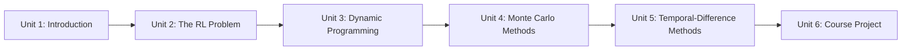

# Reinforcement Learning for Robotics

This course builds up the classical reinforcement learning toolkit from first principles — the multi-armed bandit and the Markov Decision Process, then the three families of algorithms that solve MDPs (dynamic programming, Monte Carlo methods, and temporal-difference methods) — and ends by deploying a tabular Q-learning agent to solve a maze with three obstacles. It's a theory-into-practice course: every unit pairs the math with runnable code, building toward algorithms you can later carry into ROS-based simulations and real robot tasks.

The diagram below shows how each unit builds directly on the concepts introduced in the one before it, culminating in the Unit 6 project.

1. [Introduction to the Course](01-introduction-to-the-course.md) — Course roadmap, environment setup, and a first look at the agent-environment loop.
2. [The Reinforcement Learning Problem](02-the-reinforcement-learning-problem.md) — Multi-armed bandits, Markov Decision Processes, State-Value and Action-Value functions, and the Bellman equation.
3. [Dynamic Programming](03-dynamic-programming-problem.md) — Policy evaluation, policy iteration, and value iteration for solving a fully known MDP.
4. [Monte Carlo Methods](04-monte-carlo-methods.md) — Learning value functions and policies from complete sampled episodes, on-policy and off-policy.
5. [Temporal-Difference Methods](05-temporal-difference-methods.md) — TD(0), SARSA, and Q-learning for model-free, step-by-step learning.
6. [Course Project](06-course-project.md) — Deploying tabular Q-learning to solve a maze environment with three obstacles.
