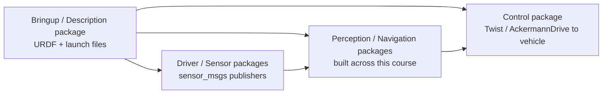

# ROS Autonomous Vehicles 101 — Unit 0: Introduction

This unit orients you to the course: what "Level 3" autonomy actually commits you to, what the simulated car looks like as a ROS stack, and how to move it around before any of the harder sensing or navigation work begins.

The diagram below sketches the package layout you'll tour in this unit: bringup starts everything, sensor drivers feed perception/navigation, and that in turn commands the vehicle.



## What "Level 3 conditional automation" means here
The SAE autonomy scale runs from 0 (no automation) to 5 (full automation in all conditions). This course targets **Level 3**: the vehicle handles the driving task under defined conditions, but a human must be ready to take over when asked. Practically, that shapes the whole course:

- Every subsystem you build (sensing, GPS navigation, obstacle avoidance) has to report its own confidence or failure state, not just "succeed silently."
- The car needs a clean way to hand control back — an emergency stop and a well-defined "I need the driver" signal, which you'll build in Unit 3.
- You are not building a general-purpose driver. You're building a system that is honest about the conditions it can and can't handle.

Keep this framing in mind: a Level 3 stack that drives perfectly but never admits uncertainty is more dangerous than one that asks for help too often.

## Touring the car's ROS stack
A typical autonomous-car ROS workspace is organized as a handful of cooperating packages rather than one monolith:

- A **description/bringup** package with the vehicle's URDF (or SDF for simulation) and launch files that start everything together.
- **Driver/sensor** packages, one per sensor family, each publishing standard `sensor_msgs` types.
- A **control** package that translates high-level commands (`geometry_msgs/Twist` or `AckermannDrive`) into whatever the vehicle (or CAN bus, in Unit 4) expects.
- **Perception/navigation** packages you will fill in across this course.

Start by just listing what's running:

```bash
ros2 launch <your_sim_package> car_world.launch.py
ros2 node list
ros2 topic list
```

Getting comfortable reading `ros2 node list` / `ros2 topic list` output is the single most useful habit for this whole course — every unit from here on starts with "what's actually publishing right now?"

## Moving the car around
Before touching sensors or navigation, confirm you can command the vehicle manually. Most simulated cars accept velocity commands on a topic like `/cmd_vel`:

```bash
ros2 topic pub /cmd_vel geometry_msgs/msg/Twist "{linear: {x: 0.5}, angular: {z: 0.1}}" --once
```

or interactively with the standard teleop tool:

```bash
ros2 run teleop_twist_keyboard teleop_twist_keyboard
```

Watch `/odom` while you do this to see the car's estimated pose update:

```bash
ros2 topic echo /odom
```

If the car doesn't move, the fastest debugging path is always the same: check the topic name and message type match on both ends (`ros2 topic info /cmd_vel -v`), and check that a controller node is actually subscribed.

## Where this course goes
Units 1-5 build up in layers: sensors you can see (Unit 1), where you are in the world (Unit 2), what's in your way (Unit 3), how commands actually reach the wheels (Unit 4), and finally a small mission that uses all of it (Unit 5).

## Try it yourself
Launch your simulation, run `ros2 topic list` and `ros2 node list`, and write down (in a scratch file) every topic that looks sensor-related versus control-related — you'll use that list as a checklist while working through Unit 1.
