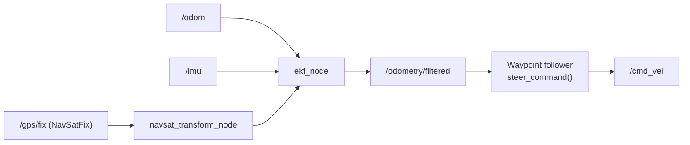

# ROS Autonomous Vehicles 101 — Unit 2: GPS Navigation

Sensors tell the car what's around it; GPS tells it where it is on the planet. This unit covers reading GPS in ROS, turning that into coordinates you can actually do math with, and using it to steer toward a waypoint.

The diagram below traces the full pipeline this unit builds, from raw GPS and odometry/IMU data through fusion to the waypoint-following steer command.



## GPS fundamentals and the NavSatFix message
GPS receivers report position as latitude, longitude, and altitude — a spherical coordinate, not the flat Cartesian coordinates your control code wants. In ROS 2 this arrives as `sensor_msgs/msg/NavSatFix`:

```bash
ros2 topic echo /gps/fix
```

Key fields to actually check, not just latitude/longitude:

- `status.status` — whether the fix is valid at all (a value of `-1` means "no fix," don't trust the coordinates).
- `position_covariance` — the receiver's own uncertainty estimate. A cheap GPS module can be off by several meters; treat covariance as a confidence signal, not decoration.

A Level 3 car (recall Unit 0) must notice when `status.status` goes bad and react — that's your first real "hand back to the driver" condition.

## From lat/lon to local coordinates
Latitude and longitude aren't convenient for path-following math (the distance covered by one degree of longitude changes with latitude). The standard fix is projecting GPS fixes into a local flat frame:

- **UTM (Universal Transverse Mercator)** — splits the globe into zones and gives you metric x/y within a zone. Good for anything that stays within one UTM zone.
- **ENU (East-North-Up)** relative to a fixed local origin — simplest for a single test area, and what most local path-planning code expects.

You rarely need to hand-roll this conversion: the `robot_localization` package (a well-known ROS navigation package) includes a `navsat_transform_node` that converts `NavSatFix` + odometry + IMU into a local ENU frame automatically, publishing a corrected odometry estimate you can plan against directly.

## Fusing GPS with odometry
GPS alone is noisy and updates slowly (often 1-10 Hz); wheel odometry is smooth and fast but drifts. Combining them gives you a position estimate that's both accurate over the long run and smooth moment-to-moment. This is a job for an extended Kalman filter (EKF) — `robot_localization`'s `ekf_node` is the standard ROS choice, fusing `/odom`, `/imu`, and GPS-derived odometry into a single `/odometry/filtered` topic.

You don't need to implement the filter math yourself for this course; you do need to understand the shape of the pipeline:

```
/gps/fix ──► navsat_transform_node ──► odometry (GPS-derived)
/odom, /imu ─────────────────────────► ekf_node ──► /odometry/filtered
```

## Waypoint following
With a reliable local position, steering toward a target GPS point becomes ordinary geometry. A minimal waypoint-follower loop:

```python
import math

def bearing_and_distance(x, y, target_x, target_y):
    dx, dy = target_x - x, target_y - y
    distance = math.hypot(dx, dy)
    bearing = math.atan2(dy, dx)
    return bearing, distance

def steer_command(current_yaw, bearing, distance, arrival_tolerance=1.0):
    if distance < arrival_tolerance:
        return 0.0, 0.0  # arrived: stop
    heading_error = math.atan2(math.sin(bearing - current_yaw),
                                math.cos(bearing - current_yaw))
    linear = min(1.0, distance)          # slow down near the target
    angular = 1.5 * heading_error        # simple proportional steering
    return linear, angular
```

This is deliberately naive — no path planning, no obstacle awareness — but it's the core loop every real waypoint follower wraps additional logic around.

## Try it yourself
Subscribe to your car's (filtered, if available) position topic and a hard-coded target x/y a few meters away. Publish `/cmd_vel` using the `steer_command` logic above and confirm the car turns to face the target and stops within your tolerance.
