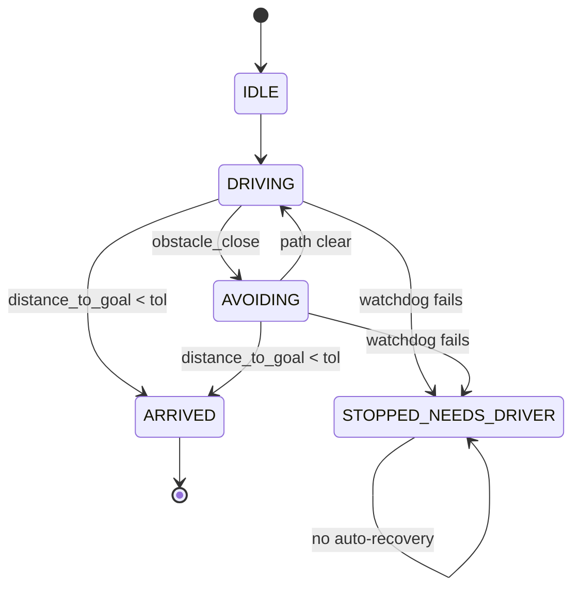

# ROS Autonomous Vehicles 101 — Unit 5: Microproject

This unit is where Units 1-4 stop being separate exercises and become one system: drive the car, using CAN-Bus for actuation and GPS for navigation, to the gas station — stopping or rerouting around whatever obstacles are in the way.

The diagram below visualizes the `mission_node` state machine that ties Units 1-4 together, including the watchdog's one-way trip into `STOPPED_NEEDS_DRIVER`.



## The brief
Mission: starting from a parked state, drive autonomously to a fixed GPS waypoint representing a gas station, using only the sensors and interfaces you've already built:

- Position comes from GPS (Unit 2), ideally fused with odometry/IMU.
- Actuation goes out over CAN-Bus via your DBW bridge (Unit 4), not `/cmd_vel` directly.
- Obstacles along the way must be detected and avoided or, if avoidance isn't possible, trigger a safe stop (Unit 3).
- The mission reports its own state clearly: driving, avoiding, arrived, or stopped-needs-driver.

## System architecture
Sketch the node graph before writing the mission logic — this is the same shape any real AV stack uses, just smaller:

```
/gps/fix, /odom, /imu ──► robot_localization (ekf_node) ──► /odometry/filtered
/scan ────────────────────────────────────────────────────► obstacle_monitor node
/odometry/filtered + waypoint ─────► mission_node ──► desired /cmd_vel
obstacle_monitor + mission_node ───► arbitration ──► final /cmd_vel
final /cmd_vel ──► can_bridge node ──► CAN frames ──► vehicle
```

The important design decision is that `mission_node` never talks to CAN directly, and `can_bridge` never contains mission logic — each node has exactly one job, which is what makes it possible to test them independently.

## A minimal mission state machine
Mission logic is a natural fit for a small state machine rather than a tangle of `if` statements:

```python
from enum import Enum, auto

class MissionState(Enum):
    IDLE = auto()
    DRIVING = auto()
    AVOIDING = auto()
    ARRIVED = auto()
    STOPPED_NEEDS_DRIVER = auto()

def next_state(state, distance_to_goal, obstacle_close, watchdog_ok, arrival_tol=1.0):
    if not watchdog_ok:
        return MissionState.STOPPED_NEEDS_DRIVER
    if state == MissionState.STOPPED_NEEDS_DRIVER:
        return state  # requires explicit reset, never auto-recovers
    if distance_to_goal < arrival_tol:
        return MissionState.ARRIVED
    if obstacle_close:
        return MissionState.AVOIDING
    return MissionState.DRIVING
```

Each state maps to a specific command source: `DRIVING` uses Unit 2's waypoint follower, `AVOIDING` uses Unit 3's reactive avoider, `ARRIVED` and `STOPPED_NEEDS_DRIVER` both publish a zero command — the difference is only in what gets reported to the (simulated) driver.

## Testing and iterating
Build this incrementally rather than end-to-end from the start:

1. Test `mission_node` against a fake position source (no obstacles, no CAN) — confirm the state machine transitions correctly on paper-easy cases.
2. Add the obstacle monitor with a stationary obstacle and confirm `AVOIDING` triggers and clears correctly.
3. Swap `/cmd_vel` for the real `can_bridge` last, once everything upstream is trustworthy — CAN issues are much easier to debug when you already know the commands being sent are correct.
4. Kill a sensor topic mid-run (`Ctrl+C` a driver node) and confirm the watchdog correctly forces `STOPPED_NEEDS_DRIVER` instead of the car continuing on stale data.

## Try it yourself
Write a launch file that brings up all four nodes (`ekf_node` or equivalent, `obstacle_monitor`, `mission_node`, `can_bridge`) together, set a waypoint a short distance away with one obstacle in the path, and run the mission end to end. Log the mission state on every transition and review the log afterward to confirm it matches what actually happened in the simulation.
